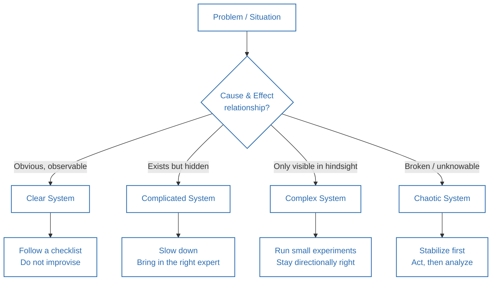
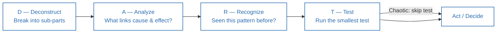
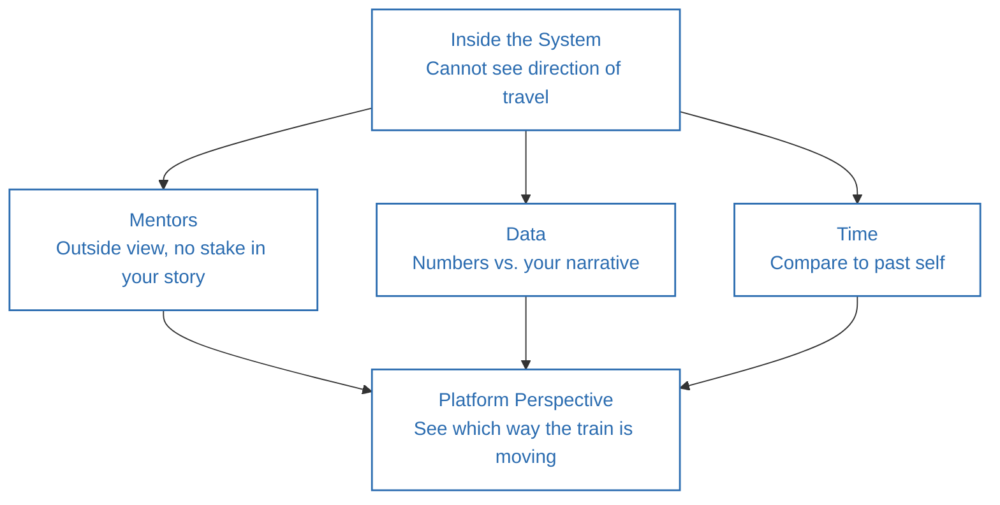

**Source video:** [How To Think SO Clearly People Assume You're Brilliant](https://www.youtube.com/watch?v=mjTgkm-h__M) — Sandeep Swadia (YouTube: *theMITmonk*)
**Credit:** All core framework ideas below (the four system types, the "DART" diagnostic, and the platform-perspective idea) are drawn directly from this video. Section 6 adds outside context to connect these ideas to established literature.

---

## 1. Summary

- A **system** is a set of connected parts that keeps producing a repeating pattern (a company, a career, a marriage, a coffee shop).
- Most "smart mistakes" happen because someone applied the wrong kind of thinking to the wrong kind of system.
- There are **four types of systems** — Clear, Complicated, Complex, and Chaotic — and each demands a different response.
- Three things make systems thinking hard: (1) not knowing which system you're in, (2) the **incentive/cobra effect** (people game misaligned rewards), and (3) **delayed feedback loops** (the consequence shows up long after the action).
- A four-step diagnostic — **DART** (Deconstruct, Analyze, Recognize, Test) — helps you figure out which system you're actually in before you act.
- Every system you live inside is also quietly training you, and you usually can't see the direction from inside it — you need **mentors, data, or time** to get an outside ("platform") view.
- Many "either/or" choices (Ferrari vs. Toyota, luxury vs. mass-market) are limits of system *design*, not limits of reality — Apple's mass-produced luxury iPhone is the counterexample.

---

## 2. Thinking Framework

### The Four Types of Systems

| System | Cause → Effect Relationship | Example from video |
|---|---|---|
| **Clear** | Obvious, directly observable | Van Halen's "no brown M&Ms" contract clause; a recipe; surgical scrub-in protocol |
| **Complicated** | Exists but hidden — needs analysis/expertise to uncover | ER patient with chest pain; choosing a mortgage |
| **Complex** | Only visible in hindsight; emerges over time | Post-acquisition culture integration; raising a teenager |
| **Chaotic** | Broken / impossible to know in the moment | 1982 Tylenol cyanide poisonings |

### DART — The Diagnostic Framework

- **D — Deconstruct:** Break the problem into sub-parts. Are they stable or shifting?
- **A — Analyze:** What's the cause-effect relationship? Obvious → Clear. Discoverable via analysis → Complicated. Emergent, seen only in hindsight → Complex. Broken → Chaotic.
- **R — Recognize:** Have you seen this pattern before, in this system or a different one?
- **T — Test:** Run the smallest possible test before committing (skip this step only in a chaotic system — there's no time to test).

### The Platform Perspective

You cannot see which direction a system is taking you from *inside* it (like not knowing if your train or the one next to it is moving). Three ways to get outside perspective:
1. **Mentors** — someone outside your story who can see your "train" from the platform.
2. **Data** — numbers don't care about your narrative.
3. **Time** — compare yourself to a year/month/week ago.

---

## 3. Act / Applying the Framework

1. **Ask the three diagnostic questions anywhere** — at a coffee shop, in a meeting, in your career: *What are the hidden parts? How are they connected? What patterns keep repeating?*
2. **Run DART before you act on any non-trivial problem.** Don't skip straight to a solution — deconstruct and analyze first to identify the system type.
3. **Match your response to the system type:**
 - Clear → build/follow a checklist. Don't improvise.
 - Complicated → slow down, bring in the *right* specialist (not just any expert).
 - Complex → run small experiments, stay directionally right, course-correct — don't expect a fixed playbook.
 - Chaotic → stabilize first, act immediately, analyze later. Avoid analysis paralysis.
4. **Watch for the cobra effect in anything you design** — before setting an incentive or metric, ask "how could someone technically satisfy this without achieving the actual goal?"
5. **Build in a feedback-loop check** — for slow-moving risks (health, culture, financial habits), don't wait for the damage to be visible; look for early leading indicators.
6. **Schedule regular "platform time"** — a recurring check-in with a mentor, a data review, or a look-back at where you were 6–12 months ago.
7. **Question your own binary constraints** — when you're told "you can only have A or B," ask whether that's a fact about the world or just a limitation of the current system design.

---

## 4. Details of Topics Discussed in the Video

- **The firefighter analogy:** experienced firefighters read smoke color as information (black = fuel/plastics/chemicals; white/gray = moisture or oxygen-starved fire) — this is pattern recognition from observable parts, the essence of systems thinking.
- **The coffee shop example:** customer → cashier → barista → customer is a simple, observable system used to illustrate "parts → connections → patterns."
- **The cobra effect:** British colonial bounty-per-dead-cobra policy in Delhi backfired because people bred cobras for profit — a textbook incentive-misalignment failure.
- **Delayed feedback loops:** 20th-century cigarette culture — pleasure arrived in seconds, damage arrived in decades, which is why the system was hard to correct in real time.
- **Clear system example — Van Halen's M&M clause:** a trivial contract detail (no brown M&Ms backstage) functioned as a proxy signal for whether a venue had read the entire safety contract carefully.
- **Complicated system example — the ER "chest pain" scenario:** one symptom, ~20 possible causes; requires expert differential diagnosis, not a checklist.
- **Complex system example — a real acquisition:** the speaker (as COO) led an acquisition where the products fit well on paper, but cultural incompatibility (formal/hierarchical vs. informal/fast-moving) caused leadership attrition and product shutdowns within 90 days — cause and effect were only clear in hindsight.
- **Chaotic system example — the 1982 Tylenol poisonings:** Johnson & Johnson couldn't analyze first; they pulled 31 million bottles immediately (stabilize first, understand later).
- **The "binary choice is a system-design limit" idea:** Apple manufacturing ~350 iPhones/minute — a luxury product at mass-market scale — shows that "high margin OR high volume" was never a law of physics, just an unsolved system-design problem until Apple solved it.
- **Personal narrative:** the speaker's own path from a "running away from home to become a monk" story (which he later realized, via honest feedback, was really running away from his father) to recognizing that self-narrative is itself a redesignable system.

---

## 5. Diagrams

### The Four System Types and Their Response

### The DART Diagnostic Loop

### Getting the Platform Perspective

---

## 6. Learnings from Additional Sources (Connecting the Concepts)

- **This maps closely to the Cynefin Framework** (Dave Snowden, IBM/Cognitive Edge, formalized ~1999–2007), a well-known sense-making model in organizational and management theory that uses nearly identical categories: *Clear (formerly "Simple/Obvious")*, *Complicated*, *Complex*, and *Chaotic*, plus a fifth "Disorder" state for when you don't know which domain you're in — which is exactly the gap DART is designed to fill. Cynefin is widely used in agile software development, public policy, and crisis management.
- **The cobra effect is a specific case of Goodhart's Law**: "When a measure becomes a target, it ceases to be a good measure" (economist Charles Goodhart, 1975). Both describe the same failure mode — optimizing for a proxy metric instead of the underlying goal.
- **Donella Meadows' *Thinking in Systems: A Primer*** (2008, based on her decades of systems-dynamics research at MIT) is the classic text on this topic — it formalizes concepts like stocks, flows, reinforcing/balancing feedback loops, and delayed feedback (directly relevant to the cigarette example), and shows how leverage points differ by system type.
- **The chaotic-system response ("stabilize first, analyze later") echoes the OODA loop** (Observe–Orient–Decide–Act), developed by military strategist John Boyd, which similarly prioritizes fast action and iteration over complete information in fast-moving, high-uncertainty situations.
- **Complex-system advice ("run small experiments, stay directionally right") parallels agile/lean methodology** and the "Cynefin complex-domain" guidance to *probe–sense–respond* rather than plan-and-execute — small, safe-to-fail experiments generate the hindsight needed to navigate emergent systems.
- **The "platform perspective" idea overlaps with the concept of the "outside view"** popularized by psychologist Daniel Kahneman and used in forecasting — using external data/reference cases instead of your own internal narrative to judge a situation.

---

## 7. References

1. Sandeep Swadia (theMITmonk), ["How To Think SO Clearly People Assume You're Brilliant"](https://www.youtube.com/watch?v=mjTgkm-h__M), YouTube.
2. Kurtz, C. F., & Snowden, D. J. (2003). "The new dynamics of strategy: Sense-making in a complex and complicated world." *IBM Systems Journal* — origin of the Cynefin Framework.
3. Meadows, D. H. (2008). *Thinking in Systems: A Primer*. Chelsea Green Publishing.
4. Goodhart, C. (1975). Original statement of what became known as "Goodhart's Law."
5. Wikipedia — ["Cobra effect"](https://en.wikipedia.org/wiki/Cobra_effect) (background on the historical Delhi bounty policy referenced in the video).
6. Wikipedia — ["1982 Chicago Tylenol murders"](https://en.wikipedia.org/wiki/Chicago_Tylenol_murders) (background on the chaotic-system example).
7. Boyd, J. — originator of the OODA Loop concept, U.S. Air Force strategist.