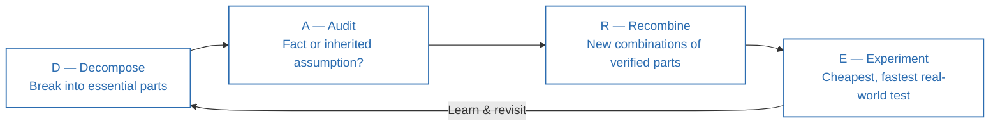
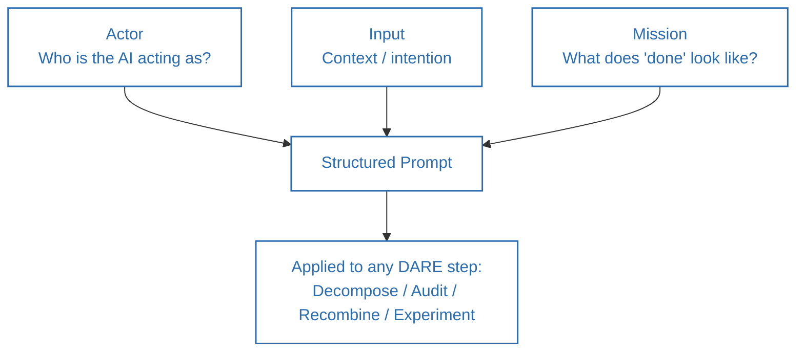

**Source video:** [If You Don't Understand First Principles, You Can't Think Clearly](https://www.youtube.com/watch?v=jPSirKTGTfo) — Sandeep Swadia (YouTube: *theMITmonk*)
**Companion resource mentioned in video:** [sandeepswadia.com/first-principles-prompts](https://sandeepswadia.com/first-principles-prompts) (free downloadable prompt PDF)
**Credit:** The four-step "Decompose → Audit → Recombine → Experiment" framework, the AIM prompt structure, and all worked prompts below originate from this video. Section 6 connects these to established literature on first-principles reasoning.

---

## 1. Summary

- Most of our thinking runs on **inherited assumptions** — from colleagues, family, industry convention, or our own past experience — not on verified fact.
- **First principles thinking** means stripping a problem back to what you *actually* know for certain, then rebuilding from there.
- General-purpose AI models are pattern-matchers: they default to the *most familiar* answer, not the *most correct* one — so left alone, AI reinforces convention rather than breaking it.
- The video proposes a **four-step framework (D-A-R-E)** for doing first-principles thinking *with* AI as a forcing function, plus a matching prompt for each step built on the **AIM** structure (Actor, Input, Mission).
- The goal of first principles thinking isn't to be right every time — it's to fail fast and learn *why* you were wrong, since even a very low hit-rate can produce outsized results (Martin Short's "you fail 98% of the time — those are great odds").

---

## 2. Thinking Framework

### DARE — Four Steps of First Principles Thinking

| Step | Question it answers | Example from video |
|---|---|---|
| **D — Decompose** | What is this problem actually made of, stripped of conventional wisdom? | Starting a YouTube channel doesn't require a studio/crew — just a phone and a story |
| **A — Audit (assumptions)** | Which of these "requirements" are facts vs. inherited conventions? | Toyota questioned why cars had to be big, mass-produced in huge batches, and hold large inventory |
| **R — Recombine** | Given only the verified building blocks, what new combinations are possible? | 12 notes of Western music recombined endlessly by Bach, the Beatles, Beyoncé |
| **E — Experiment** | What's the cheapest, fastest real-world test of this idea? | James Dyson's 5,127 prototypes over 5 years; Google's button-color testing |

### AIM — The Prompt Structure Used at Every Step

- **A — Actor:** Tell the model who it's acting as (e.g., "a skeptical red-team analyst").
- **I — Input:** State your intention/context clearly (what you want and why).
- **M — Mission:** Define exactly what "done" looks like and what the model should *not* do (e.g., "do not recommend solutions yet").

---

## 3. Act / Applying the Framework

1. **Pick a real problem or belief you hold** ("I can't focus," "I need a studio to start a channel," "we need to raise millions to start a company").
2. **Step D (Decompose):** Prompt AI, constrained to decomposition only — no advice, no solutions — and have it show the problem's hierarchy (major components → sub-elements) using only relevant dimensions (people, process, time, cost, etc.).
 > *Sample prompt:* "Act as a world-class first-principles analyst. Your job in this step is decomposition only — you're penalized for introducing advice, solutions, or standard playbooks... Break the problem into its smallest useful constituent parts. Show the hierarchy clearly... Stop decomposing when going further would no longer improve my understanding."
3. **Step A (Audit):** Prompt AI as a skeptical red-team analyst to flag which "building blocks" are actual facts vs. unquestioned conventions.
4. **Step R (Recombine):** Ask AI to generate multiple new combinations of the *verified* building blocks — treat this as generating options, not final answers.
5. **Step E (Experiment):** Ask AI (as a "skeptical scientist") to design the cheapest, fastest test for each option, and to specify in advance what result would rule the idea out vs. keep it alive.
6. **Keep the judgment yourself.** AI does the decomposition, auditing, recombination, and experiment design — you make the call on what to pursue.
7. **Expect to be wrong often** — treat every failed experiment as data about which building block to revisit, not as a verdict on the whole idea.

---

## 4. Details of Topics Discussed in the Video

- **Personal story — sleep apnea:** the speaker spent 12 years assuming his exhaustion was due to overwork/"needing more coffee," until a sleep study revealed 34 wake-ups per hour caused by his jaw structure. Deconstructing the *symptom* from first principles (rather than accepting the inherited "I just need more sleep/coffee" story) found the actual root cause.
- **Elon Musk / reusable rockets:** questioning the unstated assumption that rockets, unlike cars, must be single-use — this single audited assumption changed the economics of spaceflight.
- **Starting a YouTube channel — decomposition example:** conventional advice (studio, camera, lighting, editor, agency) vs. the decomposed essentials (a phone and a story).
- **Toyota vs. Detroit (audit example):** post-WWII Toyota, with far less capital than U.S. automakers, questioned assumptions behind mass production itself (why big cars, why huge batch sizes, why large inventories) — this questioning led to Just-In-Time production, which eventually helped Toyota overtake GM as the world's largest automaker.
- **Tesla vs. Toyota:** Tesla later questioned an assumption Toyota itself never challenged — why a car needs a combustion engine at all — and by 2020 had overtaken Toyota in market value.
- **Music/recombination analogy:** Western music's 12 notes are a fixed, small set of "verified building blocks," yet they produce virtually unlimited compositions — innovation is about recombination, not discovering a mythical "13th note." (Also noted: Indian classical and Arabic music use additional micro-pitches between the 12 Western notes — a reminder that even "fixed" building blocks are themselves conventions.)
- **James Dyson (experiment example):** 5,127 vacuum-cleaner prototypes over 5 years before reaching the cyclonic design that solved suction loss.
- **Martin Short's advice to a young comedian:** "In this business, you fail 98% of the time — those are great odds," because you only need the 2% that works to change your trajectory.

---

## 5. Diagrams

### The DARE Framework

### AIM Prompt Structure Applied at Each DARE Step

---

## 6. Learnings from Additional Sources (Connecting the Concepts)

- **First principles reasoning traces back to Aristotle**, who defined a first principle as "the first basis from which a thing is known" — the foundational, non-reducible truths underneath a domain. Elon Musk has popularized this in modern business/engineering contexts, explicitly contrasting it with "reasoning by analogy" (copying what others already do).
- **The Audit step overlaps with the "5 Whys" technique** (developed at Toyota, notably by Sakichi Toyoda, as part of the Toyota Production System) and with the **Socratic method** of systematically questioning assumptions until you reach something that can't be further reduced.
- **The Decompose step is functionally similar to root-cause / functional decomposition analysis** used in engineering and Lean/Six Sigma, where a system is broken into its minimum functional requirements before any solution is proposed.
- **The Experiment step mirrors the scientific method and the "build-measure-learn" loop from Lean Startup methodology** (Eric Ries) — cheap, falsifiable tests before large commitments, and pre-registering what result would falsify the hypothesis (a practice also used in rigorous scientific experimentation to avoid post-hoc rationalization).
- **The AIM prompt structure (Actor–Input–Mission) is a specific instance of the broader "role + context + goal" prompting pattern** widely documented in AI prompt-engineering guidance (e.g., Anthropic's own documentation recommends assigning a role/persona, supplying relevant context, and being explicit and detailed about the desired outcome and format) — this is not unique to this framework but the video packages it into a memorable acronym.
- **Toyota's Just-In-Time system**, used as the audit example, is one of the two pillars of the Toyota Production System (the other being *Jidoka*, or automation with a human touch) — a well-documented case study in lean manufacturing history.

---

## 7. References

1. Sandeep Swadia (theMITmonk), ["If You Don't Understand First Principles, You Can't Think Clearly"](https://www.youtube.com/watch?v=jPSirKTGTfo), YouTube.
2. Sandeep Swadia, [First Principles Prompts PDF](https://sandeepswadia.com/first-principles-prompts) — companion resource with the full prompt set referenced in the video.
3. Aristotle, *Metaphysics* — classical origin of "first principles" as the foundational basis of knowledge.
4. Ohno, T. (1988). *Toyota Production System: Beyond Large-Scale Production*. Productivity Press — background on Just-In-Time production and the "5 Whys."
5. Ries, E. (2011). *The Lean Startup*. Crown Business — background on build-measure-learn experimentation.
6. Anthropic, [Prompt Engineering Overview](https://docs.claude.com/en/docs/build-with-claude/prompt-engineering/overview) — general guidance on role-based, context-rich prompting that parallels the AIM structure.