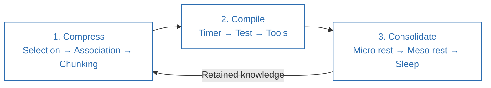
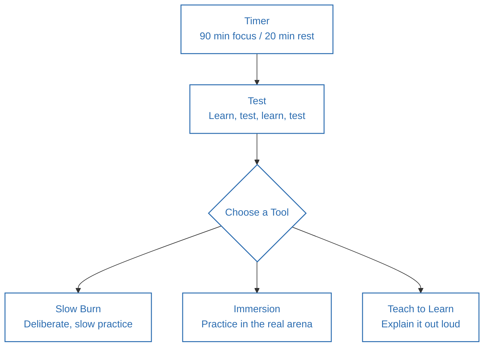
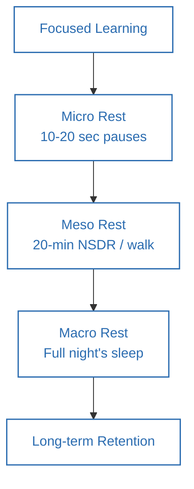

**Source video:** [How To Learn So Fast It's Almost Unfair](https://www.youtube.com/watch?v=npQ2IORdlvU) — Sandeep Swadia (YouTube: *theMITmonk*)
**Credit:** The 3C Protocol (Compress, Compile, Consolidate) and its component tools (selection/association/chunking, the timer-test-tools model, the three rest levels) are the video's original framework. Section 6 connects these to established cognitive-science research.

---

## 1. Summary

- In an AI world, raw intelligence is a commodity — **how fast you learn** is the real, durable edge.
- 99% of learners fail because they **cram** ("a gallon of theory into a 4-oz cognitive bowl") instead of working *with* how the brain actually processes information (serially, not in parallel like AI).
- Your brain lies to you about difficulty: **friction is not failure** — desirable difficulty (the *generation effect*) is what wires learning in deeply. Using AI as a crutch instead of a coach short-circuits this.
- The **3C Protocol** — **Compress, Compile, Consolidate** — is the proposed learning system.
- Learning is a two-stage process: **focus** (the request to rewire) and **rest** (where the actual consolidation happens) — both must be actively managed, at micro (seconds), meso (minutes/hours), and macro (nightly sleep) levels.

---

## 2. Thinking Framework

### The 3C Protocol

| Stage | Purpose | Component tools |
|---|---|---|
| **1. Compress** | Reduce many ideas into fewer, stronger chunks your brain can actually hold (working memory ≈ 4 items at once) | **Selection** (find the 20% that gives 80% of the value) → **Association** (connect new info to something already known) → **Chunking** (compress into a model: drawing, summary, metaphor, song) |
| **2. Compile** | Convert compressed knowledge into durable, usable skill through active testing, not passive consumption | **Timer** (90-min deep work / 20-min rest — the *ultradian cycle*) → **Test** (learn→test→learn→test, not one big exam at the end) → **Tools**: *Slow burn* (do it very slowly, deliberately), *Immersion* (practice in the real arena, not just rehearsal), *Teach to learn* (explain it out loud to someone/something) |
| **3. Consolidate** | Retain what you've compiled *forever* through structured rest, not through flashcards alone | Micro rest (10–20 sec pauses — brain "replays" info 10–20x faster during pauses) → Meso rest (the 20-min ultradian rest, e.g. NSDR/yoga nidra) → Macro rest (a full night's sleep, when the brain replays learning in reverse) |

---

## 3. Act / Applying the Framework

1. **Before consuming any material, ask: "What's the 20% of this that gives me 80% of the value?"** Read/watch only that portion first (Selection).
2. **For every new idea, explicitly ask: "Where have I seen something like this before?"** and write the connection down (Association).
3. **Compress what you've learned into one artifact** — a one-sentence summary, a hand-drawn diagram, or a metaphor — before moving to the next topic (Chunking).
4. **Block 1–2 recurring 90-minute deep-work sessions per week and protect them ruthlessly**; follow each with a mandatory 20-minute rest.
5. **Replace "study for weeks then take one big test" with a learn→test→learn→test loop** — test yourself (or apply the skill) right after each small chunk, not at the end of a long unit.
6. **Choose a testing tool that fits the skill:** go painfully slow for physical/technical skills (*slow burn*); rehearse in the real environment, not just in your head (*immersion*); explain what you just learned to another person, out loud (*teach to learn*).
7. **Take deliberate 10–20 second pauses after intense learning bursts** — don't fill every micro-gap with a phone check.
8. **Protect your 20-minute post-focus rest as literal rest** — NSDR/lying down/a walk, not scrolling or a different task.
9. **Protect sleep as a non-negotiable part of the learning process**, not a reward for finishing.
10. **Stop comparing your pace to other people's** — the only meaningful benchmark is yourself yesterday.

---

## 4. Details of Topics Discussed in the Video

- **Why cramming fails:** the prefrontal cortex ("CEO" of the brain) is metabolically expensive (the brain uses up to 20% of the body's fuel); dumping large volumes of new theory into it produces poor retention — described as the "gallon into a 4-oz bowl" problem.
- **AI runs in parallel, brains run serially:** unlike AI's massively parallel processing, humans are built for serial, one-transfer-at-a-time learning — so pacing matters more for us than for machines.
- **Carnegie Mellon adaptive-difficulty study:** students who used a system that increased difficulty based on their prior success disliked it, but learned roughly twice as much as students using standard, easier material — evidence for the **generation effect** (harder self-generated retrieval wires knowledge more deeply than passive review).
- **Magnus Carlsen and chunking:** grandmasters are estimated to internalize 50,000–100,000 board patterns, not through rote memorization but by compressing information into recognizable chunks, because working memory can only juggle roughly four independent ideas at once.
- **Kim Peek (the real-life inspiration for *Rain Man*):** could recall the content of ~12,000 books but struggled with basic daily tasks and social functioning — used as a cautionary example that memory/consumption alone ("hoarding information") is not the same as mastery.
- **The ultradian cycle:** the brain's roughly 90-minute cycle of peak focus followed by a need for ~20 minutes of rest — the basis for the "Timer" tool.
- **Software-development analogy:** applying agile/sprint thinking (short learn-test cycles) to personal learning instead of a single end-of-course exam.
- **The three testing tools in depth:**
 - *Slow burn* — e.g., practicing guitar at an excruciatingly slow tempo while staying mentally engaged with every micro-movement.
 - *Immersion* — rehearsal never fully prepares you for the live "arena" (a band's rehearsal vs. actual stage performance; practicing a speech in a mirror vs. in front of real people).
 - *Teach to learn* — described as the "boss tool": explaining a concept out loud (even to an empty room) forces internalization, connection, and reframing.
- **Consolidation research cited:** a 10-second pause after intense learning lets the brain "replay" the material at 10–20x speed, effectively giving "free reps"; NSDR (Non-Sleep Deep Rest, related to the yogic practice of *yoga nidra*) is presented as the speaker's preferred 20-minute macro-rest practice; sleep is described as a period when the brain replays the day's learning in reverse.
- **Closing reframe:** stop racing other people (there's always someone faster — that comparison never ends); separate "performer" and "critic" roles while learning (don't judge yourself mid-learning); and give learning the time it needs, like a natural cycle/ocean tide.

---

## 5. Diagrams

### The 3C Protocol End-to-End

### Compile: The Timer–Test–Tools Sub-loop

### Consolidation: Rest at Three Levels

---

## 6. Learnings from Additional Sources (Connecting the Concepts)

- **The "generation effect" is a well-documented cognitive-science finding** (originating from research by Slamecka & Graf, 1978, and extended by Robert Bjork's concept of "desirable difficulties"): information you generate or retrieve yourself is remembered better than information you passively read — directly supporting the video's "friction is not failure" point.
- **The learn→test→learn→test loop is essentially retrieval practice**, one of the most robust findings in learning science (Roediger & Karpicke's "testing effect" studies, ~2006 onward) — repeated low-stakes self-testing outperforms repeated re-reading/re-studying by a wide margin.
- **"Chunking" and the ~4-item working-memory limit** connect to classic cognitive psychology: George Miller's famous 1956 paper suggested working memory holds "seven, plus or minus two" items, while more recent research (Nelson Cowan, 2001) narrowed this to roughly **four** meaningful chunks — matching the number cited in the video.
- **The ultradian rhythm** (~90-minute cycles of alertness) is a real, studied physiological pattern (associated with sleep researcher Nathaniel Kleitman's work on Basic Rest-Activity Cycles), and has been popularized for knowledge-work scheduling by writers like Tony Schwartz ("The Power of Full Engagement") and, separately, by Cal Newport's concept of protected "deep work" blocks.
- **NSDR (Non-Sleep Deep Rest)** has been popularized in recent years by Stanford neuroscientist Andrew Huberman, drawing on the traditional yogic practice of *yoga nidra*; early research suggests such practices can aid recovery and, in some studies, memory consolidation — though the research base is still smaller than that for full sleep.
- **Sleep's role in memory consolidation** is extensively documented in sleep science — during certain sleep stages the brain replays and strengthens recently learned material (memory "replay" and consolidation research, e.g., work from Matthew Walker and others in the sleep-and-memory field).
- **"Teach to learn" matches the Feynman Technique** — physicist Richard Feynman's well-known study method of explaining a concept in simple language as if teaching someone else, which reliably surfaces gaps in understanding.
- **Barbara Oakley's *Learning How to Learn* / *A Mind for Numbers*** (based on the popular Coursera course with Terrence Sejnowski) covers highly complementary ground — focused vs. diffuse thinking modes, chunking, and spaced practice — and is a good next resource for anyone who wants a deeper, textbook-style treatment of this same territory.

---

## 7. References

1. Sandeep Swadia (theMITmonk), ["How To Learn So Fast It's Almost Unfair"](https://www.youtube.com/watch?v=npQ2IORdlvU), YouTube.
2. Slamecka, N. J., & Graf, P. (1978). "The generation effect: Delineation of a phenomenon." *Journal of Experimental Psychology: Human Learning and Memory.*
3. Roediger, H. L., & Karpicke, J. D. (2006). "Test-enhanced learning: Taking memory tests improves long-term retention." *Psychological Science.*
4. Miller, G. A. (1956). "The magical number seven, plus or minus two." *Psychological Review*; Cowan, N. (2001) — revised working-memory capacity estimate (~4 chunks).
5. Kleitman, N. — foundational research on ultradian/Basic Rest-Activity Cycles.
6. Oakley, B., & Sejnowski, T. — *Learning How to Learn* (Coursera) / *A Mind for Numbers* (2014, Tarcher Perigee).
7. Walker, M. (2017). *Why We Sleep*. Scribner — background on sleep and memory consolidation.