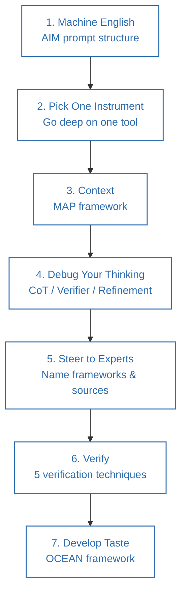
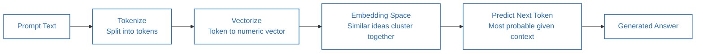
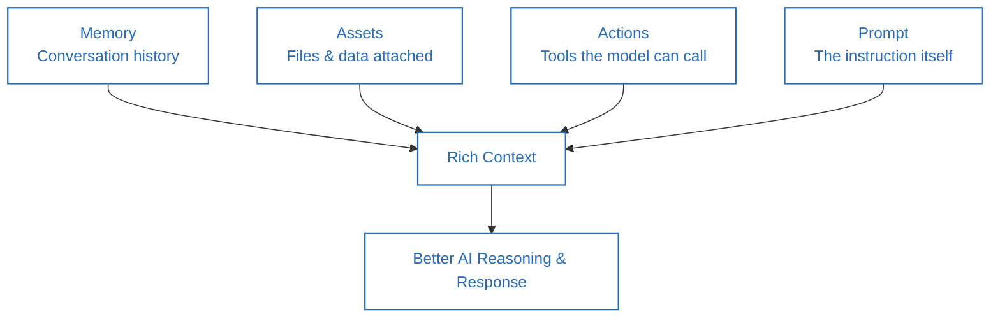

**Source video:** [You're Not Behind (Yet): How to Learn AI in 17 Minutes](https://www.youtube.com/watch?v=EWFFaKxsz_s) — Sandeep Swadia (YouTube: *theMITmonk*)
**Credit:** The seven-step roadmap and the AIM, MAP, and OCEAN acronyms are the video's original framework (AIM is reused/extended from the First Principles video). Section 6 connects these to established prompt-engineering literature.

---

## 1. Summary

- Generative AI models **predict** language, they don't understand it — they break text into tokens, convert tokens into numerical vectors placed in an "embedding space" where similar ideas sit close together, and generate the *most statistically likely* next token given context.
- **A vague prompt produces a vague guess; a sharp prompt produces a sharp guess** — this is the core reason prompting technique matters.
- The video lays out a **7-step, 30-day roadmap**: (1) learn "machine English" via the **AIM** prompt structure, (2) pick one AI tool and go deep instead of tool-hopping, (3) supply rich context via the **MAP** framework, (4) debug your own thinking with three iterative prompt patterns, (5) steer AI away from generic answers toward named experts/frameworks, (6) verify outputs using five techniques, and (7) develop "taste" using the **OCEAN** framework.
- The meta-point: every prompt you refine is also training *you* — the discipline transfers beyond AI use.

---

## 2. Thinking Framework

### The 7-Step Roadmap

| Step | Name | Core Idea |
|---|---|---|
| 1 | **Machine English (AIM)** | Actor, Input, Mission — structure every prompt instead of chatting casually |
| 2 | **Pick One Instrument** | Go deep on a single AI tool for week one rather than sampling many tools shallowly |
| 3 | **Context (MAP)** | Memory, Assets, Actions, Prompt — the four inputs that determine answer quality |
| 4 | **Debug Your Thinking** | When output is weak, the fault is usually your prompt, not the model — iterate using three patterns |
| 5 | **Steer to Experts** | Explicitly name frameworks/experts/sources in the prompt to move answers from average to sharp |
| 6 | **Verify** | Five techniques to separate real answers from confident-sounding fabrication |
| 7 | **Develop Taste (OCEAN)** | Push AI output toward something distinctive, evidenced, and opinionated — not generic |

### AIM (Prompt Structure)
- **Actor** — who the model is acting as.
- **Input** — the context/data it needs.
- **Mission** — what "done" looks like.

### MAP (Context Framework)
- **M — Memory:** conversation history/notes carried over between sessions.
- **A — Assets:** files, data, or resources you attach/paste in.
- **A — Actions:** tools the model can call (web search, file access, code execution, etc.).
- **P — Prompt:** the instruction itself.

### Three Debugging Patterns
1. **Chain of thought:** "Think step by step. Show your reasoning, then give the final concise answer."
2. **Verifier pattern:** "Ask me three questions, one at a time, that would clarify my intent — then combine what you've learned and try again."
3. **Refinement pattern:** "Before answering, propose two sharper versions of my question and ask which one I prefer."

### Five Verification Techniques
1. **Assumptions** — "List every assumption you made and rank each by confidence."
2. **Sources** — "Cite two independent sources for each major claim, with title, URL, and a one-line quote."
3. **Counter-evidence** — "Find one credible source that disagrees with your answer and explain the discrepancy."
4. **Auditing** — "Recompute every figure. Show your math or code."
5. **Cross-model verification** — run the same prompt in multiple models (e.g., ChatGPT, Gemini, Claude) and have one critique the other's output.

### OCEAN (Developing Taste)
- **O — Original:** "Give me three angles no one else has thought about; label one as risky."
- **C — Concrete:** "Back every claim with one real example" (names, numbers, specifics).
- **E — Evident:** "Show your logic in three bullets before the final answer."
- **A — Assertive:** "Pick a side. State your thesis, defend it, address the best counterpoint."
- **N — Narrative:** "Write it like a story — hook, problem, insight, proof, action."

---

## 3. Act / Applying the Framework

**Week 1 — Machine English & Your Instrument**
1. Rewrite one habitual vague prompt (e.g., "fix my resume") into full AIM structure (Actor / Input / Mission).
2. Pick a single AI tool for the week (ChatGPT, Gemini, or Claude) and use only that one — learn its "personality," strengths, and limits before comparing tools.
3. By the end of the week, be able to write a structured AIM prompt without consciously thinking about the format.

**Week 2 — Context & Debugging**
4. For your next serious task, deliberately supply all four MAP elements: recap relevant memory, attach real assets/files, specify which actions/tools the model should use, and only then write the prompt.
5. When an output disappoints, don't blame the model — ask which of the three debug patterns (chain-of-thought, verifier, refinement) would have produced a better result, and re-run it.

**Week 3 — Steering & Verification**
6. Replace one generic prompt with an expert-anchored version (e.g., name specific frameworks, researchers, or organizations you want the answer to draw on). If you don't know the experts, ask AI to list them first, then feed that list back in.
7. Before accepting any factual claim from AI, run at least one of the five verification techniques — sources and cross-model verification are the fastest habits to build first.

**Week 4 — Taste**
8. Take one AI-generated draft and push it through the OCEAN checklist — for each letter, either confirm the draft passes or issue a follow-up prompt to fix it.
9. Treat AI as a sparring partner, not a vending machine: argue with its output, push back, and require it to defend its stance.

**Ongoing:** track the version of your own thinking as it improves — the discipline of demanding rigor from AI output is the same discipline that sharpens your own reasoning.

---

## 4. Details of Topics Discussed in the Video

- **How LLMs actually generate text:** text is split into tokens; each token becomes a multi-dimensional numerical vector; vectors live in an embedding space where semantically related concepts cluster together; the model predicts the most probable next token given context — illustrated with "Humpty Dumpty sat on a ___" and how "wall" is more probable than "roof" given training data patterns (compared to Google autocomplete, which works similarly).
- **Why vague prompts fail:** since AI is fundamentally a "guessing machine," vague input produces vague, generic output; sharp input produces sharp output.
- **The AIM example (resume review):** contrasting "fix my resume" with a full AIM prompt that assigns a persona ("world's most sought-after résumé editor"), supplies input (the resume + job description), and states the mission (10 specific, measurable improvement ideas).
- **The "pick one instrument" analogy:** cites a Frontiers in Psychology study finding that drummers learn guitar faster than complete beginners — not because of shared melody skills, but because deep practice with one instrument builds transferable pattern-recognition and practice discipline; the speaker relates this to his own experience moving from drums to guitar.
- **Tool guidance:** ChatGPT recommended as the most mature/general option; Gemini for those embedded in Google's ecosystem; Claude for more business/project-based AI work.
- **Why context (MAP) matters:** without memory, assets, or actions, the model has "no grounding" — it's reasoning inside "a mathematical space filled with billions of numbers," and context is what maps that space to your specific situation.
- **The origin of prompt engineering, personally:** the speaker recounts frustration with an early GPT model before "prompt engineering" was even a recognized term, framing prompting as *iteration*, not typing — the model can even be asked directly, "What did you do, and why did you choose that answer?"
- **Why verification matters:** AI can state confident-sounding falsehoods (the video's example: a fabricated statistic like "68% of Americans are getting divorced") with the same tone of confidence as a correct answer, because generative models are designed to generate plausible content, not to retrieve verified facts.
- **Why "taste" is the final differentiator:** by week 3–4, most people can get technically correct AI output, but it reads generically (like every other AI-generated LinkedIn post); OCEAN is presented as the way to push output toward something that "sounds like you."
- **Closing framing:** the speaker positions AI as restoring human worth rather than replacing human work, framing the whole 30-day system as a way to train your own judgment, not just the model's output.

---

## 5. Diagrams

### The 7-Step, 30-Day Roadmap

### How an LLM Turns a Prompt into an Answer

### MAP: The Four Inputs That Build Context

---

## 6. Learnings from Additional Sources (Connecting the Concepts)

- **The tokenization/embedding explanation matches how transformer-based LLMs actually work at a high level**: text is broken into subword tokens, mapped to vector embeddings, and the model predicts the next token via a learned probability distribution — a simplified but accurate description consistent with the original Transformer architecture (Vaswani et al., "Attention Is All You Need," 2017) that underlies models like GPT, Gemini, and Claude.
- **AIM (Actor–Input–Mission) is a specific packaging of role-based prompting**, a technique also documented in formal prompt-engineering guides: giving a model a role/persona, supplying relevant context, and stating a clear task and output format are core recommendations in Anthropic's own prompt-engineering documentation, as well as in OpenAI's prompting guides.
- **The "chain of thought" debug pattern is drawn directly from a well-studied technique in the AI research literature**: Wei et al.'s 2022 paper "Chain-of-Thought Prompting Elicits Reasoning in Large Language Models" showed that asking a model to reason step-by-step measurably improves accuracy on complex tasks — the video's advice to say "think step by step" is a plain-language version of this finding.
- **The five verification techniques map onto the broader problem of "hallucination" in generative AI** — a well-documented failure mode where models generate fluent, confident, but factually incorrect content. Techniques like requiring cited sources, cross-model comparison, and independent fact-checking are standard mitigations discussed in AI safety and reliability literature, and closely resemble "grounding" and "retrieval-augmented generation (RAG)" strategies used to reduce hallucination in production AI systems.
- **"Steer to experts" is a lightweight, prompt-level version of retrieval-augmented generation (RAG)** — instead of connecting the model to an external database, you're manually anchoring its output to named, credible sources within the prompt itself, which measurably narrows the space of "average" answers the model draws from.
- **The OCEAN framework overlaps with classic persuasive-writing and critical-thinking principles** — the emphasis on originality, concrete evidence, visible reasoning, a clear stance, and narrative structure mirrors long-standing journalism and argumentative-writing guidance (e.g., the "show, don't tell" principle, and Toulmin's model of argument: claim, evidence, warrant).

---

## 7. References

1. Sandeep Swadia (theMITmonk), ["You're Not Behind (Yet): How to Learn AI in 17 Minutes"](https://www.youtube.com/watch?v=EWFFaKxsz_s), YouTube.
2. Vaswani, A. et al. (2017). "Attention Is All You Need." *NeurIPS* — foundational Transformer architecture underlying modern LLM tokenization/embedding behavior.
3. Wei, J. et al. (2022). "Chain-of-Thought Prompting Elicits Reasoning in Large Language Models." *NeurIPS.*
4. Anthropic, [Prompt Engineering Overview](https://docs.claude.com/en/docs/build-with-claude/prompt-engineering/overview) — official guidance on role-based prompting, context, and chain-of-thought techniques.
5. Lewis, P. et al. (2020). "Retrieval-Augmented Generation for Knowledge-Intensive NLP Tasks." *NeurIPS* — background on RAG/grounding as a hallucination mitigation strategy.
6. Toulmin, S. (1958). *The Uses of Argument* — classical model of claim/evidence/warrant argumentation, relevant to the OCEAN framework's "assertive" and "evident" components.