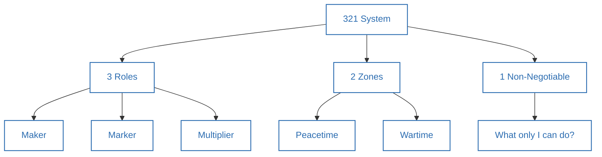
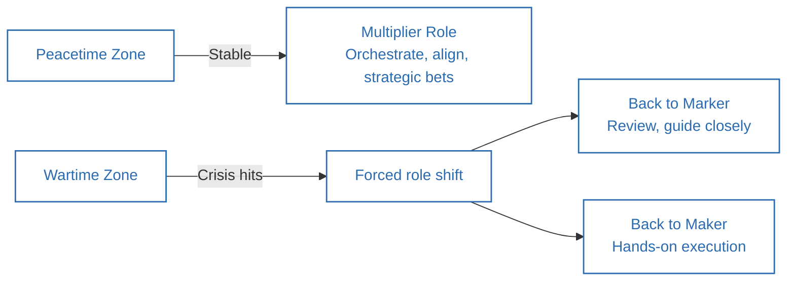
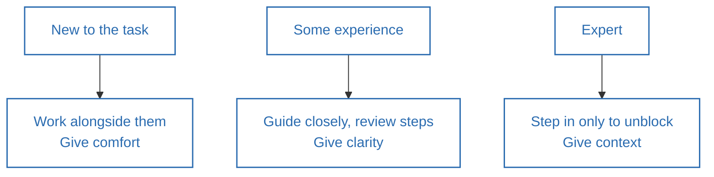

**Source video:** [How To Manage Your Time Like a CEO](https://www.youtube.com/watch?v=HwwqlLJAZhM) — Sandeep Swadia (YouTube: *theMITmonk*)
**Credit:** The "321 System" (3 roles, 2 zones, 1 non-negotiable) and the trust-management model are the video's original framework. Section 6 connects these to established management literature.

---

## 1. Summary

- Top performers don't manage **time** — they manage **attention**. Everyone gets the same 168 hours a week; the difference is what they're playing for.
- The **321 System**: **3 Roles** you might be playing (Maker, Marker, Multiplier), **2 Zones** you might be in (Wartime, Peacetime), and **1 Non-Negotiable** — the single thing only you can do, which you protect while delegating everything else.
- Your **role must match your zone**, and your zone can force you to shift roles temporarily (a multiplier can be pulled back into marker or maker mode during a crisis).
- Beyond the 321 System, **delegation only works if you manage trust, not just tasks** — the right level of involvement depends on the other person's experience level.
- Core principle: *you cannot control time, you can only steward it.*

---

## 2. Thinking Framework

### The 3-2-1 System

**3 Roles**

| Role | When it applies | What you do |
|---|---|---|
| **Maker** | Handful of priorities / individual contributor | Deep work yourself: details, diligence, hands-on execution |
| **Marker** | 10–20 priorities, leading a team | You review and edit others' work (give feedback, don't rewrite); build processes; delegate |
| **Multiplier** | 30–50+ responsibilities, large team | You recruit, orchestrate, and align — "the most expensive router" (Eric Schmidt); focus on connections and strategic bets, not details |

**2 Zones**

| Zone | Description | Effect on role |
|---|---|---|
| **Peacetime** | Stable growth, systems working | Multiplier mode is appropriate — hire well and get out of the way |
| **Wartime** | Crisis, existential threat, rapid change | Zone forces you back down — multiplier → marker, or marker → maker — "all bets are off" |

**1 Non-Negotiable**
- The one question to ask: *"What is the one thing that only I can do?"* — identify it, protect time for it, and delegate everything else around it (while still maintaining the operating rhythm: standups, leadership meetings, etc.).

### Trust Management (How to Delegate Well)

| Teammate's experience | Your posture | How you build trust |
|---|---|---|
| **New to the task** | Work alongside them | Give comfort |
| **Some experience** | Guide closely, review steps | Give clarity |
| **Expert** | Step in only to unblock | Give context |

---

## 3. Act / Applying the Framework

1. **Identify which role you're actually in right now** (Maker / Marker / Multiplier) — don't default to the role that worked at your last level.
2. **Identify which zone you're in** (Peacetime / Wartime) — if you're in wartime, expect to temporarily take on more hands-on work than your title suggests, and don't feel guilty about it.
3. **Write down your one non-negotiable** — the single thing only you, specifically, can do — and protect calendar time for it before anything else gets scheduled.
4. **Audit your delegation by trust level, not by task type** — for each person/task, decide: work alongside (new), guide closely (some experience), or step back and only unblock (expert). Giving a new hire too much freedom sets them up to fail; micromanaging an expert makes them quit.
5. **Keep your "operating rhythm" intact even while delegating** — standups, leadership meetings, and key touchpoints still happen; delegation isn't disappearing, it's redirecting your personal time.
6. **Re-check your role/zone/non-negotiable periodically** — these aren't set-once; Airbnb's founder had to consciously move from multiplier back to marker/maker when the zone changed.
7. **This week, pick one action:** define your role, name your zone, write your one non-negotiable, or delegate one repeatable task using the trust-management posture that matches the person's experience level.

---

## 4. Details of Topics Discussed in the Video

- **Opening framing:** Jack Dorsey running Twitter and Square simultaneously, and Elon Musk running multiple companies, with the same 168 hours as everyone else — used to argue that attention management, not time-blocking tactics alone, is the real lever.
- **Taylor Swift as the "3 roles" example:** early career = pure Maker (writing/recording songs herself); today she must write, produce, record, perform, make videos, run business operations, philanthropy, and brand partnerships simultaneously — illustrating that "what got you here won't get you there" (a line attributed to executive coach Marshall Goldsmith), and that her early-career time-management approach would fail her now.
- **Maker role in depth:** appropriate for individual contributors with a handful of clear priorities; "stay in late, stay in your lane, heads down"; described as a fully legitimate long-term career path, not just a stepping stone.
- **Marker role in depth:** you become "the editor" — you give feedback and refine others' work rather than redoing it yourself; you build processes and delegate, while staying hands-on for anything mission-critical.
- **Multiplier role in depth:** referencing Eric Schmidt's description of a senior leader as "the most expensive router" — job is to recruit, orchestrate, align, and make strategic bets, not to create or even review most output directly.
- **Airbnb / Brian Chesky (2 zones example):** 2016–2020, Chesky followed standard multiplier advice ("hire great people and get out of their way") while the business grew; when COVID hit and growth stalled/costs exploded (2020), he had to shift back into a hands-on marker/maker role — removing leadership layers, getting personally involved in product decisions — leading to 500+ product improvements in 3 years and a return to profitability.
- **The speaker's own "1 non-negotiable" story:** as CEO of a top-20 fastest-growing U.S. tech company (per the Deloitte Fast 500) operating in constant wartime-zone chaos, he identified that his personal non-negotiable was building mission-driven relationships (with people and customers) — and delegated the rest, while still keeping standard operating-rhythm meetings (daily standups, weekly leadership/product/tech/finance meetings).
- **Steve Jobs and Jony Ive (trust management example):** their daily lunch/walk ritual, discussing business, design, and aesthetics in detail — Ive reportedly never felt micromanaged because Jobs was "in the details to learn, not to control," illustrating the "trust, not time" management principle.
- **Closing principle:** "You cannot control time. You can only steward the time you have" — framed as an invitation to apply the system beyond work, to relationships and personal life as well.

---

## 5. Diagrams

### The 3-2-1 System

### How Zone Forces Role Shifts

### Trust Management by Experience Level

---

## 6. Learnings from Additional Sources (Connecting the Concepts)

- **The Maker/Marker/Multiplier progression closely parallels Paul Graham's well-known essay "Maker's Schedule, Manager's Schedule"** (2009), which distinguishes between individual-contributor time (needing long, uninterrupted blocks) and management time (naturally chopped into hour-long meeting slots) — the video adds a third tier (Multiplier) for leaders operating above direct management.
- **The trust-management model (work alongside / guide closely / step in to unblock) mirrors the Situational Leadership Model** (Hersey & Blanchard, 1969), which similarly recommends adjusting leadership style — directing, coaching, supporting, or delegating — based on a team member's competence and commitment level for a given task, not a fixed personal leadership style.
- **The "wartime CEO vs. peacetime CEO" distinction is a well-known concept in startup/venture circles**, popularized by investor Ben Horowitz (Andreessen Horowitz) in his writing and in *The Hard Thing About Hard Things* (2014) — Horowitz explicitly argues that the leadership behaviors that work in stable growth periods can be actively harmful during existential crises, and vice versa.
- **The "one non-negotiable" idea overlaps with Peter Drucker's concept of the "effective executive"** (*The Effective Executive*, 1967), which argues that senior leaders' primary responsibility is deciding what *not* to do and concentrating personal effort on the few things only they can contribute — and with Greg McKeown's *Essentialism* (2014), built around the same "what is essential" filtering question.
- **Eric Schmidt's "most expensive router" framing** appears in his and Jonathan Rosenberg's book *How Google Works* (2014) and related talks, describing how senior leaders at scale add value primarily by routing information, talent, and decisions rather than doing the work themselves.
- **The Airbnb wartime example is publicly documented**: Brian Chesky has spoken and written extensively (including in interviews and Airbnb's own public communications) about flattening Airbnb's management structure and re-engaging directly with product decisions during 2020, a case frequently cited in leadership/management commentary as an example of zone-driven role-switching.

---

## 7. References

1. Sandeep Swadia (theMITmonk), ["How To Manage Your Time Like a CEO"](https://www.youtube.com/watch?v=HwwqlLJAZhM), YouTube.
2. Graham, P. (2009). ["Maker's Schedule, Manager's Schedule."](http://www.paulgraham.com/makersschedule.html) paulgraham.com.
3. Hersey, P., & Blanchard, K. H. (1969). "Life Cycle Theory of Leadership" — origin of the Situational Leadership Model.
4. Horowitz, B. (2014). *The Hard Thing About Hard Things*. HarperBusiness — background on "wartime vs. peacetime" leadership.
5. Drucker, P. F. (1967). *The Effective Executive*. Harper & Row.
6. McKeown, G. (2014). *Essentialism: The Disciplined Pursuit of Less*. Crown Business.
7. Schmidt, E., & Rosenberg, J. (2014). *How Google Works*. Grand Central Publishing — origin of the "most expensive router" concept.