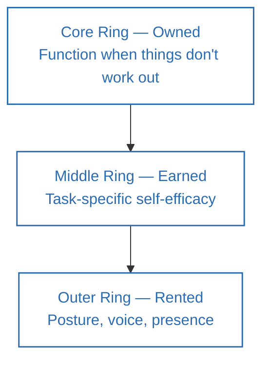
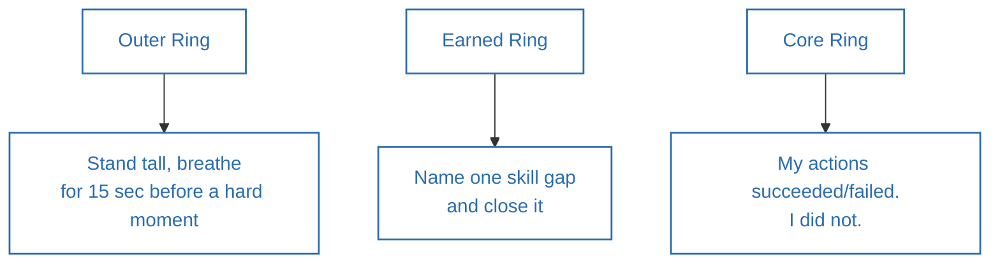

**Source video:** [The ONE Skill Every High Performer Needs To Master](https://www.youtube.com/watch?v=5D0RV5AqFh4) — Sandeep Swadia (YouTube: *theMITmonk*)
**Credit:** The Three-Ring Model (rented/earned/owned confidence) and its associated weekly action items are the video's original framework. Section 6 connects these to established psychological research the video draws on and around.

---

## 1. Summary

- Confidence is widely misunderstood: **71% of CEOs report imposter syndrome**, and research shows the *least* skilled people are often the *most* visibly confident (the Dunning-Kruger effect), while genuine experts underestimate themselves.
- Confidence is not binary ("born with it" vs. "fake it") — it has **three distinct layers**: **Rented** (performance-based, borrowed, collapses under scrutiny), **Earned** (task-specific self-efficacy), and **Owned** (durable capacity to function when things don't work out).
- **Action precedes confidence, not the other way around** — the brain updates its self-model through repeated action and recovery from failure, not through positive thinking.
- **Rehearsal, not "faking it," is the real mechanism** behind visible confidence — you practice the behavior before it feels natural ("act till you become it," not "fake it till you make it").
- **Quiet confidence often outperforms loud confidence** — Jim Collins' "Level 5 leaders" and the counterintuitive finding that higher-imposter-syndrome employees often receive the *best* performance reviews.
- **Self-compassion, not outcome-dependent self-esteem, is the most durable foundation of confidence** (Kristin Neff's research).

---

## 2. Thinking Framework

### The Three-Ring Model of Confidence

| Ring | Source | Characteristics | Risk |
|---|---|---|---|
| **Outer — Rented** | Performance: posture, voice, room presence | Fast to project, works short-term | Collapses the moment the room "knows more than you do" — borrowed, must be "returned" |
| **Middle — Earned** | Task-specific competence (Bandura's *self-efficacy*) | Real and deep, but domain-specific (a confident surgeon may be an anxious public speaker) | Doesn't transfer automatically across domains |
| **Core — Owned** | Not dependent on outcomes or recognition | Your capacity to function *when things don't work out* | Requires deliberate building through action + self-compassion, not innate |

### The Behavior-First Sequence

Most people assume: *feel confident → then act.* The evidence points the other way:

**Act → Brain survives it / updates its self-model → Confidence follows**

### Three Weekly Action Items (One per Ring)

1. **Outer ring:** Before a hard conversation/presentation, stand tall, take up space, breathe deeply for 15 seconds — to prepare yourself, not to perform for others.
2. **Middle ring:** Identify one specific skill gap in your domain and start closing it.
3. **Core ring:** After any success or rejection, write one sentence: *"My actions succeeded or failed — I did not succeed or fail."* (Separating self from outcome.)

---

## 3. Act / Applying the Framework

1. **Take one small, real risk this week** — not a giant leap, just one conversation, idea, or room you've been avoiding. Confidence is built through recovery from rejection, not through avoiding it.
2. **Rehearse before high-stakes moments**, the way musicians do sound checks even on a long tour: picture the room, know your first few minutes, give yourself simple instructions (e.g., "slow your breathing") on the way in.
3. **Separate your identity from your outcomes** — after a win or a loss, write: "My actions succeeded/failed. I did not."
4. **When something goes wrong, write yourself a self-compassion letter** — the way you'd write to a close friend going through the same setback: how would you help them forgive themselves and move forward?
5. **Don't mistake volume for competence** — if you notice you're the loudest person in a room but not the most correct, that's Rented confidence; invest instead in the Earned and Owned rings.
6. **Build Earned confidence deliberately** — pick one specific weak skill in your domain and close the gap through real practice (the speaker's example: identifying corporate finance as a career gap and working in investment banking to close it).
7. **Notice your self-doubt without treating it as disqualifying** — the MIT Sloan finding (highest imposter-syndrome individuals received the best performance reviews) suggests doubt can coexist with — and even drive — strong performance.

---

## 4. Details of Topics Discussed in the Video

- **Dunning-Kruger effect (Cornell, Justin Kruger and David Dunning):** experts tend to *underestimate* their ability, while people with limited knowledge tend to *overestimate* theirs — a "double burden," since being unskilled also makes you unaware you're unskilled. (The video itself notes that some researchers have since questioned the precise statistical methodology behind the original study, while the core observation — ignorance often *feels* like confidence — still generally holds.)
- **UC Berkeley overconfidence-and-status study:** overconfident people gain higher status in groups; critically, even after the group later discovers the person was bluffing, their elevated status tends to persist — creating a perverse incentive to project confidence regardless of actual competence.
- **Why "fake it till you make it" is incomplete:** Rented confidence (posture, projection, reading the room) works short-term but "collapses" the moment the room actually knows more than you — described as confidence that is "borrowed," with the implicit obligation to eventually "return the car."
- **Albert Bandura's self-efficacy concept (Stanford), used for the middle ring:** belief in your ability to perform a *specific* task — real and durable, but local to that domain (example given: a surgeon confident in the operating room but uncomfortable delivering bad news to a patient).
- **The innermost, Owned ring:** defined not as confidence that things will work out, but as the capacity to function when they don't — independent of external recognition or a proven track record.
- **Why action precedes confidence:** framed as a brain-updating process — you have to act first (repeatedly) for the brain to slowly revise its self-model; this is presented as the mechanism underlying *all* the anecdotes that follow.
- **Sara Blakely (Spanx):** her father's nightly dinner-table question was "what did you fail at today?" (disappointed if she had nothing to report); years of door-to-door fax-machine sales rejection built the resilience that later underpinned her billion-dollar company — used to show confidence built through repeated failure, not talent.
- **Other examples cited (without deep elaboration):** Fred Smith (FedEx), Howard Schultz (Starbucks), Serena Williams, J.K. Rowling — all framed as people who "kept going" despite repeated rejection/failure.
- **Rehearsal, not faking:** the speaker's own pre-meeting ritual (mentally rehearsing the room, the opening minutes, and using breathing cues in the elevator) is compared to musicians doing daily sound checks even on long tours with the same setlist — the point being that rehearsal is preparation, not deception, and outcomes ("the show") are never fully controllable.
- **Jim Collins' "Level 5 Leaders" (*Good to Great*):** studied 1,400+ large companies over 5 years; only 11 achieved sustained "good to great" transitions, and all 11 were led by leaders combining "extreme personal humility" with "fierce professional will" — used to argue that the quietest leaders, not the loudest, produced the best long-term results.
- **MIT Sloan imposter-syndrome/performance study:** employees reporting the most frequent imposter thoughts received the *highest* performance reviews from supervisors — used to reframe self-doubt as potentially performance-driving rather than performance-destroying.
- **Kristin Neff (University of Texas) self-compassion research:** people who treat themselves less harshly during setbacks are more willing to take on harder challenges and try again — presented as the actual mechanism underlying durable, "core ring" confidence, distinct from outcome-based self-esteem ("building on sand").
- **Closing image:** water carving the Grand Canyon — used as a metaphor for quiet, non-dominating confidence that nonetheless reshapes everything around it over time.

---

## 5. Diagrams

### The Three-Ring Model of Confidence

### The Behavior-First Confidence Loop

### Three Weekly Action Items by Ring

---

## 6. Learnings from Additional Sources (Connecting the Concepts)

- **Bandura's self-efficacy theory** (Bandura, 1977, "Self-efficacy: Toward a Unifying Theory of Behavioral Change," *Psychological Review*) is a foundational, well-replicated construct in psychology, distinguishing task-specific self-efficacy from general self-esteem — directly underlying the video's "Earned" ring.
- **The Dunning-Kruger effect** (Kruger & Dunning, 1999, "Unskilled and Unaware of It," *Journal of Personality and Social Psychology*) is real but has faced methodological critique in recent years — some researchers (e.g., Nuhfer et al., and a widely-discussed 2020 analysis by Gilles Gignac) argue part of the original effect can be explained by statistical artifacts (regression to the mean / "better than average" self-report bias) rather than a pure metacognitive deficit. The video itself flags this nuance, which is worth preserving rather than treating the effect as beyond question.
- **"Rented confidence collapsing" connects to the broader literature on overconfidence and status**, including work by Cameron Anderson and colleagues at UC Berkeley's Haas School of Business showing that overconfident displays can raise perceived status even independent of actual competence — with status effects sometimes persisting even after the overconfidence is exposed, a striking and somewhat unsettling finding in the organizational-behavior literature.
- **The idea that "behavior shapes identity" and rehearsal builds real confidence connects to Cognitive Behavioral Therapy's concept of "behavioral activation"** — a well-established clinical technique where taking action (even before motivation or confidence is present) is used to shift mood and self-belief, rather than waiting to "feel ready" first.
- **The "act till you become it" framing is closely related to identity-based habit change**, popularized by James Clear in *Atomic Habits* (2018) — the idea that repeated small actions gradually reshape self-identity, rather than self-identity needing to change first.
- **Amy Cuddy's "power posing" research** is a natural point of comparison for the "outer ring" (posture/voice/room presence) — but it's worth noting this specific research has faced significant replication difficulties since roughly 2015–2017, and even one of the original co-authors later distanced herself from the hormonal-change claims (though the broader link between posture and *self-perceived* confidence has more support than the original hormonal claims did). This is a useful caution against over-relying on the "outer ring" alone, which the video itself frames as the weakest, most collapsible layer.
- **Jim Collins' Level 5 Leadership** (*Good to Great*, 2001, HarperBusiness) remains one of the most cited findings in leadership research connecting humility with sustained organizational performance, complementing the video's "quiet confidence" argument.
- **Kristin Neff's self-compassion research** (Neff, 2003 onward, University of Texas at Austin) is a well-established, separate research program from self-esteem research, consistently finding that self-compassion — rather than self-esteem — predicts resilience after failure, directly supporting the video's "core ring" claims.

---

## 7. References

1. Sandeep Swadia (theMITmonk), ["The ONE Skill Every High Performer Needs To Master"](https://www.youtube.com/watch?v=5D0RV5AqFh4), YouTube.
2. Bandura, A. (1977). "Self-efficacy: Toward a unifying theory of behavioral change." *Psychological Review*, 84(2), 191–215.
3. Kruger, J., & Dunning, D. (1999). "Unskilled and unaware of it: How difficulties in recognizing one's own incompetence lead to inflated self-assessments." *Journal of Personality and Social Psychology*, 77(6), 1121–1134.
4. Gignac, G. E., & Zajenkowski, M. (2020). A re-examination of the statistical basis of the Dunning-Kruger effect.
5. Anderson, C., et al. — UC Berkeley Haas School of Business research on overconfidence and social status.
6. Collins, J. (2001). *Good to Great: Why Some Companies Make the Leap... and Others Don't*. HarperBusiness — origin of "Level 5 Leadership."
7. Neff, K. D. (2003). "Self-compassion: An alternative conceptualization of a healthy attitude toward oneself." *Self and Identity*, 2(2), 85–101.
8. Clear, J. (2018). *Atomic Habits*. Avery — background on identity-based habit change.
9. Cuddy, A. (2012 TED talk; subsequent research and replication debate, 2015–2017) — background and caveats on "power posing."