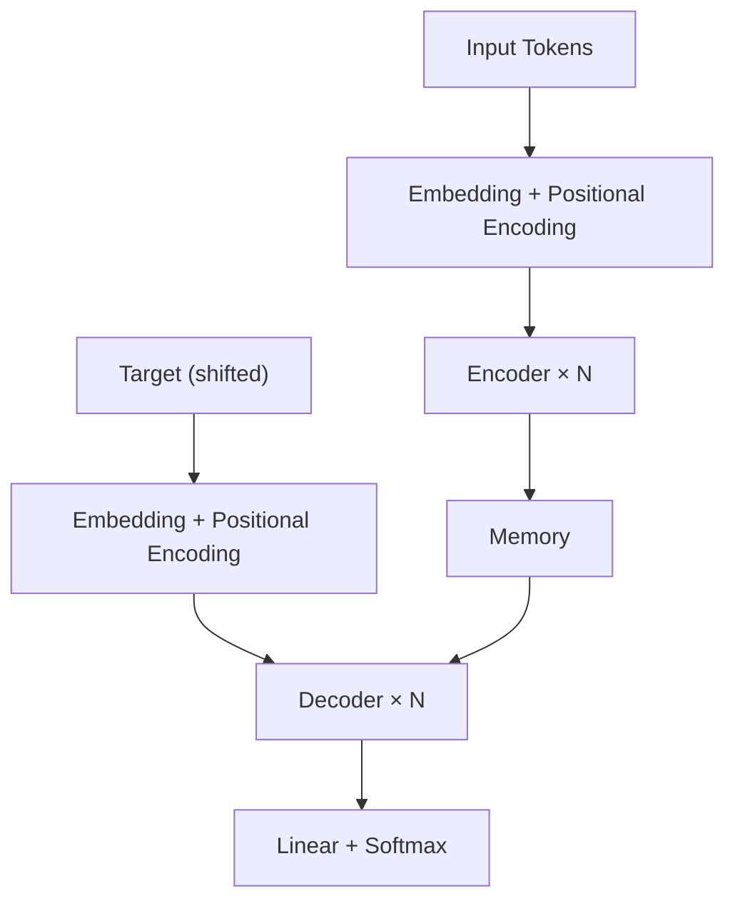

---
# ======================================================================
# YAML Frontmatter — metadata for py/build.py
# ======================================================================
title: "Attention Is All You Need — A Practitioner's Walkthrough"
subtitle: >
  Re-deriving scaled dot-product attention from first principles, with annotated
  PyTorch code, mermaid architecture diagrams, and a discussion of why positional
  encoding works the way it does.
category: technical
date: 2024-01-12
tags:
  - transformers
  - attention
  - pytorch
  - nlp
reading_time: 12
author: "Shreedhar Kodate"
output: "blogs/technical/posts/intro-to-transformers.html"
# requires: [highlight, katex, mermaid]   # CDN libraries to include
---

## Motivation

The 2017 paper *Attention Is All You Need* [^1] replaced recurrent networks with a pure
attention mechanism and changed the trajectory of NLP permanently. This walkthrough
rebuilds each piece from scratch so the intuition is clear before the math arrives.

> The dominant sequence transduction models are based on complex recurrent or convolutional
> neural networks. We propose a new simple network architecture, the Transformer, based solely
> on attention mechanisms.
>
> — Vaswani et al., 2017

## The Problem With RNNs

Recurrent networks process tokens one at a time. Each hidden state `h_t` depends on `h_{t-1}`:

- Training cannot be parallelised across time steps.
- Long-range dependencies cause vanishing / exploding gradients.

> [!NOTE]
> LSTMs mitigate but do not eliminate the long-range dependency problem. Attention removes
> the path-length bottleneck entirely: any two positions interact in O(1) operations.

## Scaled Dot-Product Attention

Given queries **Q**, keys **K**, and values **V**, attention is:

$$
\text{Attention}(Q, K, V) = \text{softmax}\!\left(\frac{QK^\top}{\sqrt{d_k}}\right) V
$$

```python
import math
import torch
import torch.nn.functional as F

def scaled_dot_product_attention(Q, K, V, mask=None):
    d_k = Q.size(-1)
    scores = torch.matmul(Q, K.transpose(-2, -1)) / math.sqrt(d_k)
    if mask is not None:
        scores = scores.masked_fill(mask == 0, float('-inf'))
    weights = F.softmax(scores, dim=-1)
    return torch.matmul(weights, V), weights
```

## Multi-Head Attention

$$
\text{MultiHead}(Q,K,V) = \text{Concat}(\text{head}_1, \ldots, \text{head}_h)\,W^O
$$

## Architecture Overview



## Positional Encoding

$$
PE_{(pos,2i)} = \sin\!\left(\frac{pos}{10000^{2i/d_{\text{model}}}}\right)
\quad
PE_{(pos,2i+1)} = \cos\!\left(\frac{pos}{10000^{2i/d_{\text{model}}}}\right)
$$

## References

[^1]: Vaswani et al. (2017). *Attention is all you need.* NeurIPS.
      https://arxiv.org/abs/1706.03762

[^2]: Rush, A. (2018). *The Annotated Transformer.* Harvard NLP.

[^3]: Alammar, J. (2018). *The Illustrated Transformer.*
