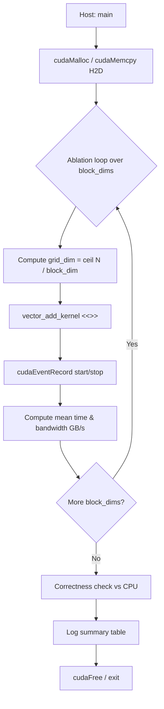

# Tutorial 01: Threads, Blocks & Grids

## Concept

CUDA organizes parallel work in a three-level hierarchy:

```
Grid
 └── Block (shares shared memory, can __syncthreads)
      └── Thread (one GPU lane, threadIdx / blockIdx)
```

Global thread ID (1D): `idx = blockIdx.x * blockDim.x + threadIdx.x`

## Key APIs

| API | Purpose |
|-----|---------|
| `<<<grid, block>>>` | Launch kernel with given grid/block dims |
| `blockIdx.x` | Block index within grid |
| `threadIdx.x` | Thread index within block |
| `blockDim.x` | Threads per block |
| `gridDim.x` | Blocks per grid |

## Execution Flow



## Ablation Results (placeholder)

| block_dim | grid_dim | mean_ms | GB/s |
|-----------|----------|---------|------|
| 32        | 32768    | TBD     | TBD  |
| 64        | 16384    | TBD     | TBD  |
| 128       | 8192     | TBD     | TBD  |
| 256       | 4096     | TBD     | TBD  |
| 512       | 2048     | TBD     | TBD  |

## What to Observe in Nsight Compute

- `sm__throughput.avg.pct_of_peak_sustained_active` — SM utilization
- `l1tex__t_bytes_pipe_lsu_mem_global_op_ld.sum` — global load bytes
- `dram__bytes.sum` — HBM traffic (should equal ~3 × N × 4 bytes)
