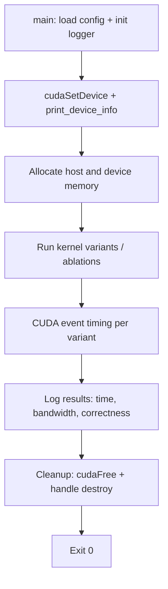

## Concept

See `src/tutorials/05_shared_memory_bank_conflicts/main.cu` for detailed inline comments explaining
each CUDA concept, all API calls, and the ablation experiments.

## Key APIs

Refer to the source file for full API usage and inline explanations.

## Execution Flow



## Ablation Results (placeholder — fill after running on H200)

| Variant | Mean Time (ms) | Bandwidth / GFLOPS | Notes |
|---------|---------------|-------------------|-------|
| TBD     | TBD           | TBD               | TBD   |

## What to Observe in Nsight Compute

Run:
```bash
ncu --set full ./build/bin/tutorial_05_shared_memory_bank_conflicts
```

Key metrics:
- `sm__throughput.avg.pct_of_peak_sustained_active` — SM utilization
- `dram__bytes.sum` — HBM traffic
- `smsp__warp_issue_stalled_long_scoreboard_per_warp` — memory stalls
- `l1tex__t_bytes_pipe_lsu_mem_global_op_ld.sum` — L1/global load bytes