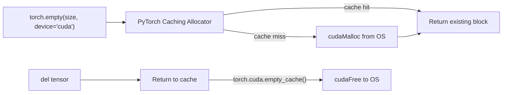
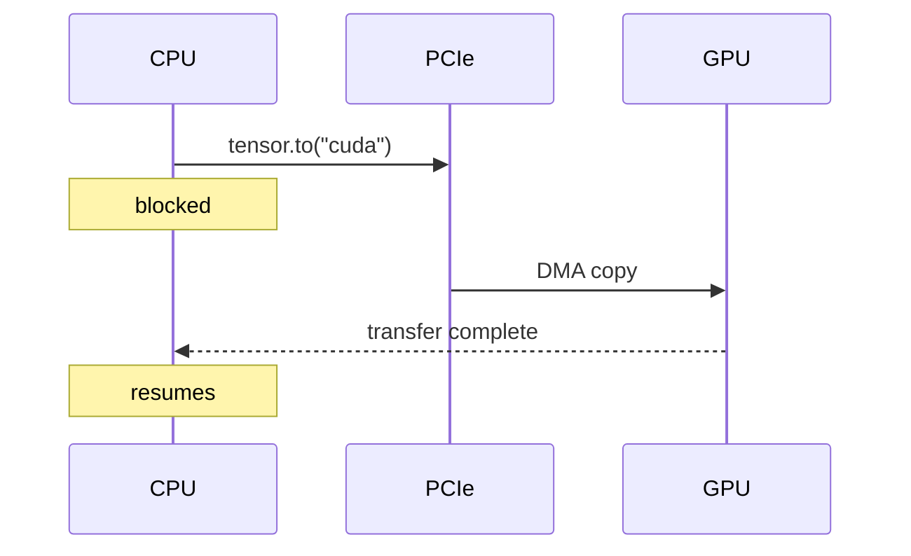
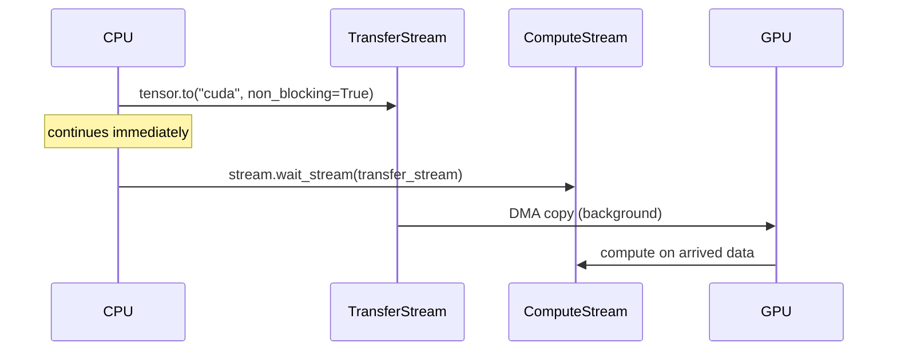
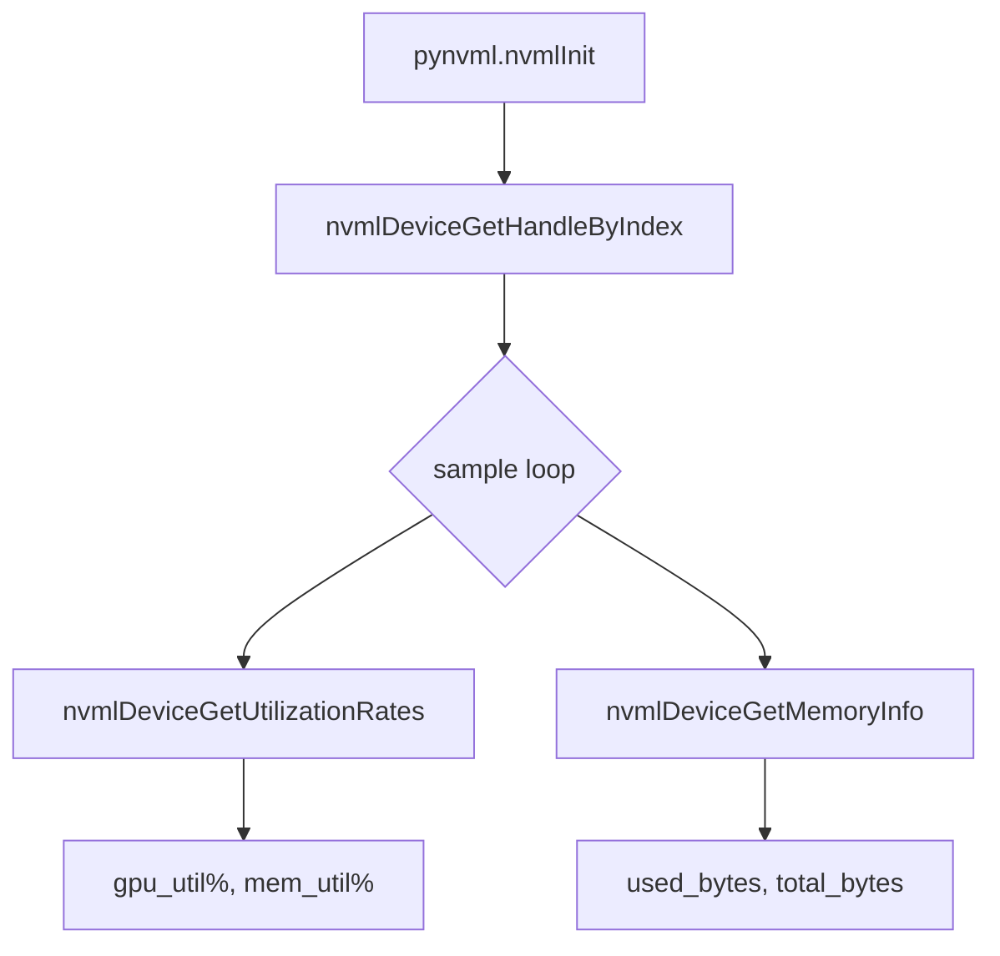

# Module 1 — GPU Basics: Memory & Data Transfer

## Overview

This module teaches the mechanics of GPU memory management and CPU↔GPU data
movement — the foundation every GPU-accelerated workload is built on.

| File | Teaches |
|------|---------|
| `memory_manager.py` | Allocation, pinned memory, `empty_cache()` |
| `data_transfer.py` | Synchronous vs async transfers, CUDA streams, double-buffering |
| `profiler.py` | Utilization sampling via NVML, kernel timing with CUDA Events, `torch.profiler` |

---

## Key Concepts

### GPU Memory Hierarchy

```
CPU (DDR5 RAM)
    │  PCIe 5.0 × 16  (~128 GB/s bidirectional)
    ▼
GPU (H200 HBM3e)  — 141 GB  @ ~3.35 TB/s internal bandwidth
    ├── L2 Cache   (~50 MB)
    ├── L1 / Shared Memory (per SM)
    └── Registers  (per thread)
```

- **HBM3e** bandwidth is ~26× faster than PCIe — keep data on GPU as long as possible.
- **Pinned (page-locked) memory** on the host prevents the OS from paging it out,
  enabling DMA engines to transfer directly without a CPU copy → lower latency and
  higher throughput across PCIe.

### Memory Allocation Flow



> The PyTorch caching allocator avoids expensive `cudaMalloc`/`cudaFree` calls
> on every operation. `empty_cache()` flushes the cache back to CUDA — useful
> when measuring peak memory but slows subsequent allocations.

---

## Data Transfer Patterns

### Synchronous Transfer



- Simple but leaves the CPU idle during transfer.
- Effective bandwidth on H200 via PCIe 5.0: **~64 GB/s per direction**.

### Asynchronous Transfer with CUDA Streams



- `non_blocking=True` requires the source tensor to be **pinned**.
- The CPU never stalls; compute and transfer overlap on the GPU.

### Double-Buffering Pattern

The key pattern for hiding transfer latency in training:

```mermaid
flowchart LR
    subgraph Step N
        T1["Batch N on GPU"] --> C1["Compute (stream A)"]
    end
    subgraph Step N+1
        T2["Batch N+1 transfer (stream B)"] --> W["stream A waits stream B"]
        W --> C2["Compute N+1 (stream A)"]
    end
    Step N --> Step N+1
```

---

## GPU Profiling

### CUDA Event Timing

```python
start = torch.cuda.Event(enable_timing=True)
end   = torch.cuda.Event(enable_timing=True)
start.record()
# ... kernel ...
end.record()
torch.cuda.synchronize()
ms = start.elapsed_time(end)  # GPU-side measurement, no CPU round-trip
```

CUDA Events measure time on the **GPU clock** — far more accurate than
`time.perf_counter()` which includes CPU-GPU sync overhead.

### NVML Utilization Sampling



H200 peak compute: **989 TFLOPS** (FP16), so a well-tuned matmul should approach
that ceiling when measured with CUDA Events.

---

## Running the Module

```bash
# All three scripts read from configs/gpu_basics.yaml

# Memory allocation & pinned memory demo
python -m src.gpu_basics.memory_manager

# PCIe bandwidth benchmark + double-buffering
python -m src.gpu_basics.data_transfer

# GPU utilization profiler + torch.profiler trace
python -m src.gpu_basics.profiler
```

### Key config knobs (`configs/gpu_basics.yaml`)

| Key | Effect |
|-----|--------|
| `logging.level` | `DEBUG` shows per-allocation stats; `INFO` shows summary |
| `memory.use_pinned_memory` | Toggle pinned vs pageable comparison |
| `transfer.num_streams` | Number of CUDA streams for async benchmark |
| `transfer.tensor_shapes` | Matrix sizes to benchmark |
