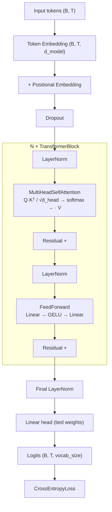
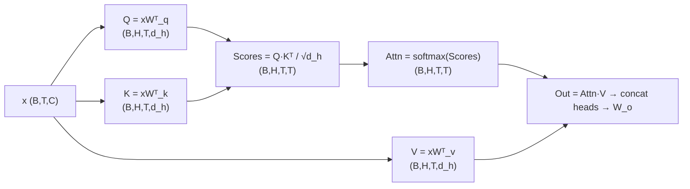
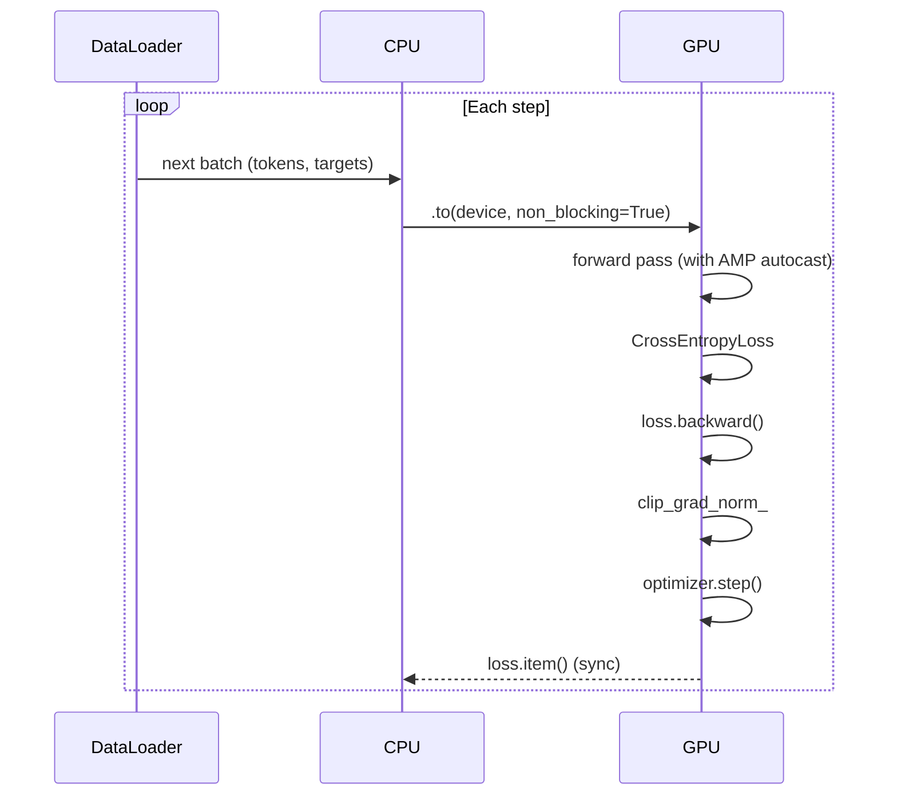
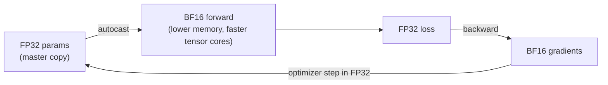

## Overview

This module implements a complete Transformer training loop from scratch,
showing exactly how data and model tensors flow through the GPU.

| File | Teaches |
|------|---------|
| `model.py` | Transformer architecture: embedding, MHA, FFN, residuals |
| `dataset.py` | Synthetic token dataset (no external corpus needed) |
| `trainer.py` | Training loop with AMP, gradient clipping, checkpointing |
| `main.py` | Entry point — reads config, starts training |

---

## Architecture



### Multi-Head Attention (MHA) — Step by Step



**Weight tying**: the output projection head shares weights with the token
embedding matrix — reduces parameter count and improves perplexity.

---

## Training Loop



### Automatic Mixed Precision (AMP)

H200 natively supports **BF16** (better dynamic range than FP16, no loss scaling needed):



- With `bfloat16`: no `GradScaler` needed (no underflow risk).
- With `float16`: `GradScaler` wraps backward to prevent underflow.

### Gradient Clipping

Prevents exploding gradients common in deep Transformers:
```
‖g‖₂ = sqrt(Σ gᵢ²)
if ‖g‖₂ > max_norm:
    g ← g × (max_norm / ‖g‖₂)
```
Configured via `training.gradient_clip_norm` in the YAML.

---

## Memory Breakdown (per GPU, 6-layer model, d_model=512)

| Component | Approx size |
|-----------|------------|
| Parameters (FP32) | ~100 MB |
| Activations (BF16) | ~200 MB (batch=32, seq=128) |
| Gradients (BF16) | ~100 MB |
| Optimizer states (FP32 Adam) | ~200 MB |
| **Total** | **~600 MB** |

H200 has 141 GB — this model fits easily; the config can scale up.

---

## Running

```bash
python -m src.transformer_training.main
```

### Key config knobs (`configs/transformer_training.yaml`)

| Key | Effect |
|-----|--------|
| `training.use_amp` | Enable/disable mixed precision |
| `training.amp_dtype` | `bfloat16` (recommended on H200) or `float16` |
| `training.batch_size` | Increase until GPU memory saturates |
| `model.num_layers` | Depth vs speed tradeoff |
| `logging.level` | `DEBUG` logs every step; `INFO` logs every N steps |