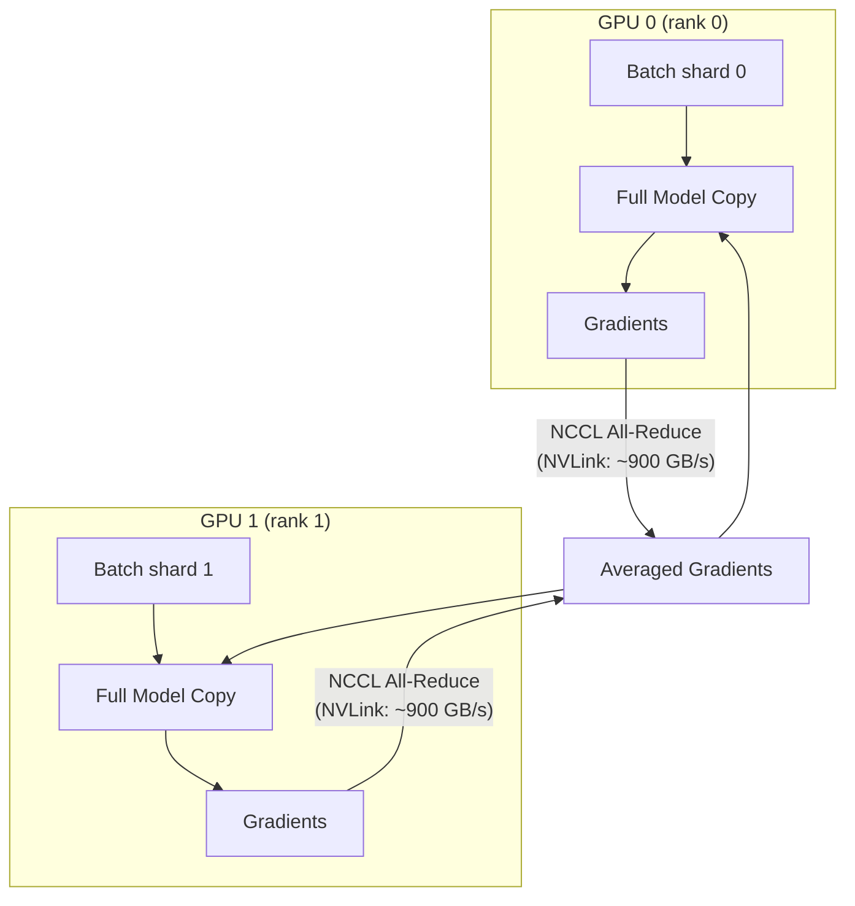
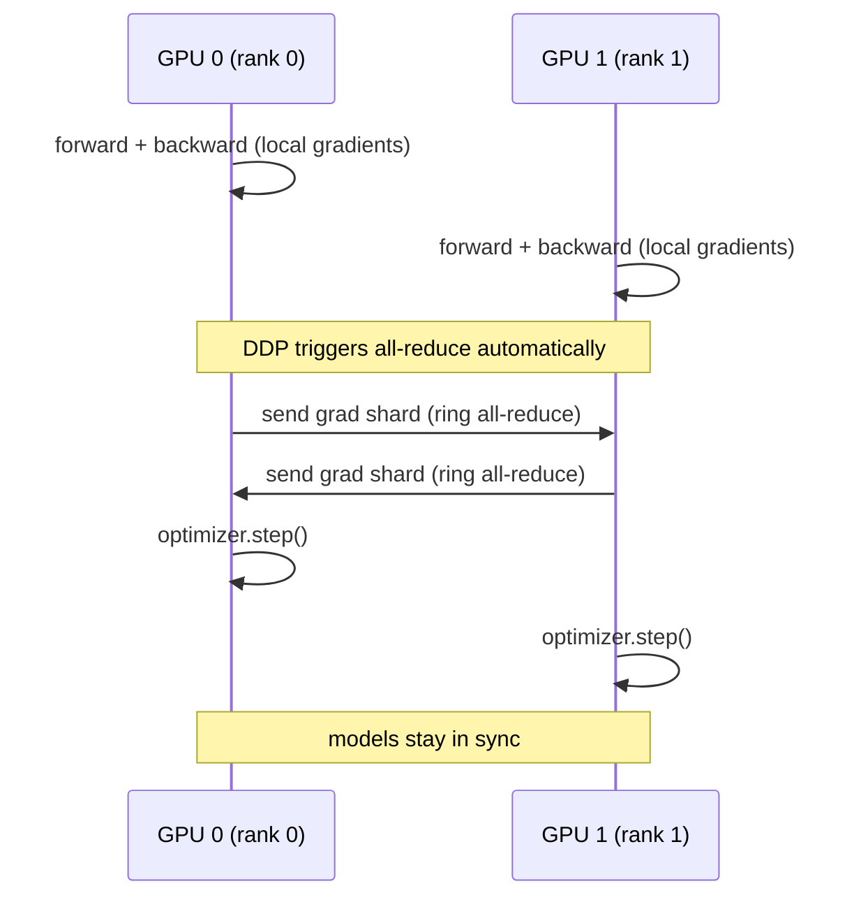
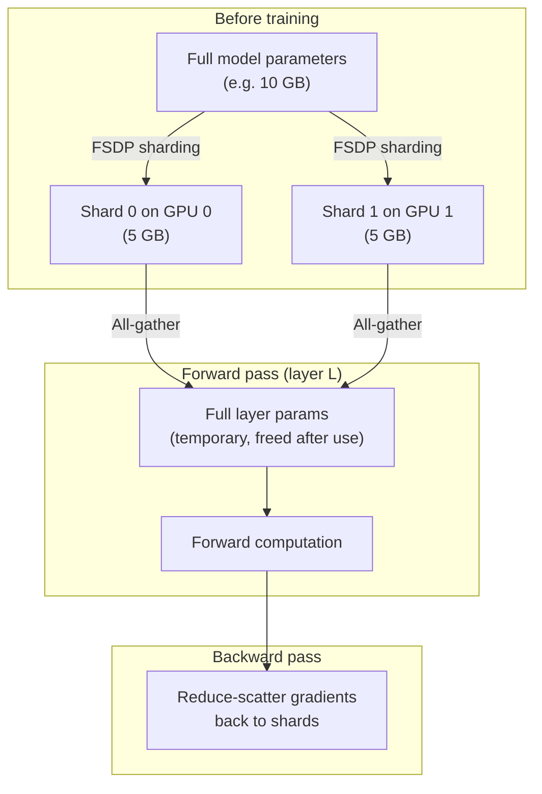
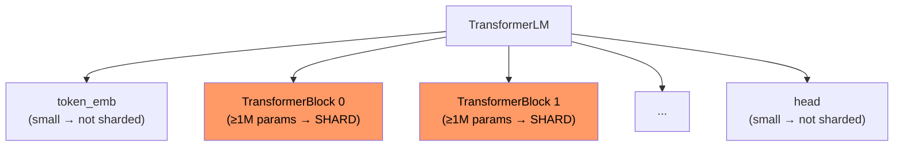

## Overview

This module demonstrates two complementary parallelism strategies for
scaling Transformer training across both H200 GPUs connected via NVLink.

| File | Strategy |
|------|----------|
| `ddp_trainer.py` | **Data parallelism** — each GPU has a full model copy |
| `fsdp_trainer.py` | **Model + data parallelism** — parameters sharded across GPUs |

---

## DistributedDataParallel (DDP)

### Concept

Each GPU holds a **complete copy** of the model. The dataset is split across
GPUs via `DistributedSampler`. After each backward pass, DDP **all-reduces**
gradients so every replica stays identical.



### Communication Pattern



### When to use DDP

- Model fits in a single GPU's memory.
- Want maximum simplicity — DDP is a one-line wrapper.
- On H200 with NVLink, all-reduce bandwidth is ~900 GB/s — communication
  overhead is negligible for most models.

---

## FullyShardedDataParallel (FSDP)

### Concept

FSDP shards **parameters, gradients, and optimizer states** across GPUs.
Each GPU owns only `1/N` of each tensor. Just-in-time all-gather before
each forward pass reconstructs the full parameter, then immediately frees it.



### Sharding Strategies

| Strategy | What's sharded | Memory saving | Communication cost |
|----------|---------------|---------------|--------------------|
| `FULL_SHARD` | Params + grads + optimizer | 1/N per GPU | All-gather + reduce-scatter each layer |
| `SHARD_GRAD_OP` | Grads + optimizer (params kept full) | ~2/3 | Reduce-scatter only |
| `NO_SHARD` | Nothing (equivalent to DDP) | None | All-reduce |

### auto_wrap_policy

FSDP needs to know which sub-modules to shard independently:



Configured via `fsdp.min_num_params` in YAML.

---

## NVLink vs PCIe for Multi-GPU

The 2× H200 server uses **NVLink 4.0** between GPUs:

| Link | Bandwidth | Latency |
|------|-----------|---------|
| NVLink 4.0 (H200) | ~900 GB/s bidirectional | ~1 µs |
| PCIe 5.0 ×16 | ~128 GB/s | ~5 µs |

NVLink makes FSDP's all-gather/reduce-scatter overhead very small,
making FULL_SHARD viable even for moderate-size models.

---

## Launching

```bash
# DDP — 2 GPUs
torchrun --nproc_per_node=2 -m src.parallelism.ddp_trainer

# FSDP — 2 GPUs
torchrun --nproc_per_node=2 -m src.parallelism.fsdp_trainer
```

`torchrun` sets `RANK`, `LOCAL_RANK`, `WORLD_SIZE` env vars automatically.
Each process calls `dist.init_process_group()` to form the group, then
`torch.cuda.set_device(local_rank)` to bind to its GPU.

### Key config knobs (`configs/parallelism.yaml`)

| Key | Effect |
|-----|--------|
| `distributed.backend` | `nccl` (GPU-to-GPU via NVLink/PCIe) |
| `fsdp.sharding_strategy` | `FULL_SHARD` → most memory efficient |
| `fsdp.cpu_offload` | Move params to CPU RAM when not in use (slower) |
| `fsdp.min_num_params` | Threshold for wrapping sub-modules |
| `training.batch_size` | **Global** batch size; each GPU sees `batch_size/N` |