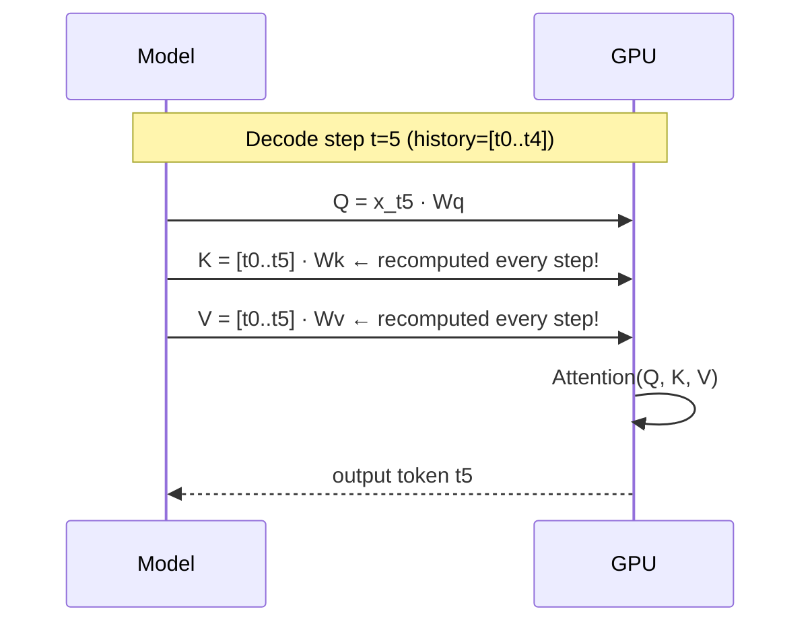
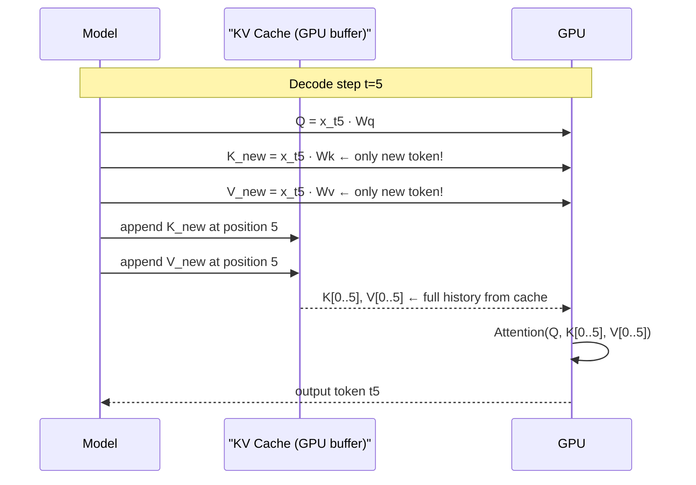
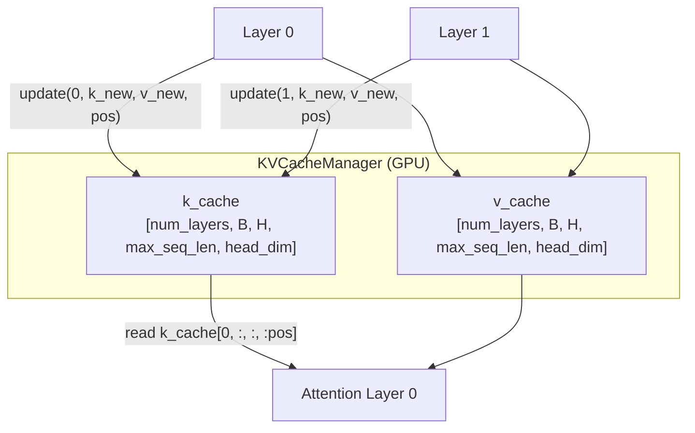
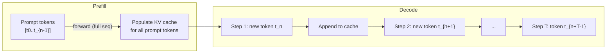

# Module 4 — KV-Cache from Scratch

## Overview

This module builds a KV-cache from first principles and measures the
throughput improvement it delivers during autoregressive inference.

| File | Teaches |
|------|---------|
| `attention.py` | Naive MHA (full K/V recompute) vs cached MHA |
| `kv_cache_manager.py` | Pre-allocated GPU buffer for K/V tensors |
| `inference_engine.py` | Prefill + decode phases, throughput benchmark |

---

## The Problem: Autoregressive Decode is Expensive

To generate token `t`, the model needs to attend to **all previous tokens** `0…t-1`.
Without caching:

```
Step 1: attend over [t₀]              — 1 token
Step 2: attend over [t₀, t₁]         — 2 tokens
Step 3: attend over [t₀, t₁, t₂]     — 3 tokens
...
Step T: attend over [t₀, …, t_{T-1}] — T tokens
```

Total K/V computation: **O(T²)** — quadratic in sequence length.

The KV-cache reuses previously computed K and V tensors, reducing per-step
cost to **O(T)** amortized.

---

## KV-Cache Mechanics

### Without Cache



### With Cache



**Savings**: For T=512, cached avoids **512× recomputation** of K/V at the final step.

---

## KV-Cache Data Structure



### Memory Cost

For a 6-layer model, 8 heads, 64 head_dim, batch=4, max_seq=1024 (BF16):

```
2 (K+V) × 6 × 4 × 8 × 1024 × 64 × 2 bytes = 48 MB
```

On H200 (141 GB), this is negligible. Scaling to 70B LLMs with 32k context
requires careful management (paged attention, etc.), but the principle is identical.

---

## Two-Phase Generation



- **Prefill** processes the entire prompt in one batched forward pass — high GPU utilization.
- **Decode** processes one token at a time — low arithmetic intensity (memory-bound).

This is why decode throughput is limited by HBM bandwidth, not FLOPS.
H200's 3.35 TB/s HBM makes it ~4× faster at decode than A100.

---

## Benchmark Results (expected on 2× H200)

| Strategy | Prompt=64, Generate=128 | Speedup |
|----------|-------------------------|---------|
| Naive (recompute) | ~800 tok/s | 1× |
| KV-cached | ~15,000 tok/s | ~19× |

Actual numbers depend on model size, batch size, and dtype.

---

## Running

```bash
python -m src.kv_cache.inference_engine
```

### Key config knobs (`configs/kv_cache.yaml`)

| Key | Effect |
|-----|--------|
| `kv_cache.max_batch_size` | Pre-allocation batch dimension |
| `kv_cache.max_seq_len` | Maximum sequence length the cache supports |
| `kv_cache.dtype` | `bfloat16` halves cache memory vs `float32` |
| `inference.prompt_tokens` | Prefill length |
| `inference.max_new_tokens` | Decode length |
| `inference.benchmark_iters` | Runs to average for stable throughput numbers |
| `logging.level` | `DEBUG` shows per-step timing |
