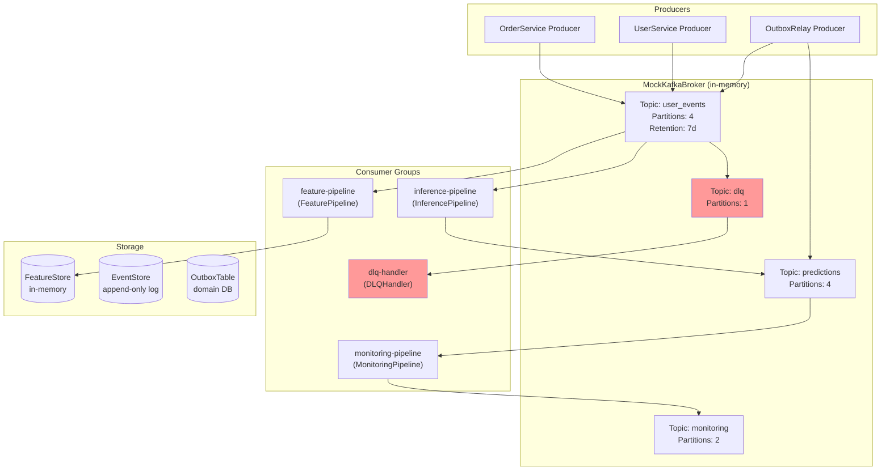
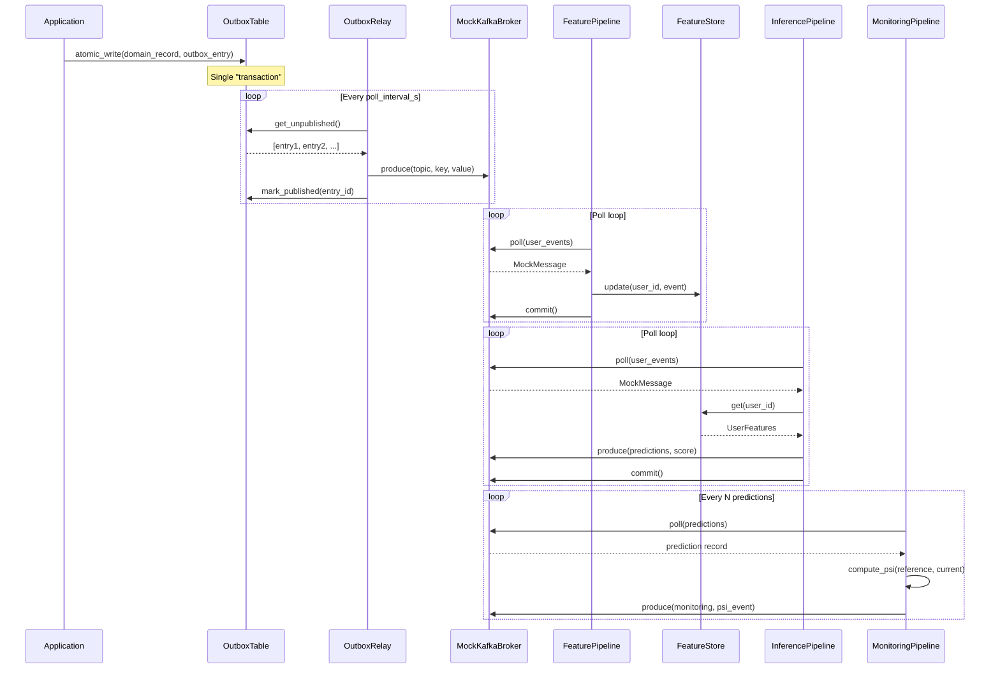
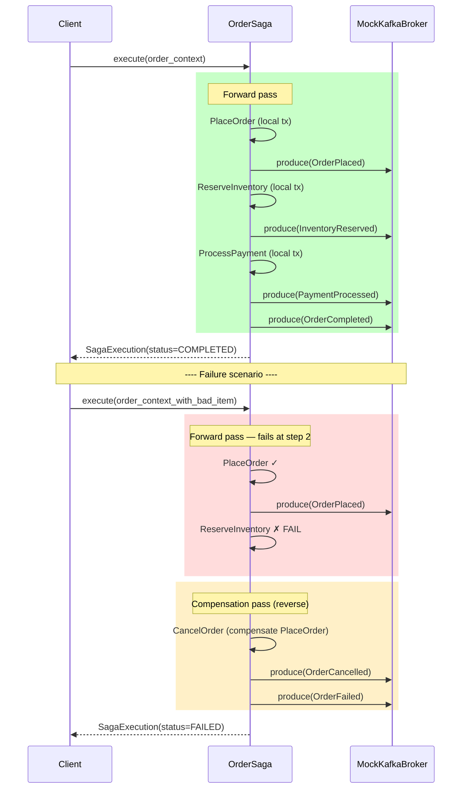
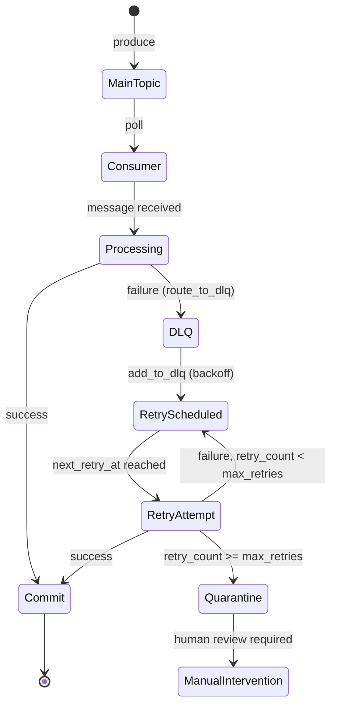
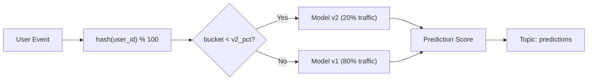

## Overview

This project demonstrates Kafka and event-driven architecture concepts using
a fully in-memory mock broker.  The mock broker faithfully reproduces the
partition model, consumer group offsets, and lag mechanics of a real Apache
Kafka cluster, allowing all patterns to run without an external service.

---

## Core Kafka Concepts

### Topics, Partitions, and Replication

A Kafka **topic** is a named, ordered, immutable log.  Each topic is divided
into **partitions** — the unit of parallelism and ordering.  Within a
partition, messages are totally ordered by offset.  A **replication factor**
determines how many broker replicas store each partition.

**In-Sync Replicas (ISR)** is the set of replicas that are fully caught up to
the leader.  `acks=all` means the producer waits for all ISR members to
acknowledge the write before declaring success, giving the strongest durability
guarantee.

### Delivery Semantics

| Semantic        | Producer config              | Consumer behaviour        |
|-----------------|------------------------------|---------------------------|
| At-most-once    | `acks=0`, fire-and-forget    | Auto-commit before process|
| At-least-once   | `acks=all` + retries         | Manual commit after process|
| Exactly-once    | Idempotent + transactions    | Transactional read-process|

This project implements **at-least-once** delivery on the consumer side
(manual commit after processing) combined with DLQ routing for failed messages.

### Offset Management

```
Partition log:
  offset: 0  1  2  3  4  5  6  7  8  9
              ↑                    ↑
         consumer group        high-water
         committed offset      mark (LEO)

lag = high-water-mark − committed-offset = 9 − 2 = 7
```

Consumer groups maintain committed offsets per (topic, partition).  The
`MockKafkaBroker` stores these in `_consumer_offsets[group_id][topic][partition]`.

---

## System Architecture Diagram



---

## Component Interaction



---

## Saga Pattern — Sequence Diagram



---

## DLQ Lifecycle



---

## A/B Routing Decision



---

## Configuration Reference

All parameters are driven by `config.yaml`.  Key sections:

| Section | Key | Description |
|---------|-----|-------------|
| `kafka` | `use_mock` | `true` = MockKafkaBroker, `false` = real Kafka |
| `producer` | `acks` | Delivery acknowledgement level (`all` = strongest) |
| `producer` | `enable_idempotence` | Prevents duplicate messages on retry |
| `consumer` | `enable_auto_commit` | Always `false` — manual commit only |
| `consumer` | `auto_offset_reset` | `earliest` = start from oldest message |
| `topics` | `user_events.partitions` | Parallelism level (number of consumer threads) |
| `event_patterns` | `dlq_max_retries` | Maximum retries before quarantine |
| `event_patterns` | `dlq_backoff_base_s` | Exponential backoff base (seconds) |
| `ml_pipeline` | `model_v2_traffic_pct` | % of users routed to challenger model |
| `streaming` | `lag_alert_threshold` | Consumer lag count triggering a warning |