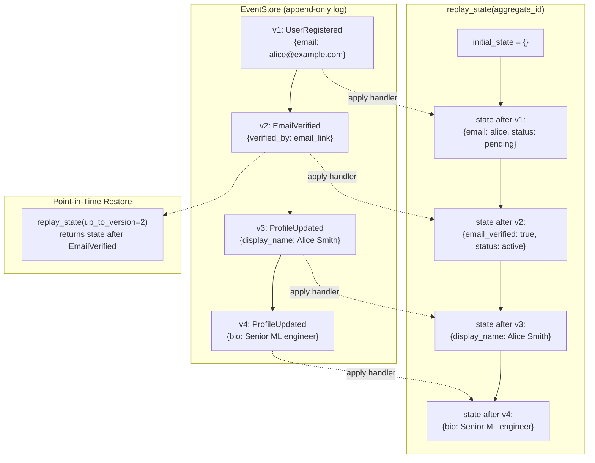
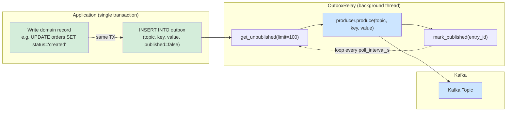
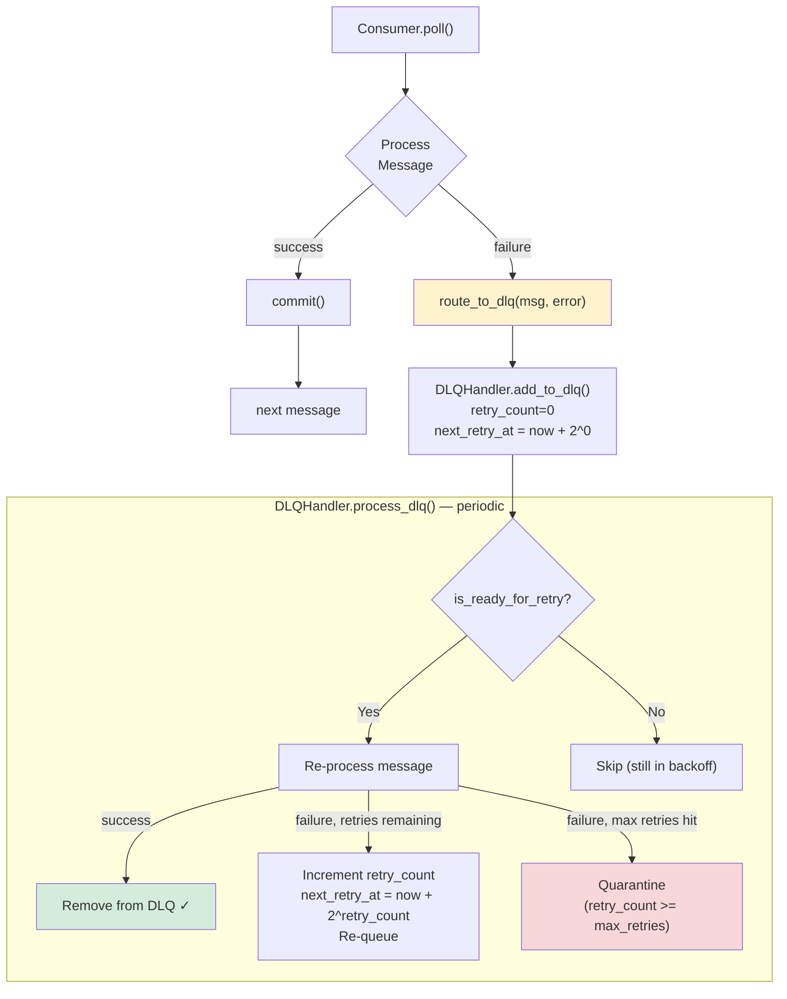
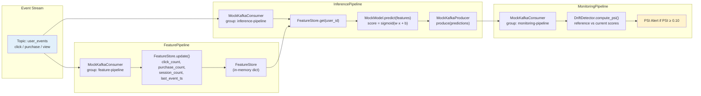
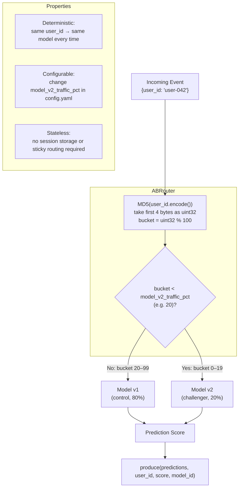
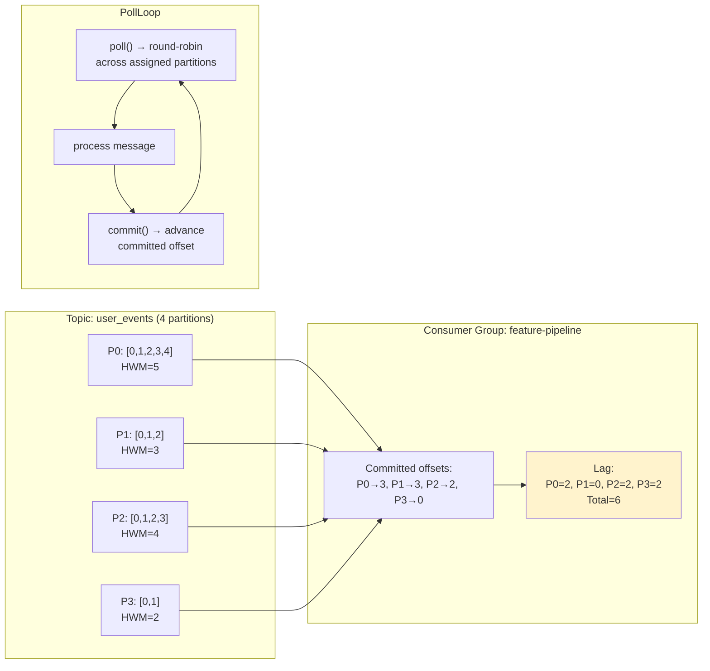
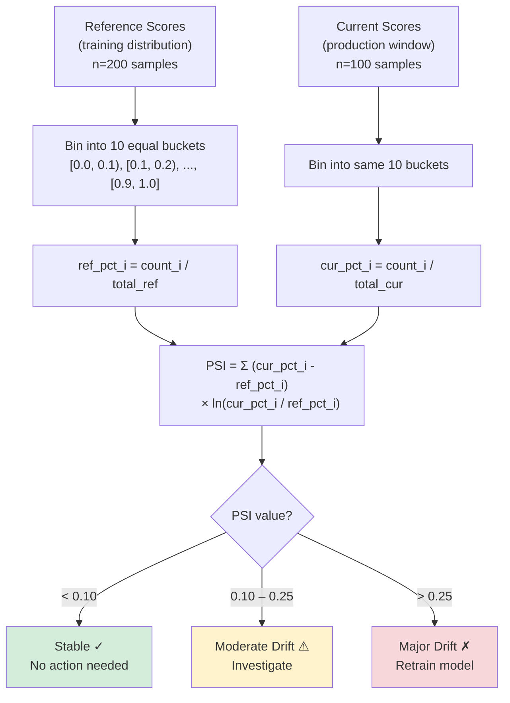

## 1. Event Sourcing — State Reconstruction

---

## 2. Outbox Relay — Guaranteed At-Least-Once Delivery

**Crash scenarios handled:**

| Crash point | Outcome |
|-------------|---------|
| Before OutboxWrite | Domain TX rolled back → no event |
| After OutboxWrite, before Publish | Relay picks up on restart → event published |
| After Publish, before Mark | Relay republishes → at-least-once (idempotent consumers handle dedup) |
| After Mark | Happy path completed |

---

## 3. DLQ Retry with Exponential Backoff

**Backoff schedule (backoff_base=2.0, max_retries=3):**

| Retry | Delay before retry | Total wait |
|-------|--------------------|-----------|
| 0 → 1 | 2^0 = 1s | 1s |
| 1 → 2 | 2^1 = 2s | 3s |
| 2 → 3 | 2^2 = 4s | 7s |
| 3     | QUARANTINE | — |

---

## 4. ML Inference Pipeline

---

## 5. A/B Model Routing Decision Flow

---

## 6. Consumer Group and Offset Flow

---

## 7. PSI Drift Detection Computation

---

## 8. Windowing — Tumbling vs Session

```mermaid
gantt
    title Event Timeline: Tumbling (300s) vs Session (30s gap)
    dateFormat X
    axisFormat %s

    section User A
    Tumbling Window 0   :0, 300
    Tumbling Window 1   :300, 300

    section Session Windows (User A)
    Session 1 (3 events)  :active, 10, 60
    Session 2 (2 events)  :active, 200, 40
    Session 3 (4 events)  :active, 350, 100
```

**Key differences:**

| Property | Tumbling Window | Session Window |
|----------|----------------|----------------|
| Duration | Fixed (e.g. 300s) | Variable (activity-based) |
| Boundaries | Clock-aligned | Inactivity-driven |
| Use case | Time-series metrics | User behaviour grouping |
| Memory | O(window_size) | O(active_sessions) |
| Ordering | Requires event timestamps | Requires event timestamps |