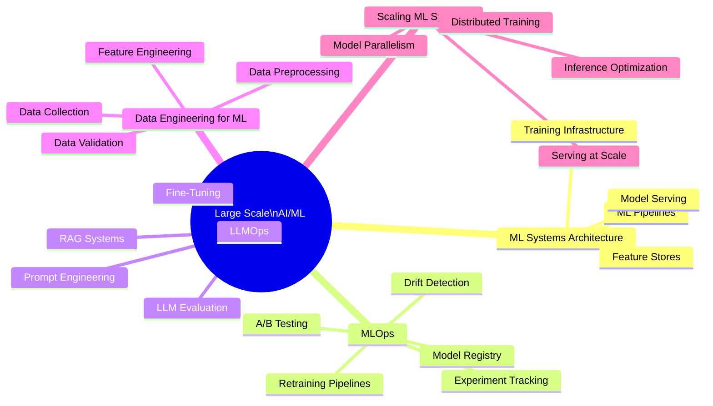

A comprehensive reference for the engineering of production AI/ML systems — covering ML system architecture, MLOps, LLMOps, data engineering for ML, and scaling ML systems from prototype to production at scale.

## Scope

This project documents the engineering disciplines required to build, deploy, monitor, and maintain AI/ML systems that serve real users in production — bridging the gap between ML research and production reliability.

## Knowledge Map

## Sections

| # | Section | Description |
|---|---------|-------------|
| 01 | [ML Systems Architecture](docs/01_ml_systems_architecture/README.md) | End-to-end ML system design |
| 02 | [MLOps](docs/02_mlops/README.md) | Operationalizing ML models |
| 03 | [LLMOps](docs/03_llmops/README.md) | Large Language Model operations |
| 04 | [Data Engineering for ML](docs/04_data_engineering_for_ml/README.md) | Data pipelines for ML |
| 05 | [Scaling ML Systems](docs/05_scaling_ml_systems/README.md) | Distributed training and inference |