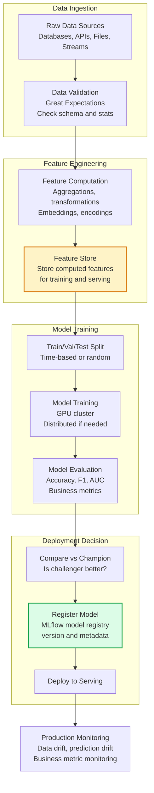
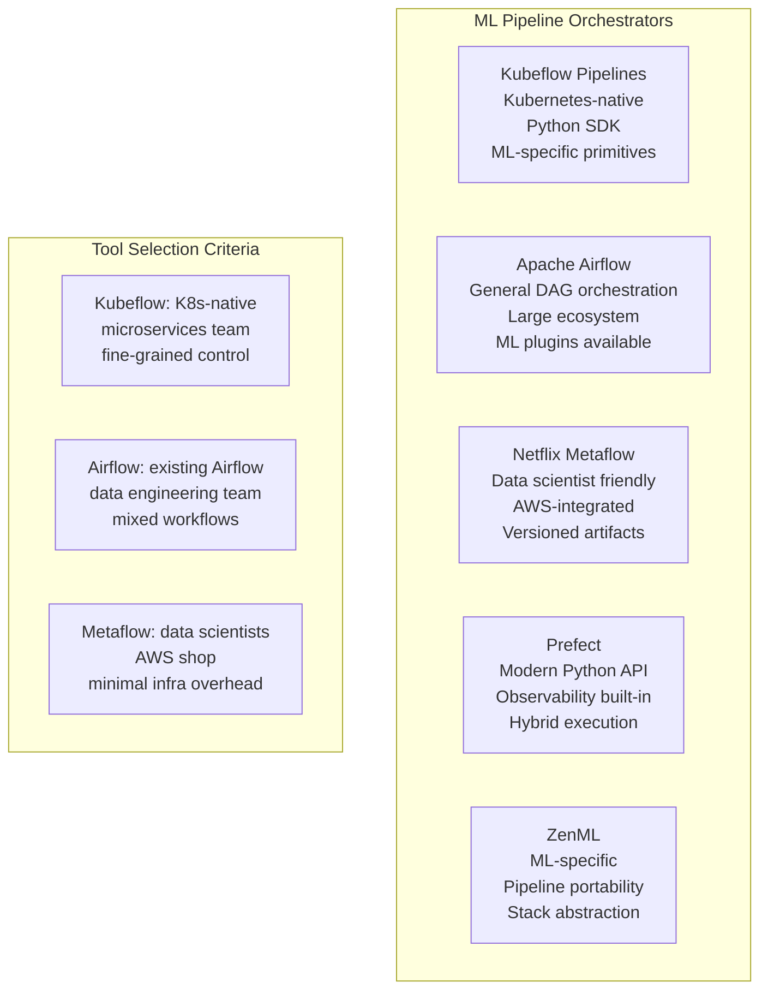
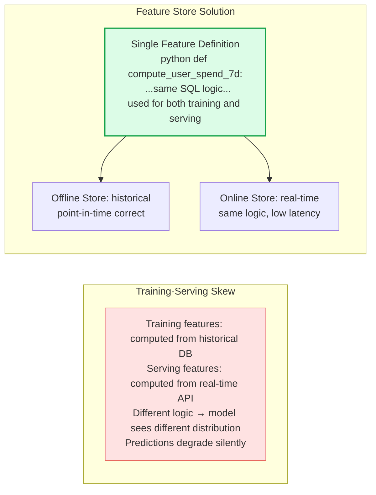

# ML Pipelines

An ML pipeline is a directed acyclic graph (DAG) of transformations that takes raw data as input and produces a trained, evaluated, and deployed model as output. Well-designed ML pipelines are reproducible, versioned, testable, and observable — applying software engineering discipline to ML workflows.

## End-to-End ML Pipeline

## ML Pipeline Orchestration Tools

## Training-Serving Skew Prevention

## Key Concepts

- **ML Pipeline as Code**: Define pipelines as code (Python functions, YAML configurations) with version control, code review, and CI/CD. Every pipeline run should be reproducible given the same inputs. Pipelines as code enable collaboration and prevent "notebook chaos" where important ML code lives in undiscoverable Jupyter notebooks.

- **DAG (Directed Acyclic Graph)**: The fundamental structure of ML pipelines. Each node is a computation step; edges represent data dependencies. DAG structure enables parallelism (independent branches run concurrently), caching (reuse completed steps on rerun), and failure recovery (resume from the failed step).

- **Artifact Versioning**: Every artifact produced by a pipeline (datasets, features, models, metrics) is versioned and associated with the pipeline run that produced it. This enables reproducibility (re-run an exact historical pipeline), debugging (trace a bad model to its training data), and rollback.

- **Training-Serving Skew**: The most common and insidious failure mode in ML systems. Training uses historical batch data to compute features; serving computes the same features from real-time data using different code paths. Subtle differences in feature computation logic cause the model to see a different distribution in production than in training. Feature stores with a single feature definition prevent this.

- **Pipeline Triggers**: ML pipelines can be triggered by: schedule (retrain every week), data events (new data volume threshold crossed), model performance degradation (accuracy drops below threshold), or manual approval. Automated triggers require careful guardrails to prevent runaway retraining.

- **Continuous Training (CT)**: Automatically retraining models on fresh data based on triggers. Different from CI/CD for software — CT must include evaluation gates (the new model must be at least as good as the current champion before deployment).

## Trade-offs

| Approach | Engineering Overhead | Flexibility | Reproducibility |
|----------|---------------------|------------|----------------|
| Notebooks only | Very Low | High | Very Low |
| Scripts in git | Low | High | Medium |
| Orchestrated pipelines | Medium | Medium | High |
| ML platform (Kubeflow) | High | Medium | Very High |

## When to Use

- **Scripted pipelines**: Small teams, early stage, single model — low overhead with reasonable reproducibility
- **Kubeflow/Airflow**: Production systems with multiple models, multiple teams, and reliability requirements
- **Feature store**: Any system where features are shared across models or where training-serving skew is a risk (almost always)
- **Continuous training**: When model accuracy is sensitive to data staleness (recommendation, fraud detection, NLP on evolving language)
