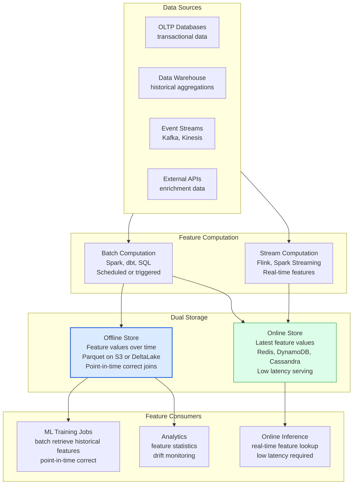
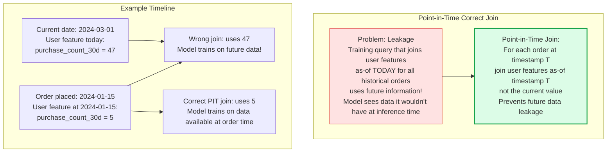
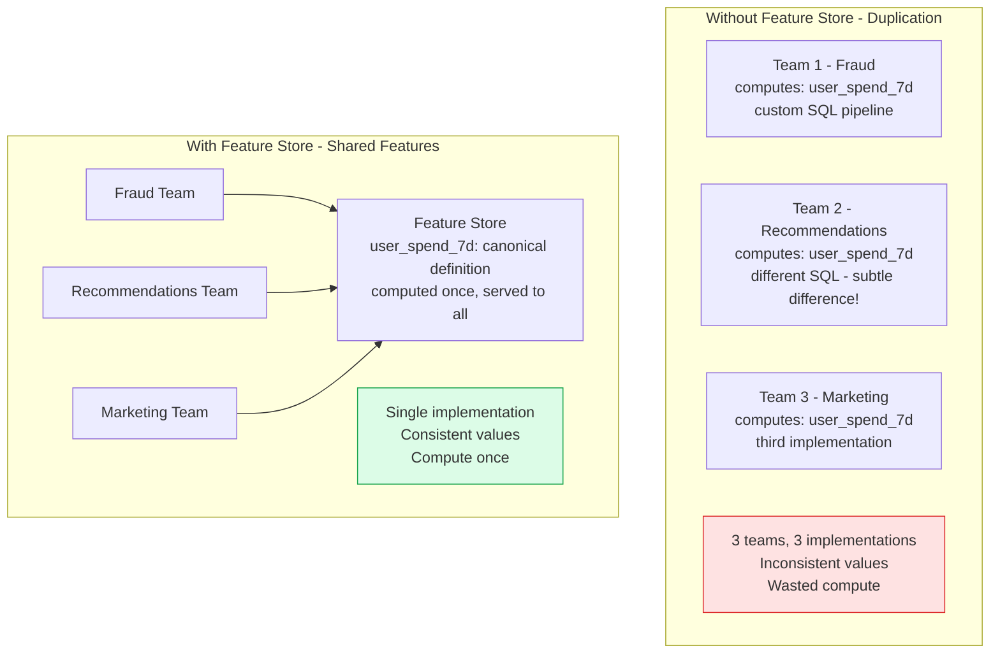

# Feature Stores

A feature store is a centralized platform for storing, computing, and serving ML features. It solves two critical problems in ML systems: feature reuse (preventing different teams from recomputing the same features independently) and training-serving consistency (ensuring the same feature values are used in training and production serving).

## Feature Store Architecture

## Point-in-Time Correct Joins

## Feature Reuse Across Teams

## Key Concepts

- **Offline Store**: Stores the historical time series of feature values. Used by training jobs to retrieve features as they existed at any point in time. Typically implemented on S3/GCS with Parquet files or Delta Lake format. Enables point-in-time correct joins to prevent label leakage.

- **Online Store**: Stores the latest (current) feature values for low-latency serving. Used by the inference serving layer to enrich incoming requests with precomputed features. Implemented with Redis, DynamoDB, or Bigtable for sub-10ms lookups. Only stores the current value, not the history.

- **Point-in-Time Correct Join**: When creating a training dataset, features must be joined to labels using the feature values that were available at the time of the label event — not the current values. Without this, the model trains on data it would not have had access to at prediction time (data leakage), producing overly optimistic evaluation metrics.

- **Feature Groups**: Features are organized into logical groups based on the entity they describe (user features, item features, session features) and the computation frequency (real-time, hourly, daily). Feature groups share a common source and computation logic.

- **Feature Backfilling**: Computing historical values for new features from historical raw data. Required when adding a new feature to the offline store. Can be computationally expensive for long history periods.

- **Feature Freshness**: The staleness of feature values in the online store. Some features (user lifetime value) can be stale for days; others (current session cart value) must be fresh within seconds. Feature freshness requirements drive online store update frequency.

- **Feast, Tecton, Hopsworks**: The leading feature store platforms. Feast is open-source; Tecton and Hopsworks offer managed cloud services. Most large companies build proprietary feature stores optimized for their specific data infrastructure.

## Trade-offs

| Approach | Training-Serving Consistency | Engineering Overhead | Feature Reuse |
|---------|------------------------------|---------------------|--------------|
| No feature store | Low (manual consistency) | Low | Very Low |
| Shared feature library | Medium | Medium | Medium |
| Full feature store | High | High | High |

## When to Use

- **Feature store**: When multiple models share features, when training-serving skew is causing production degradation, or when the ML team has 5+ data scientists with overlapping feature needs
- **Offline store only**: Start here — add the online store when online inference latency becomes a constraint
- **Skip for simple models**: If the model uses only request-time features (no historical context) and there's only one model, a full feature store may be premature
