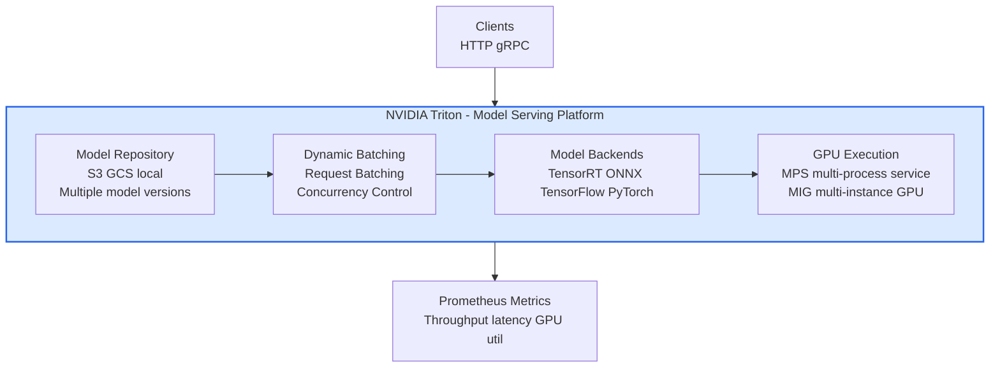
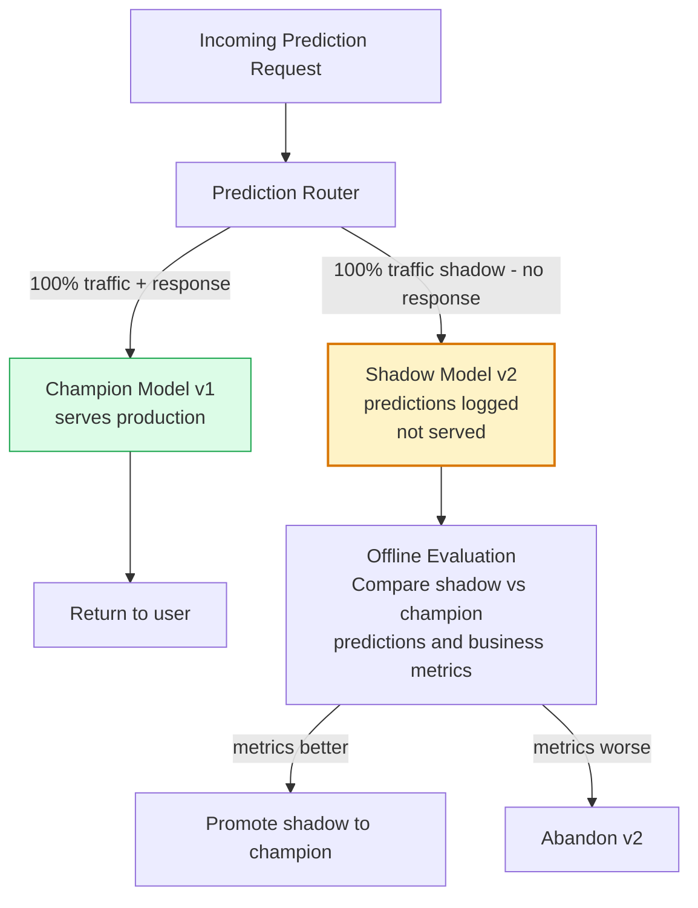

Model serving is the infrastructure that makes trained models available for predictions in production. The serving strategy depends on latency requirements, throughput needs, and the trade-off between real-time responsiveness and batch efficiency.

## Serving Architecture Patterns

```mermaid
graph TD
    subgraph OnlineServing[Online Serving - Real-Time]
        Client[Client Request] --> API[Inference API\nREST or gRPC\nFastAPI, TorchServe, Triton]
        API --> FeatureLookup[Feature Lookup\nOnline feature store\nRedis - 1-5ms]
        FeatureLookup --> ModelInf[Model Inference\nGPU or CPU\n10-500ms]
        ModelInf --> Response[Prediction Response]
        Latency1[Target: p99 < 100ms]
    end

    subgraph BatchServing[Batch Serving - Offline]
        Trigger[Trigger\nSchedule or data event]
        InputData[Input Dataset\nAll users, items, queries]
        BatchInf[Batch Inference\nSpark ML, Ray, custom]
        OutputStore[Output Store\nPredictions written to DB or S3]
        Trigger --> InputData --> BatchInf --> OutputStore
        Latency2[Target: hours, freshness matters]
    end

    subgraph StreamingServing[Streaming Serving]
        Stream[Input Stream\nKafka topic]
        StreamProc[Stream Processor\nFlink, Spark Streaming]
        StreamInf2[Model Inference\nper-event or micro-batch]
        OutputTopic[Output Topic\npredictions]
        Stream --> StreamProc --> StreamInf2 --> OutputTopic
        Latency3[Target: seconds, continuous]
    end
```

## NVIDIA Triton Inference Server Architecture

## Shadow Mode and Canary Deployment for Models

## Key Concepts

- **Online Serving**: Provides predictions in real time (milliseconds) for individual requests. Requires low-latency feature retrieval, efficient model execution, and careful resource management. Latency SLAs for online serving are typically p99 < 100-500ms.

- **Batch Serving**: Runs model inference over large datasets offline. Results are pre-computed and stored for later lookup. More efficient than online serving (better GPU utilization through large batches) but predictions are stale (hours old). Best for recommendation pre-generation, risk scoring, and content ranking.

- **Streaming Serving**: Runs inference on event streams (Kafka, Kinesis). Each event or micro-batch triggers inference. Balances between real-time and batch — predictions are fresh within seconds or minutes. Used for fraud detection on transaction streams, real-time personalization.

- **Dynamic Batching**: Groups multiple individual inference requests into a single batch to maximize GPU utilization. The server waits a configurable time (microseconds to milliseconds) to accumulate requests before processing them together. Increases throughput at the cost of slightly increased latency.

- **Model Ensemble**: Combining predictions from multiple models — averaging outputs, using a meta-model to combine predictions, or running a cascade (use a cheap model first, fall back to expensive model for low-confidence cases). Improves accuracy but increases latency and cost.

- **Shadow Mode**: Running a new model version alongside the champion, receiving the same traffic, logging its predictions, but not serving them to users. Enables offline comparison of the new model's predictions against ground truth or the champion without any user impact.

- **Triton Inference Server**: NVIDIA's high-performance inference serving platform. Supports multiple frameworks (TensorRT, ONNX Runtime, PyTorch, TensorFlow), dynamic batching, concurrent model execution, model versioning, and metrics. Industry standard for GPU inference at scale.

- **Two-Phase Serving**: First phase retrieves candidates quickly (approximate nearest neighbor, rule-based filter), second phase scores and ranks candidates with a heavier model. Used in recommendation systems — retrieval (millions to thousands), ranking (thousands to tens).

## Trade-offs

| Pattern | Latency | Throughput | Freshness | Cost |
|---------|---------|-----------|---------|------|
| Online serving | Very Low | Medium | Real-time | High (GPU on-demand) |
| Batch serving | N/A | Very High | Stale | Low (batch pricing) |
| Streaming | Low | High | Near-real-time | Medium |
| Two-phase | Low-Medium | High | Real-time | Medium |

## When to Use

- **Online serving**: User-facing real-time predictions (search ranking, recommendations in response to click, fraud check at transaction time)
- **Batch serving**: Pre-computing predictions for all users/items nightly (email recommendations, risk scores updated daily)
- **Streaming serving**: Fraud detection on payment streams, content moderation on social media posts
- **Shadow mode**: Before promoting any significant model change — validate offline before any user impact