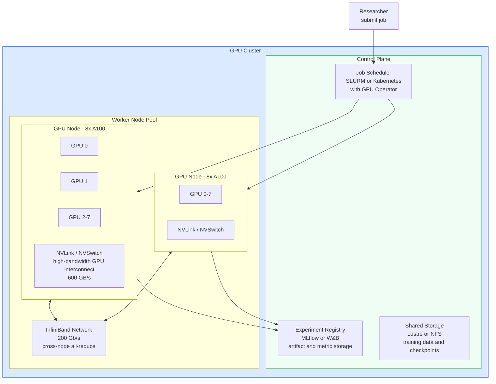
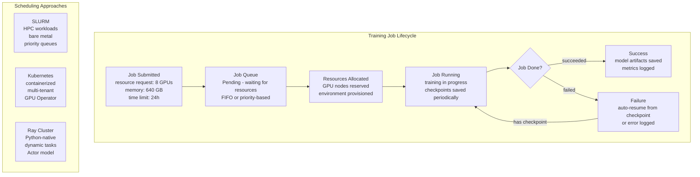
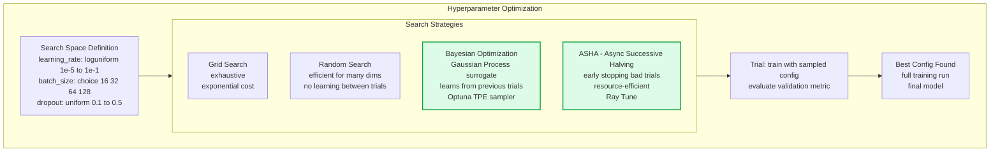
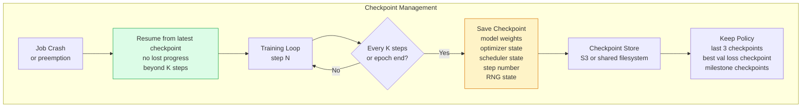

# Training Infrastructure

Training infrastructure encompasses the hardware, scheduling, and tooling needed to run ML training jobs efficiently at scale. Well-designed training infrastructure maximizes GPU utilization, minimizes queue wait times, provides experiment isolation, and enables rapid iteration from experimentation to production-scale training runs.

## GPU Cluster Architecture

## Job Scheduling and Resource Management

## Hyperparameter Optimization

## Checkpointing Strategy

## Key Concepts

- **GPU Interconnect**: For multi-GPU training on a single node, NVLink provides high-bandwidth (600 GB/s) GPU-to-GPU communication, critical for all-reduce gradient synchronization. Across nodes, InfiniBand (200 Gb/s) or RoCE (RDMA over Converged Ethernet) provides low-latency interconnect. The interconnect bandwidth is often the bottleneck for distributed training efficiency.

- **SLURM**: The dominant workload manager for HPC GPU clusters. Jobs are submitted with resource requirements (GPUs, memory, time), placed in priority queues, and dispatched to reserved nodes. SLURM supports job arrays (HPO sweeps), preemption policies, and fair-share scheduling across research groups.

- **Kubernetes GPU Operator**: Extends Kubernetes to manage GPU resources in containerized environments. Automatically installs GPU drivers, CUDA toolkit, and device plugins on GPU nodes. Enables running training jobs as Kubernetes Jobs or via frameworks like Kubeflow Training Operator. Better for multi-tenant cloud environments than SLURM.

- **Checkpointing**: Periodically saving model weights, optimizer state, and training state to durable storage. Essential for long training runs on preemptible instances (cloud spot instances) or fault-tolerant clusters. Checkpoints must include optimizer state (momentum, Adam second moments) and RNG state for exact reproducibility. Async checkpointing (write in background) minimizes training interruption.

- **Hyperparameter Optimization (HPO)**: Systematically searching for the best hyperparameter configuration. Random search is surprisingly effective and embarrassingly parallel. Bayesian optimization (Optuna, Ray Tune) learns from previous trials using a surrogate model to propose promising configurations. ASHA enables early termination of clearly poor configurations, saving compute.

- **Experiment Isolation**: Each training run should be isolated — its own container/namespace, its own output directory, its own experiment entry in the tracking system. Prevents runs from interfering with each other and ensures reproducibility. Containers provide environment isolation; experiment IDs provide artifact isolation.

- **Spot/Preemptible Instances**: Cloud GPU instances available at 60-90% discount but can be reclaimed with 2-minute notice. Training code must be checkpoint-aware to resume from the latest checkpoint. Effective for HPO sweeps and fault-tolerant distributed training with checkpointing every 5-15 minutes.

- **GPU Utilization**: The key efficiency metric for training infrastructure — target >80% GPU compute utilization. Common causes of low utilization: data loading bottlenecks (CPU-bound preprocessing), small batch sizes, synchronization overhead in distributed training, I/O-bound checkpointing. Profile with `nvidia-smi`, PyTorch Profiler, or Nsight.

## Trade-offs

| Scheduling Approach | Multi-tenancy | Flexibility | Overhead | Best For |
|--------------------|--------------|------------|---------|----------|
| SLURM bare metal | Medium | Low | Very Low | HPC research clusters |
| Kubernetes + GPU Operator | High | High | Medium | Cloud-native, mixed workloads |
| Ray Cluster | High | Very High | Medium | Dynamic ML workloads, HPO |
| Cloud managed (SageMaker) | High | Low | Low | Teams without infra expertise |

## When to Use

- **SLURM**: Research institution or HPC center with dedicated GPU hardware and homogeneous workloads
- **Kubernetes GPU Operator**: Cloud-native teams needing multi-tenant isolation and mixed ML/serving workloads on the same cluster
- **Ray Tune for HPO**: When running many short trials (minutes to hours) — ASHA dramatically reduces total compute vs. grid or random search
- **Spot instances with checkpointing**: Any training run on cloud where cost matters and runs exceed 30 minutes — checkpointing overhead is justified above this threshold
- **Dedicated training clusters**: Production ML systems where training SLAs matter — shared clusters introduce queue delays that disrupt model refresh pipelines
