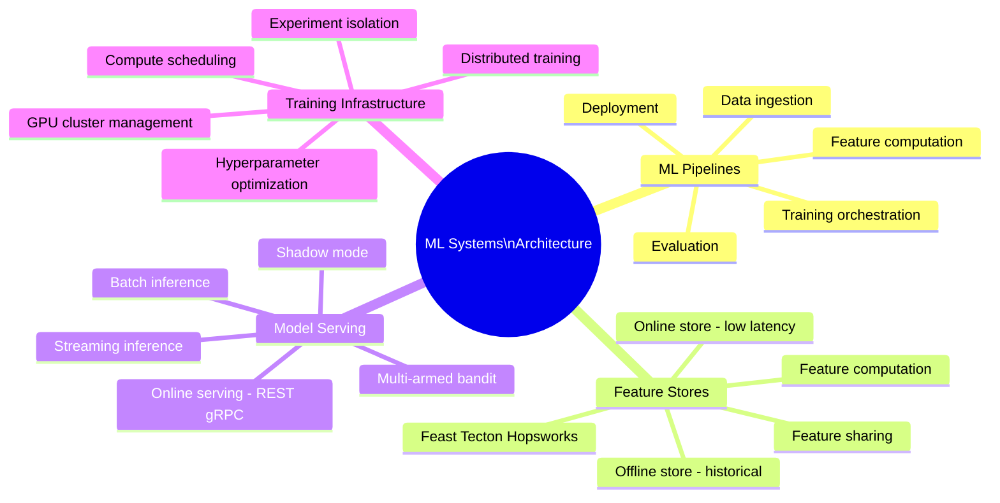

# ML Systems Architecture

ML systems architecture encompasses the design of end-to-end pipelines that transform raw data into model predictions served at scale. Unlike traditional software, ML systems must manage both code artifacts (models) and data artifacts (features, training datasets) with strict versioning and reproducibility requirements.

## Overview

## Topics in This Section

| File | Topic | Key Concepts |
|------|-------|--------------|
| [01_ml_pipelines.md](01_ml_pipelines.md) | ML Pipelines | Pipeline patterns, orchestration, DAGs |
| [02_feature_stores.md](02_feature_stores.md) | Feature Stores | Online/offline stores, feature reuse |
| [03_model_serving.md](03_model_serving.md) | Model Serving | Online, batch, streaming serving |
| [04_training_infrastructure.md](04_training_infrastructure.md) | Training Infrastructure | GPU management, job scheduling |
