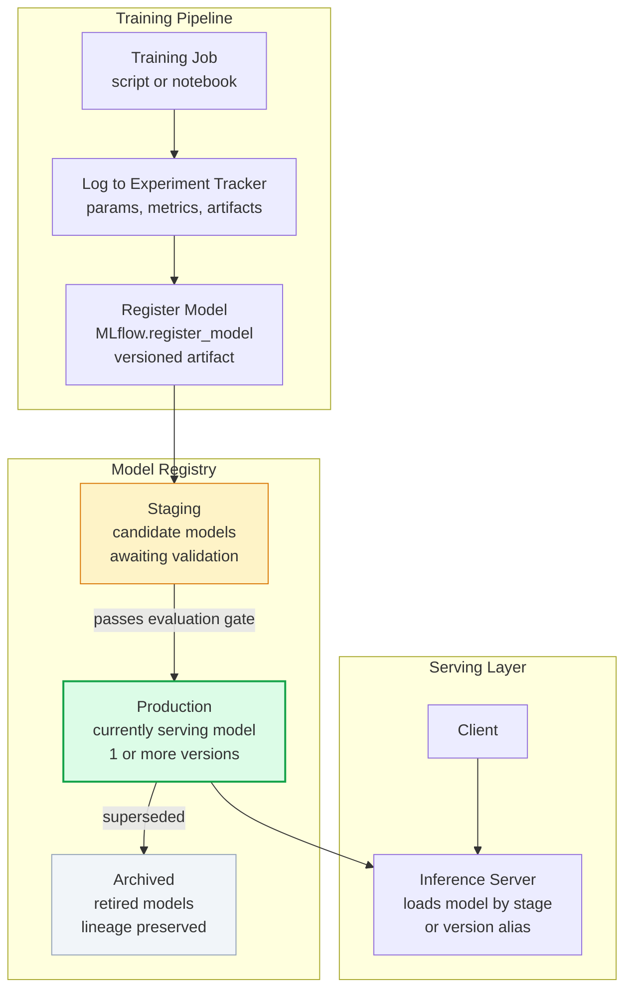
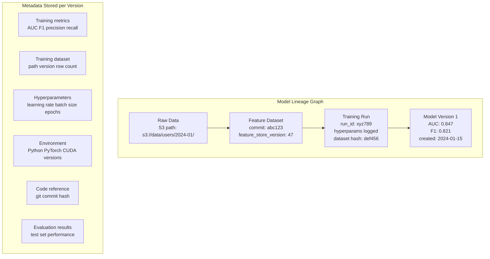

A model registry is a centralized versioned store for trained ML models — the equivalent of a software artifact repository (like Docker Hub or PyPI) for ML models. It tracks model versions, their metadata (training data, hyperparameters, evaluation metrics), lifecycle stage, and deployment lineage, enabling teams to manage model promotion and rollback systematically.

## Model Registry Architecture

## Stage Transition Workflow

```mermaid
graph TD
    subgraph Transitions[Model Stage Lifecycle]
        Registered[Registered\nNew version created\nautomatically assigned\na version number]
        Staging[Staging\nUnder review\nrunning validation\ntests and shadow eval]
        Production[Production\nServing live traffic\nalias: production points here]
        Archived[Archived\nNo longer active\nhistorical record kept]

        Registered -->|evaluation pipeline passes| Staging
        Staging -->|A/B test or shadow mode validated| Production
        Production -->|new version promoted| Archived
        Staging -->|evaluation fails| Archived
    end

    subgraph Checks[Promotion Gate Checks]
        MetricCheck[Metric Check\nnew model AUC >= champion - 0.005]
        DataCheck[Training Data Check\nschema validation passed]
        IntegTest[Integration Test\nmodel loads and serves correctly\nlatency within SLA]
        BiasCheck[Bias and Fairness Check\nperformance across demographic groups]

        MetricCheck --> DataCheck --> IntegTest --> BiasCheck
    end

    style Production fill:#dcfce7,stroke:#16a34a,stroke-width:2px
```

## Model Lineage and Metadata

## Key Concepts

- **Model Version**: Each trained model artifact registered in the registry receives a unique version number within its model name namespace. Versions are immutable — once registered, the artifact does not change. Promotion moves a version between stages but does not modify the artifact.

- **Stage**: A logical classification of a model's lifecycle position — Staging (under validation), Production (actively serving), Archived (retired). Serving infrastructure loads the model currently in the Production stage rather than hardcoding a version number, enabling seamless version rollback by changing the stage assignment.

- **Model Alias**: A named pointer to a specific model version (e.g., `champion`, `challenger`). Serving code references the alias; when a new model is promoted, only the alias assignment changes — no serving code changes needed. More flexible than stage-based promotion for A/B testing setups.

- **Model Lineage**: Tracing a model's provenance — which training dataset (at which version), which code (at which git commit), and which hyperparameters produced this model artifact. Full lineage enables reproducing any historical model and debugging production degradation by tracing back to data or code issues.

- **Evaluation Gate**: An automated check that a candidate model must pass before promotion to Production. Typically includes: metric threshold (new model must be within N% of champion), data schema validation, integration tests (model loads and serves within latency SLA), and optionally bias/fairness checks.

- **MLflow Model Registry**: The most widely adopted open-source model registry. Integrates with MLflow experiment tracking for automatic run-to-registry linking. Supports REST API and Python SDK for automation. Can be self-hosted (MLflow Tracking Server with S3 artifact store) or managed (Databricks, Azure ML).

- **Model Signatures**: Formal schema defining the expected input and output types of a model (column names, data types, tensor shapes). Stored in the registry with the model artifact. Enables runtime validation that serving infrastructure sends the correct input format.

## Trade-offs

| Approach | Governance | Automation | Overhead |
|---------|-----------|-----------|---------|
| No registry (file system) | None | None | Very Low |
| MLflow Registry | Good | Good | Low |
| Managed (SageMaker, Vertex) | High | High | Medium |
| Custom internal registry | Full control | Full control | Very High |

## When to Use

- **Model registry**: Always — even for a single model, the registry provides rollback capability and audit trail that justifies minimal overhead
- **Stage-based promotion**: When a CI-like gate review process is required before each production deployment
- **Alias-based promotion**: When running A/B tests or gradual rollouts where multiple model versions serve simultaneously
- **Full lineage tracking**: Regulated industries (finance, healthcare) where model auditability and reproducibility are compliance requirements