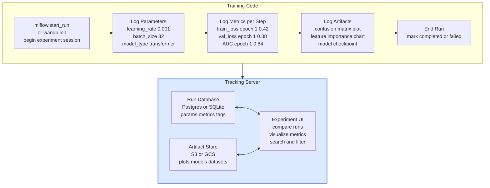
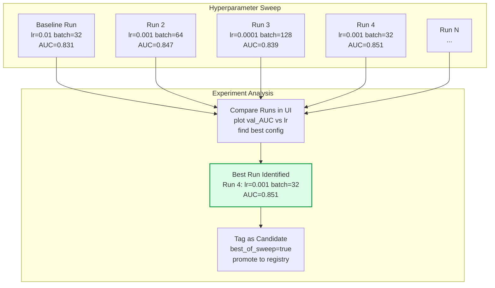
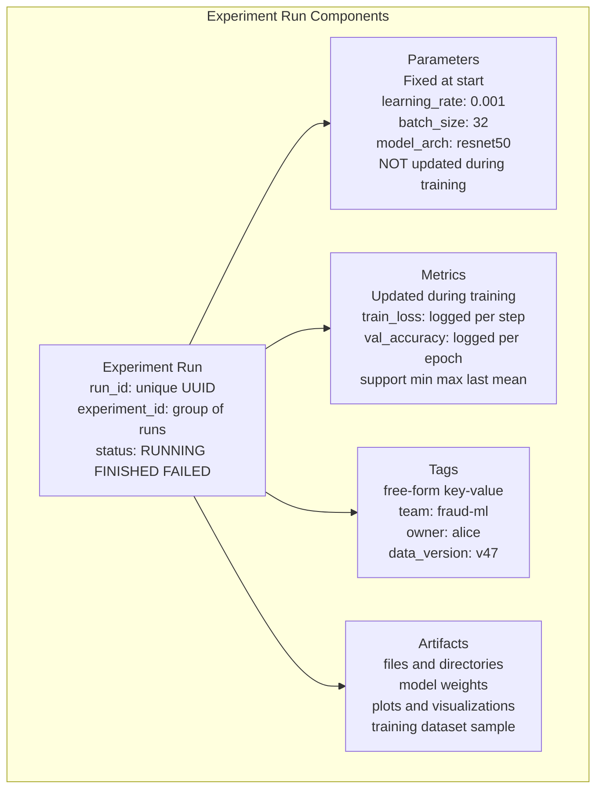

Experiment tracking is the practice of logging, organizing, and comparing ML training runs — capturing hyperparameters, metrics, and artifacts to make experimentation reproducible and comparable. Without systematic tracking, ML development degenerates into "notebook chaos" where promising experiments are lost, results cannot be reproduced, and teams repeat work.

## Experiment Tracking Architecture

## Experiment Comparison Workflow

## Run Metadata Structure

## Key Concepts

- **Run**: The atomic unit of experiment tracking — a single training execution with its own parameters, metrics, artifacts, and status. Runs are grouped into experiments (a named collection of related runs). Every run should be tagged with the git commit hash of the training code to ensure reproducibility.

- **Parameters vs Metrics**: Parameters are inputs set before training (hyperparameters, model architecture, dataset version) — logged once at run start and immutable. Metrics are outputs produced during training (loss, accuracy, AUC) — logged at each step or epoch and tracked as time series. This distinction enables metric-based search and comparison across runs.

- **Artifact Logging**: Files produced by the run — model checkpoints, evaluation plots, feature importance charts, sample predictions. Artifacts are stored in blob storage (S3/GCS) and linked to the run. Well-logged artifacts make experiments self-documenting — someone reviewing a run six months later can see exactly what the model learned.

- **Experiment**: A named container grouping related runs — e.g., "fraud-model-v3-hyperparameter-search" or "recommendation-architecture-comparison". Good experiment naming conventions make the tracking system navigable as the number of runs grows to thousands.

- **MLflow**: Open-source experiment tracking with tracking server (SQLite or Postgres backend), artifact store (S3/GCS/HDFS), and web UI. Widely adopted, self-hostable, integrates with model registry. MLflow autolog automatically captures parameters and metrics from supported libraries (scikit-learn, PyTorch, TensorFlow).

- **Weights and Biases (W&B)**: Managed SaaS experiment tracking with richer visualization, team collaboration features, and built-in hyperparameter sweeps (W&B Sweeps). Better UX than MLflow but requires sending data to a third-party service. Preferred by research teams and startups where managed infrastructure is acceptable.

- **Reproducibility**: A run is reproducible if given the same code (git commit), data (dataset version), and parameters (logged hyperparameters), the same model can be retrained. Achieving true reproducibility also requires fixing random seeds and CUDA determinism flags, but these interact with performance — deterministic mode reduces GPU throughput.

## Trade-offs

| Tool | Self-Hosted | Visualization | Team Features | Cost |
|------|------------|--------------|--------------|------|
| MLflow (self-hosted) | Yes | Basic | Limited | Free |
| MLflow (Managed) | No | Basic | Medium | Paid |
| Weights and Biases | No | Excellent | Excellent | Free tier + paid |
| Neptune.ai | No | Good | Good | Paid |
| Custom scripts + S3 | Yes | None | None | Very Low |

## When to Use

- **MLflow**: Teams running their own infrastructure who need a free, self-hostable solution that integrates tightly with the MLflow ecosystem (experiment + registry in one system)
- **W&B**: Research teams and startups where rich visualization and collaboration features are valued over data residency requirements
- **Autolog**: Enable MLflow or W&B autolog for standard frameworks — it captures 80% of what you need with zero additional code
- **Custom tags**: Always tag runs with `git_commit`, `data_version`, and `owner` at minimum — enables filtering and reproducing results months later without documentation