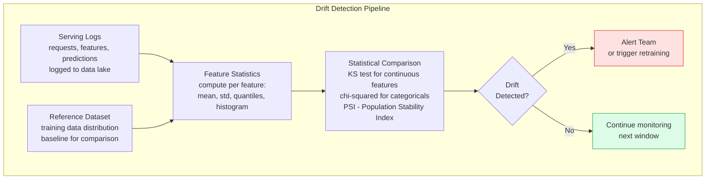
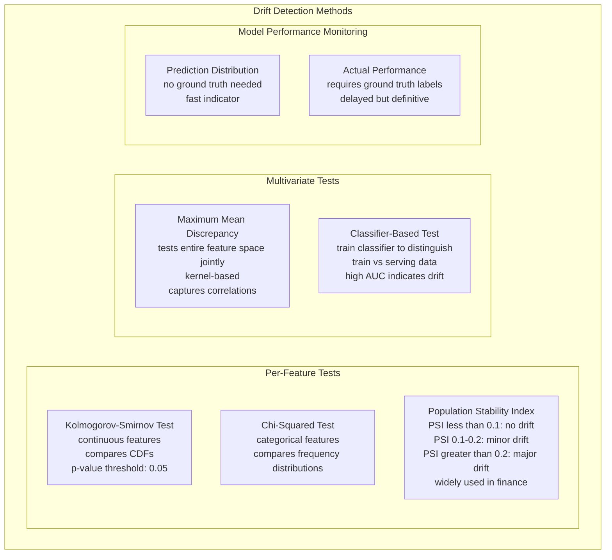
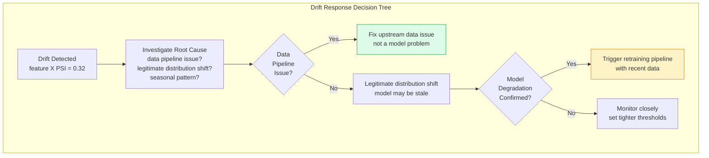

Drift detection is the process of identifying when the statistical properties of data or model behavior change in production, indicating that a deployed model may no longer be reliable. Unlike traditional software where bugs cause immediate failures, ML model degradation is gradual and silent — models continue to return predictions, but those predictions become increasingly wrong as the world shifts away from what the model learned.

## Types of Drift

```mermaid
graph TD
    subgraph DriftTypes[Drift Taxonomy]
        DataDrift[Data Drift\nalso: covariate shift\nP_train(X) != P_serve(X)\nInput feature distribution changes\nExample: new user demographics\nnew product categories]

        ConceptDrift[Concept Drift\nalso: label shift\nP_train(Y|X) != P_serve(Y|X)\nRelationship between features and labels changes\nExample: fraud patterns evolve\neconomic conditions shift]

        PredictionDrift[Prediction Drift\nP_train(Y_hat) != P_serve(Y_hat)\nModel output distribution changes\nLeading indicator of degradation\ncan detect without ground truth labels]

        LabelDrift[Label Drift\nP_train(Y) != P_serve(Y)\nTarget variable distribution changes\nRequires ground truth collection\noften delayed by days or weeks]

        DataDrift --> ConceptDrift
        ConceptDrift --> LabelDrift
        DataDrift --> PredictionDrift
    end
```

## Drift Detection Architecture



## Statistical Tests for Drift



## Drift Response Workflow



## Key Concepts

- **Data Drift (Covariate Shift)**: The input feature distribution P(X) changes between training and serving. The model's learned mapping from X to Y may still be correct, but the model is being asked to predict on inputs from a different distribution than it was trained on. Common causes: seasonal patterns, demographic shifts, new product launches, changes in upstream data pipelines.

- **Concept Drift**: The relationship between inputs and outputs P(Y|X) changes. Even with the same input features, the correct prediction has changed. Example: fraud patterns evolve as fraudsters adapt to detection systems. Concept drift requires retraining — no amount of feature engineering can fix a stale decision boundary.

- **Population Stability Index (PSI)**: A widely used metric in credit risk modeling for measuring feature drift. Computed as the sum of (actual_fraction - expected_fraction) * ln(actual_fraction / expected_fraction) across feature value bins. PSI < 0.1 is acceptable, 0.1-0.2 warrants investigation, > 0.2 indicates significant drift requiring action.

- **Reference Dataset**: The baseline distribution used for comparison. Typically the training dataset or a representative held-out sample. The reference should be stable — using a rolling window reference can mask gradual drift. Keep a fixed reference snapshot alongside each deployed model version.

- **Ground Truth Latency**: For many applications, ground truth labels are delayed — fraud labels may not be confirmed for days (chargebacks take time), recommendation clicks are immediate but conversions take hours. Drift detection without ground truth (monitoring prediction distributions) provides early warning; actual performance monitoring confirms the problem.

- **Evidently AI**: Open-source Python library for ML monitoring and drift detection. Generates HTML reports and JSON metrics for data drift, data quality, and model performance. Integrates with MLflow, Grafana, and custom dashboards. Supports batch analysis and reference-based drift comparison.

- **Whylogs**: Open-source data logging library that computes statistical profiles (histograms, distributions, counts) of datasets and model inputs/outputs at low overhead. Profiles can be stored and compared over time, enabling continuous drift monitoring without storing full datasets.

## Trade-offs

| Detection Method | Sensitivity | Interpretability | Compute Cost | Requires Labels |
|----------------|------------|-----------------|-------------|----------------|
| PSI per feature | Medium | High | Very Low | No |
| KS test per feature | High | High | Low | No |
| Classifier-based | Very High | Low | High | No |
| Actual model AUC | Definitive | High | Low | Yes (delayed) |

## When to Use

- **PSI monitoring**: Production default for tabular models — low compute cost, interpretable thresholds, well-understood by business stakeholders
- **KS test**: When continuous feature distributions need precise statistical comparison, e.g., monitoring input score distributions
- **Classifier-based drift**: When features are high-dimensional (embeddings, images) and univariate tests miss multivariate shifts
- **Prediction drift monitoring**: Always — it's a free leading indicator requiring no ground truth. Alert when prediction rate for positive class changes significantly
- **No drift monitoring**: Never acceptable for production models serving business-critical predictions