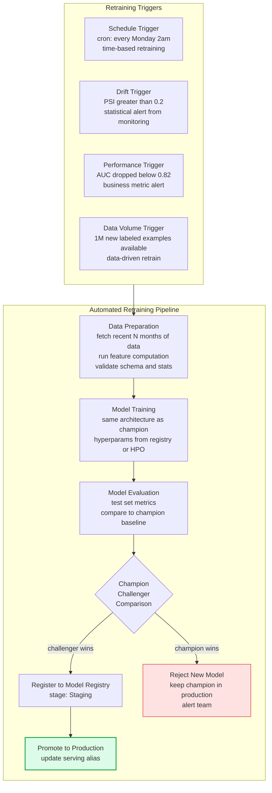
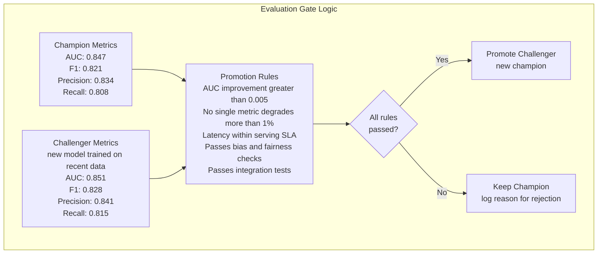
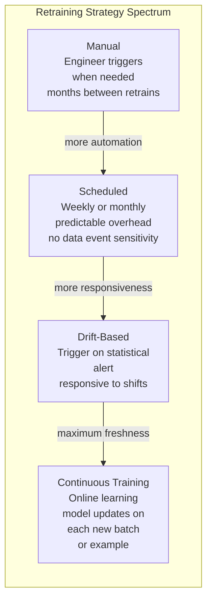
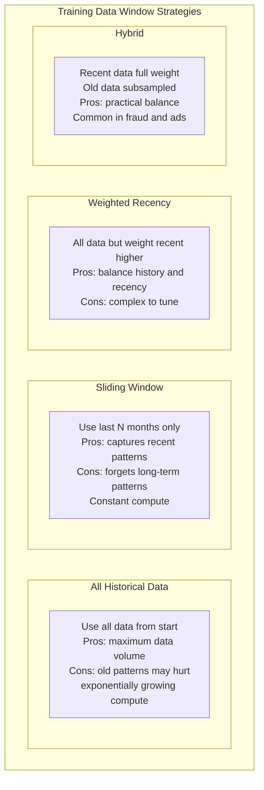

Retraining pipelines automate the process of updating ML models with fresh data to maintain prediction quality as the world changes. Unlike traditional software that remains correct until explicitly changed, ML models are correct only relative to the data distribution they were trained on — systematic retraining is required to keep them accurate over time.

## Retraining Pipeline Architecture

## Champion-Challenger Evaluation Framework

## Continuous Training vs Scheduled Retraining

## Data Window Strategy

## Key Concepts

- **Trigger Strategy**: What causes a retraining run to start. Schedule-based triggers (cron) are simple and predictable but may retrain unnecessarily (wasting compute) or too infrequently (missing rapid drift). Event-based triggers (drift threshold exceeded, performance degradation) are more responsive but require reliable monitoring infrastructure as prerequisites.

- **Champion-Challenger Evaluation**: The new model (challenger) must outperform the current production model (champion) on a held-out evaluation set before promotion. The evaluation set should be recent, representative, and use the same time-based split logic as the training set. Champion-challenger comparison prevents regressions from being automatically deployed.

- **Evaluation Gates**: Automated checks the challenger must pass before promotion. Include: metric thresholds (AUC, F1, business KPIs), latency checks (serving must stay within SLA), bias checks (performance across subgroups), integration tests (model loads and handles edge cases correctly). Gates are the quality assurance layer for automated ML deployments.

- **Data Window**: Which time period of historical data to use for retraining. A fixed sliding window (last 6 months) captures recent patterns but requires decisions about what recent means for the business. Too short a window risks forgetting rare but important patterns (fraud spikes, seasonal events). Too long a window dilutes the signal from recent shifts.

- **Online Learning**: Updating model parameters incrementally as each new example arrives, without full retraining. Enables very fresh models but is harder to validate (no batch evaluation), sensitive to outliers, and not supported by all model types. Used for recommendation and ad click prediction where recency matters enormously and data volume is very high.

- **Continual Learning Problem**: When retraining on new data causes the model to forget what it learned from old data (catastrophic forgetting). Particularly relevant for neural networks. Mitigations include experience replay (include samples from old data), regularization methods (EWC), and hybrid window strategies.

- **Monitoring as Prerequisite**: Automated retraining on drift triggers requires that monitoring infrastructure is reliable — false drift alerts cause unnecessary retraining. Building monitoring before automated retraining is the correct order.

## Trade-offs

| Strategy | Freshness | Compute Cost | Complexity | Risk |
|---------|---------|-------------|-----------|------|
| Manual retraining | Low | Low | Very Low | Model staleness |
| Scheduled weekly | Medium | Predictable | Low | Unnecessary retrains |
| Drift-triggered | High | Variable | Medium | False trigger risk |
| Continuous online | Very High | Continuous | Very High | Catastrophic forgetting |

## When to Use

- **Scheduled retraining**: Stable domains where drift is slow (credit risk, churn prediction) — weekly or monthly retraining with champion-challenger gate
- **Drift-triggered retraining**: Rapidly evolving domains (fraud, social media content) where drift is unpredictable and timeliness matters more than compute cost
- **Online learning**: Real-time personalization (news feeds, recommendations) where model freshness within minutes matters and data volume justifies the engineering complexity
- **Skip automated retraining**: Avoid automation until monitoring is robust — automated retraining without good monitoring can deploy bad models without human review