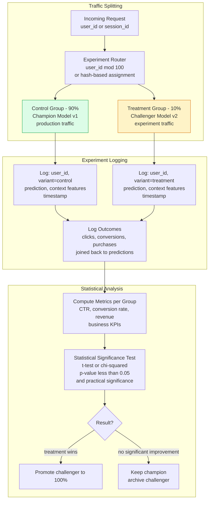
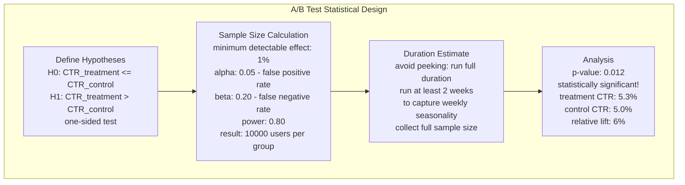
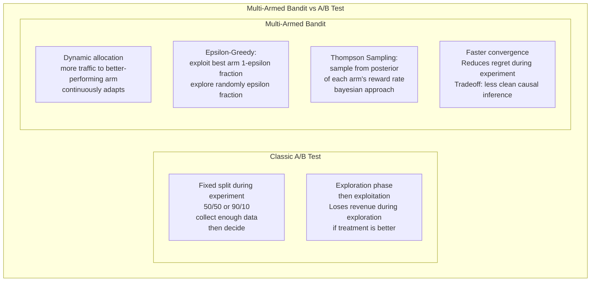

# A/B Testing for ML Models

A/B testing for ML models is the controlled online experiment that determines whether a new model (the challenger) produces better business outcomes than the current production model (the champion) when exposed to real user traffic. Unlike offline evaluation on historical data, A/B testing captures causal impact on live user behavior — the only evaluation that truly answers whether a new model improves the product.

## A/B Test Architecture for ML

## Statistical Significance Framework

## Multi-Armed Bandit Alternative

## Key Concepts

- **Randomization Unit**: The entity that is randomly assigned to control or treatment — user, session, or request. User-level randomization ensures a consistent experience (user always sees the same model) but reduces the number of independent observations. Request-level randomization maximizes statistical power but can cause inconsistent user experiences if the model affects multiple requests.

- **Statistical Significance**: A p-value below the threshold (typically 0.05) means the probability of observing the measured difference by chance (if there were truly no effect) is less than 5%. Statistical significance does not imply practical significance — a tiny but statistically significant improvement may not be worth the engineering cost.

- **Minimum Detectable Effect (MDE)**: The smallest improvement that the experiment is designed to detect with sufficient statistical power. Smaller MDEs require larger sample sizes. Setting MDE requires business input — what improvement justifies the risk and rollout effort?

- **Novelty Effect**: Users may engage differently with a new recommendation or ranking just because it's different, not because it's better. This novelty effect inflates treatment metrics early in the experiment and fades over time. Running experiments for at least 2 weeks helps distinguish novelty from sustained improvement.

- **Metric Hierarchy**: Define a primary metric (the single metric the experiment is designed to improve — e.g., 7-day retention), secondary metrics (should not degrade — revenue, support tickets), and guardrail metrics (absolute constraints — page load time must stay below 500ms). This hierarchy prevents optimizing one metric at the expense of others.

- **Multiple Testing Problem**: Running many experiments simultaneously, or testing many metrics, inflates the false positive rate. If you test 20 metrics at alpha=0.05, you expect 1 false positive by chance. Mitigations: pre-register the primary metric before experiment launch, apply Bonferroni correction for multiple metrics, or use FDR-controlling procedures.

- **Holdout Group**: A small segment of users permanently excluded from all experiments (e.g., 1-5%). Used to measure the cumulative long-term impact of all ML improvements by comparing holdout users (who always see the oldest baseline) against the rest of the user base. Answers the question: "How much better is our product overall because of ML investments?"

- **A/A Test**: Running an experiment where both arms receive identical treatment. Used to validate the experiment infrastructure — the result should show no significant difference. An A/A test that shows a significant difference indicates a bug in randomization, logging, or analysis.

## Trade-offs

| Approach | Causal Validity | Speed | Regret | Complexity |
|---------|----------------|-------|--------|-----------|
| A/B test | High | Slow | High during exploration | Low |
| Multi-armed bandit | Medium | Fast | Low | Medium |
| Shadow mode | None - offline only | Fast | Zero | Low |
| Interleaving | High | Very Fast | Low | High |

## When to Use

- **A/B test**: Default for major model changes where clean causal inference is important and the experiment runs for weeks — the statistical rigor justifies the exploration cost
- **Multi-armed bandit**: Recommendation and ad systems with many arms (model variants, content items) where continuous optimization is more important than causal inference
- **Shadow mode first**: Before any A/B test, run shadow mode to validate that the new model produces different and plausibly better predictions — avoids running an expensive A/B test on a model that has a bug
- **Interleaving**: Search and ranking systems where two ranked lists can be interleaved and user clicks directly reveal preference — much higher statistical sensitivity than A/B testing for ranking tasks
