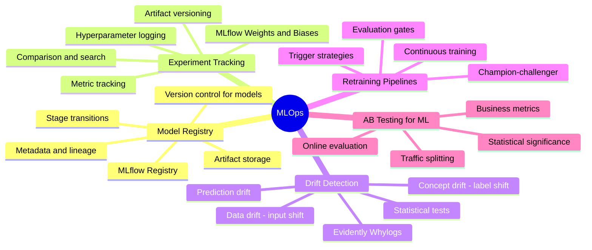
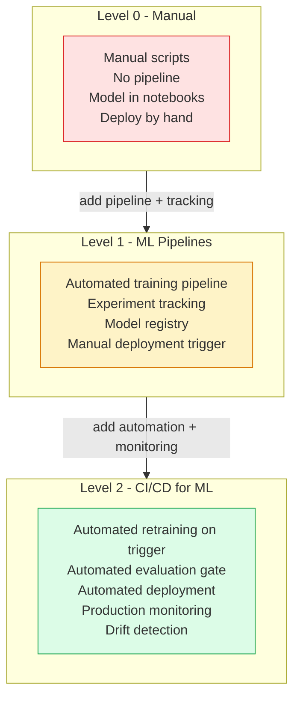

# MLOps

MLOps (Machine Learning Operations) applies DevOps principles to the ML lifecycle — automating training, evaluation, deployment, and monitoring of models in production. Unlike traditional software, MLOps must manage both code and data artifacts, and must detect degradation from data distribution shifts rather than just software bugs.

## Overview

## MLOps Maturity Model

## Topics in This Section

| File | Topic | Key Concepts |
|------|-------|--------------|
| [01_model_registry.md](01_model_registry.md) | Model Registry | Versioning, stage transitions, lineage |
| [02_experiment_tracking.md](02_experiment_tracking.md) | Experiment Tracking | Metrics, parameters, artifacts |
| [03_drift_detection.md](03_drift_detection.md) | Drift Detection | Data drift, concept drift, PSI |
| [04_retraining_pipelines.md](04_retraining_pipelines.md) | Retraining Pipelines | Triggers, CT, evaluation gates |
| [05_ab_testing.md](05_ab_testing.md) | A/B Testing for ML | Traffic splitting, significance |
