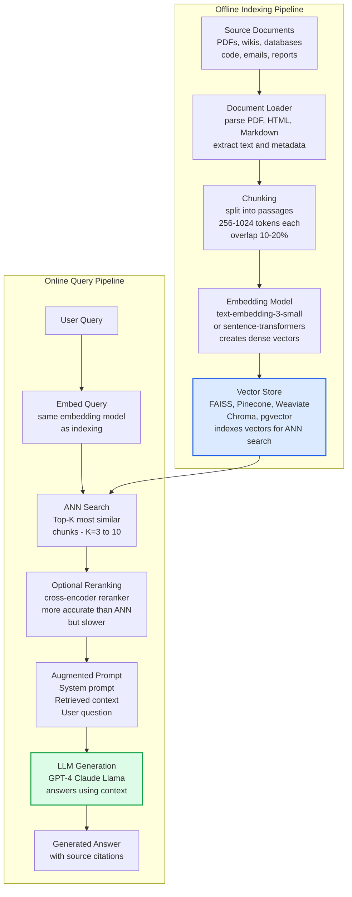
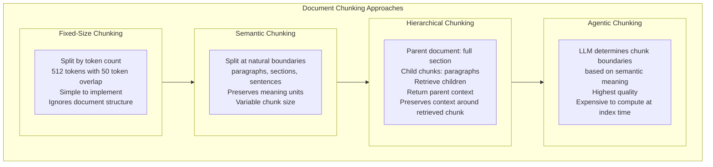
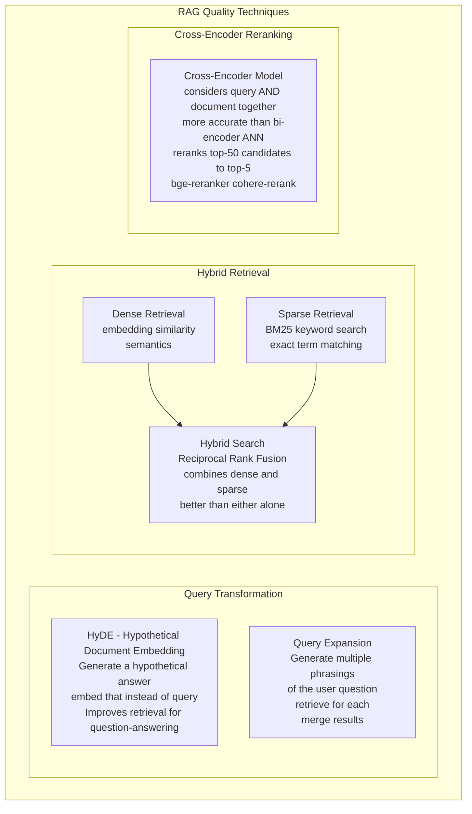

Retrieval-Augmented Generation (RAG) is a technique that enhances LLM responses by retrieving relevant documents from an external knowledge base and including them in the context window before generation. RAG addresses the key limitations of standalone LLMs: knowledge cutoff dates, hallucination of facts, and inability to access private or proprietary knowledge — without requiring expensive model fine-tuning.

## RAG Architecture

## Chunking Strategies

## Retrieval Quality Improvement

## Key Concepts

- **Vector Embeddings**: Dense numerical representations of text that capture semantic meaning — similar texts have nearby vectors in embedding space. Computed by embedding models (OpenAI text-embedding-3-small, Cohere Embed, sentence-transformers). The quality of the embedding model directly determines retrieval quality. Embedding the query with the same model used for indexing is essential.

- **Approximate Nearest Neighbor (ANN) Search**: Finding the K vectors most similar to the query vector from potentially millions of indexed chunks. Exact search scales as O(n*d) which is too slow for large knowledge bases. ANN algorithms (HNSW, IVF, LSH) trade perfect recall for dramatic speed improvements, typically achieving 95-99% recall at 10-100x speedup.

- **Chunking**: Splitting long documents into passages small enough to fit in the context window while large enough to be semantically meaningful. Chunk size is a critical hyperparameter — too small misses context, too large includes irrelevant text. Overlapping adjacent chunks ensures information at chunk boundaries is not lost.

- **Context Window Stuffing**: After retrieval, the top-K chunks are concatenated into the LLM context window along with the system prompt and user query. Context windows of 128K tokens (GPT-4 Turbo, Claude) can accommodate many chunks, but LLM performance degrades for information in the middle of very long contexts (the "lost in the middle" problem). Reranking and selecting fewer, higher-quality chunks often outperforms retrieving more chunks.

- **Hybrid Search**: Combining dense embedding search (captures semantics) with sparse keyword search (BM25 — captures exact term matches). Many queries benefit from both: "What is the revenue of AAPL?" needs keyword match for AAPL and semantic understanding of revenue. Reciprocal Rank Fusion (RRF) is the standard method for merging ranked lists from multiple retrieval methods.

- **RAG Evaluation**: Measuring RAG system quality requires evaluating multiple components: retrieval recall (were the relevant documents retrieved?), context relevance (are the retrieved documents actually relevant to the query?), answer faithfulness (does the answer only use information from the retrieved context?), and answer correctness (is the answer factually correct?). RAGAS is a framework that automates these evaluations using LLM-as-judge.

- **Metadata Filtering**: Restricting retrieval to a subset of the knowledge base using metadata filters (date range, document type, department, access permissions). Metadata filtering combines with vector search to implement access control and scoped search. Example: only retrieve documents from the past 6 months, or only retrieve documents the user has permission to see.

## Trade-offs

| Retrieval Method | Semantic Quality | Exact Match | Speed | Complexity |
|----------------|-----------------|------------|-------|-----------|
| Dense (ANN only) | High | Low | Very Fast | Low |
| Sparse (BM25 only) | Low | High | Fast | Low |
| Hybrid (Dense + Sparse) | High | High | Fast | Medium |
| Hybrid + Reranker | Highest | High | Medium | High |

## When to Use

- **RAG over fine-tuning**: When the knowledge base changes frequently (news, product docs, pricing), when you need source citations, or when domain knowledge is vast and structured — RAG is cheaper and more maintainable than fine-tuning
- **Fine-tuning over RAG**: When the task requires a specific output format or style that cannot be achieved by prompting, or when the knowledge is stable and the model needs to internalize reasoning patterns rather than facts
- **Hybrid search**: Default for production RAG systems — pure dense retrieval misses exact keyword matches that users expect
- **Hierarchical chunking**: When source documents have clear structure (documentation, reports) and surrounding context is important for understanding retrieved passages