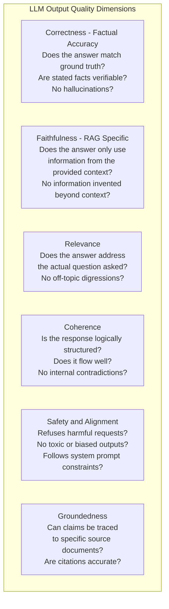
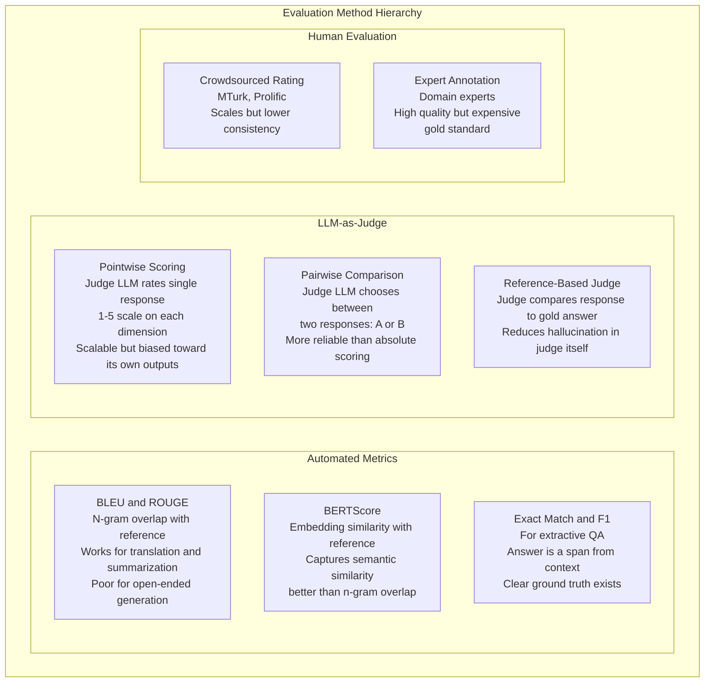
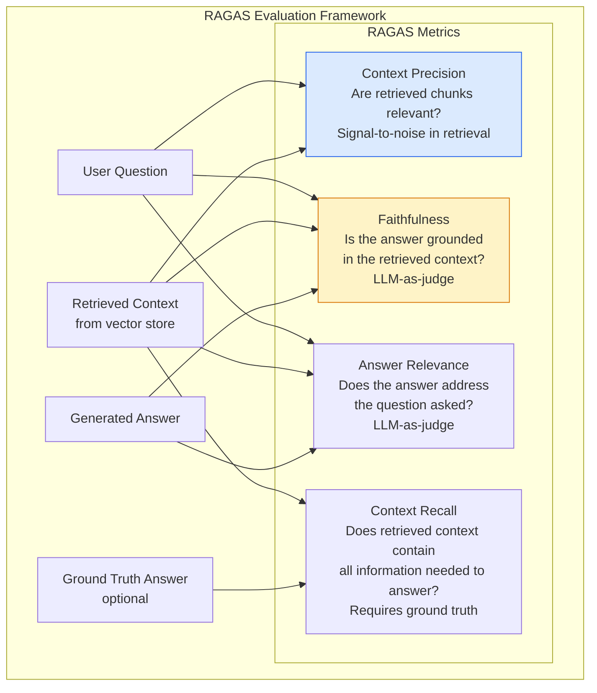
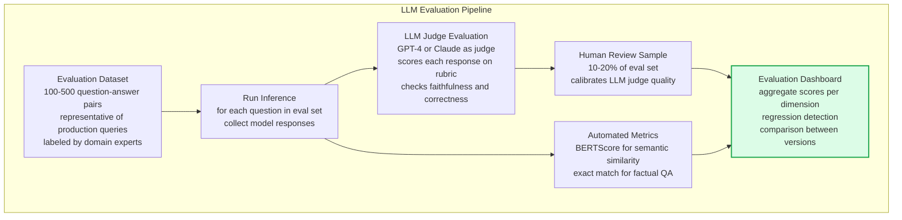

# LLM Evaluation

LLM evaluation is the systematic measurement of language model output quality across dimensions like accuracy, faithfulness, coherence, and safety. Unlike traditional ML evaluation with clear numerical metrics (AUC, F1), LLM evaluation is inherently multi-dimensional and often requires LLMs themselves as judges — because the space of correct outputs is vast and rubric-based human evaluation is expensive to scale.

## Evaluation Dimensions

## Evaluation Methods

## RAG-Specific Evaluation with RAGAS

## Evaluation Pipeline

## Key Concepts

- **LLM-as-Judge**: Using a powerful LLM (GPT-4, Claude) to evaluate the outputs of another LLM. The judge is given a rubric (scoring criteria) and the response to evaluate. Scales to large evaluation sets unlike human annotation, but has known biases: judges tend to prefer longer responses, responses in their own style, and responses from models in the same family. Calibrate with human annotations to understand judge reliability.

- **Hallucination**: LLMs generating plausible-sounding but factually incorrect information — names, dates, statistics, citations that do not exist. Hallucination is the primary quality failure mode for LLMs in factual applications. Mitigation: RAG (ground responses in documents), low temperature, structured output with fact verification, and faithfulness evaluation to catch it.

- **Evaluation Dataset Curation**: The quality of evaluation depends entirely on the quality of the evaluation dataset. Good eval sets are: representative of production traffic (not just easy cases), include adversarial examples (tricky or ambiguous questions), have clear correct answers (or rubrics for subjective dimensions), and are regularly refreshed as the use case evolves.

- **Benchmark Suites**: Standardized evaluation sets for comparing LLMs: MMLU (massive multitask language understanding — academic knowledge), HumanEval (code generation), TruthfulQA (truthfulness on tricky questions), MT-Bench (multi-turn conversation quality), HellaSwag (commonsense reasoning). Use industry benchmarks for capability assessment; use custom eval sets for application-specific performance.

- **Regression Testing**: Running the evaluation pipeline on every model or prompt change to catch regressions before deployment. The eval pipeline should be integrated into CI/CD — a new model or prompt version only advances to production if it matches or exceeds the baseline eval scores. Maintains quality as systems evolve.

- **Evaluation vs Observation**: Offline evaluation (on an eval set) measures quality in controlled conditions. Online observation (monitoring production outputs) measures quality on real traffic. Both are needed — offline evals catch regressions before deployment, online observation catches distribution shifts and edge cases that eval sets don't cover.

- **Positional Bias in Pairwise Evaluation**: When asking an LLM judge to compare response A vs response B, judges systematically prefer the response presented first. Mitigate by evaluating each pair twice with order reversed and flagging inconsistencies.

## Trade-offs

| Evaluation Method | Scale | Cost | Reliability | Latency |
|------------------|-------|------|------------|---------|
| N-gram metrics (BLEU) | Very High | Very Low | Low for open-ended | Instant |
| BERTScore | High | Low | Medium | Fast |
| LLM-as-judge | High | Medium | High (with calibration) | Slow |
| Human expert | Low | Very High | Highest | Very Slow |
| Human crowdsource | Medium | High | Medium | Slow |

## When to Use

- **Automated metrics (BLEU/ROUGE)**: Only for tasks with clear reference outputs — translation, summarization where multiple phrasings of the correct answer are acceptable
- **LLM-as-judge**: Default for open-ended generation — fast, scalable, and accurate when calibrated against human judgments
- **Human evaluation**: Ground truth baseline for calibrating LLM judges, for high-stakes decisions, and for final launch approval
- **RAGAS**: Any RAG system — it provides component-level diagnostics (is it a retrieval problem or a generation problem?) that aggregate metrics miss
- **Continuous eval in CI/CD**: Always — evaluation without deployment gates allows quality to silently regress
