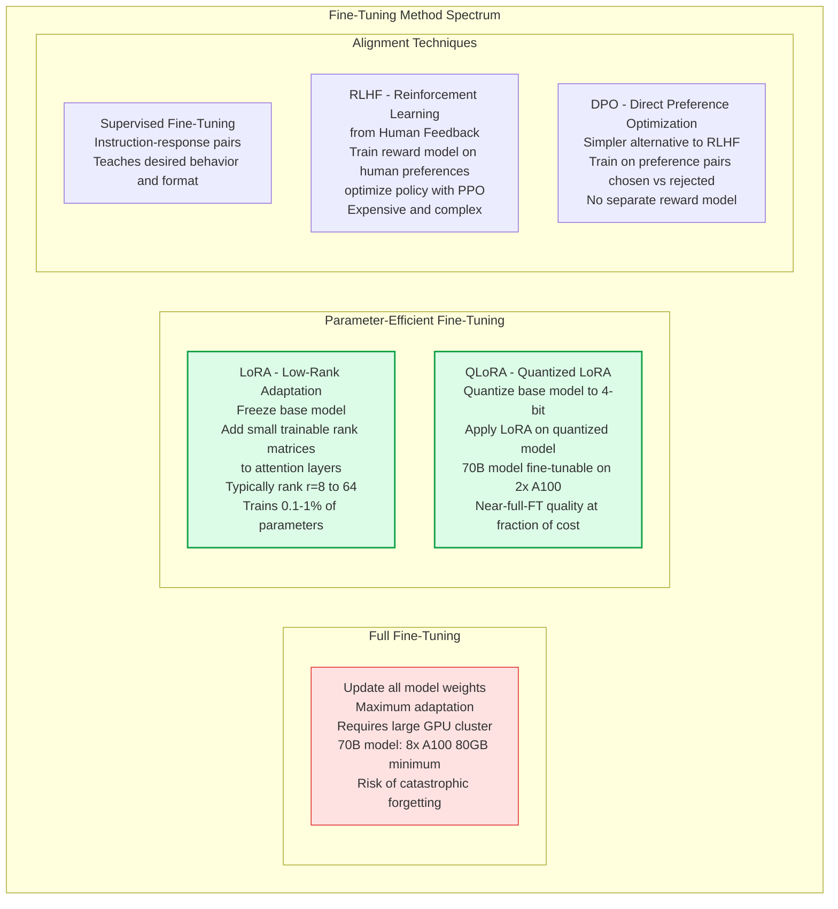
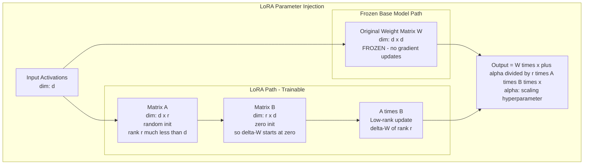
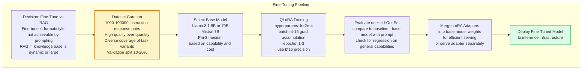

Fine-tuning adapts a pre-trained language model to a specific task or domain by continuing training on curated task-specific data. Unlike prompting which works within the frozen model's capabilities, fine-tuning modifies model weights to internalize new behavior, output formats, or domain knowledge. The decision of when to fine-tune vs use RAG vs prompt engineer is one of the most important architectural decisions in LLM system design.

## Fine-Tuning Approaches

## LoRA Architecture

## Fine-Tuning Pipeline

## Key Concepts

- **LoRA (Low-Rank Adaptation)**: Instead of modifying the full weight matrices (which are huge — a 7B model has billions of parameters), LoRA adds small trainable rank decomposition matrices alongside frozen original weights. The effective weight update W + delta-W where delta-W = AB is constrained to rank r. This makes fine-tuning feasible on modest hardware and prevents catastrophic forgetting of the base model's general capabilities.

- **QLoRA**: Combines 4-bit quantization of the base model with LoRA adapters. The base model is quantized to 4-bit (NF4 format) and kept frozen. LoRA adapters are trained in bf16. This reduces the GPU memory required to fine-tune a 70B model from 8+ A100s (full FT) to 2 A100s — a 4x memory reduction. Accuracy is near-identical to full fine-tuning in most benchmarks.

- **Instruction Tuning**: Fine-tuning on (instruction, response) pairs to teach a model to follow instructions reliably. The base pre-trained model knows a lot but doesn't know to behave helpfully. Instruction tuning (SFT on curated instruction-following datasets) produces the difference between a raw language model and a useful assistant.

- **RLHF (Reinforcement Learning from Human Feedback)**: The technique used by OpenAI, Anthropic, and others to align LLMs with human preferences. Step 1: Collect human preferences (humans rank multiple model outputs). Step 2: Train a reward model on these preferences. Step 3: Fine-tune the LLM using PPO (Proximal Policy Optimization) to maximize the reward model's score. RLHF is expensive and complex but produces highly aligned models.

- **DPO (Direct Preference Optimization)**: A simpler alignment technique that directly optimizes on preference pairs (chosen vs rejected response) without a separate reward model or RL training. DPO reformulates the RLHF objective into a classification loss on preference pairs, making it much more stable and computationally efficient. Most teams doing alignment today use DPO or its variants.

- **Data Quality over Quantity**: For fine-tuning, 1,000 high-quality, diverse, and correctly formatted instruction-response pairs typically outperforms 100,000 noisy or redundant pairs. Dataset curation — filtering, deduplicating, and quality-checking examples — is more important than collecting more data.

- **Catastrophic Forgetting**: When fine-tuning on a narrow dataset causes the model to lose its general capabilities (common knowledge, language fluency, instruction-following). Mitigations: LoRA/PEFT (modifies only a fraction of parameters), mixing in general instruction-following data during fine-tuning, and evaluating on general benchmarks alongside task-specific metrics.

## Trade-offs

| Approach | Cost | Flexibility | Capability Gain | Serving Complexity |
|---------|------|------------|----------------|-------------------|
| Prompt engineering | Very Low | High | Limited | Low |
| RAG | Low | High | Knowledge extension | Medium |
| LoRA fine-tuning | Medium | Medium | Style and format | Medium |
| Full fine-tuning | Very High | Low | Maximum | High |
| RLHF | Highest | Low | Alignment | High |

## When to Use

- **Prompt engineering first**: Always the starting point — exhausts the free option before paying for fine-tuning
- **RAG**: When the model needs access to specific up-to-date or proprietary knowledge — faster iteration than fine-tuning and knowledge can be updated without retraining
- **LoRA fine-tuning**: When the required output format or behavior cannot be achieved by prompting (JSON schemas with specific conventions, domain-specific writing style, coding in obscure languages), or when inference cost at scale justifies replacing large API calls with a smaller fine-tuned model
- **Full fine-tuning**: Rarely justified for most teams — only when PEFT doesn't achieve required quality and compute budget allows
- **DPO over RLHF**: Default for alignment when preference data is available — same quality as RLHF with significantly less engineering complexity