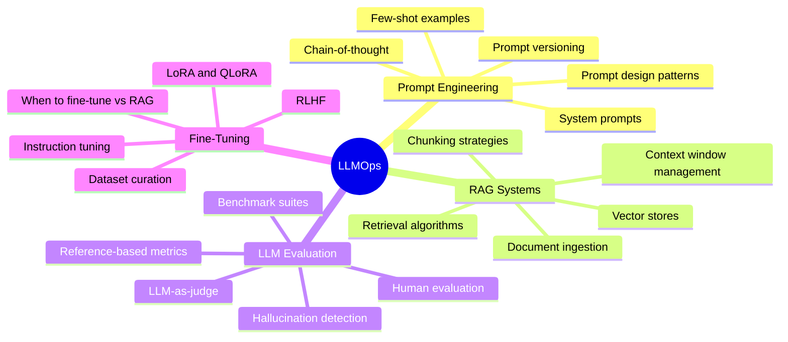
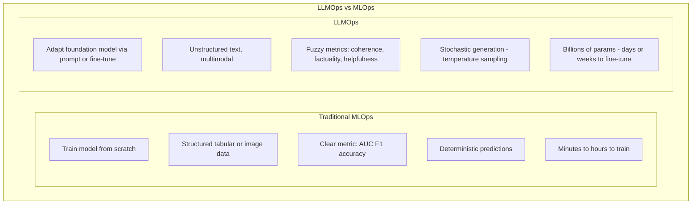

LLMOps (Large Language Model Operations) is the specialized practice of building, deploying, evaluating, and maintaining systems powered by large language models. It extends MLOps with LLM-specific challenges: prompt engineering and versioning, retrieval-augmented generation, evaluation without ground-truth labels, and the unique cost-quality-latency trade-offs of foundation model APIs and self-hosted LLMs.

## Overview

## LLMOps vs Traditional MLOps

## Topics in This Section

| File | Topic | Key Concepts |
|------|-------|--------------|
| [01_prompt_engineering.md](01_prompt_engineering.md) | Prompt Engineering | Patterns, chain-of-thought, versioning |
| [02_rag_systems.md](02_rag_systems.md) | RAG Systems | Retrieval, chunking, vector stores |
| [03_llm_evaluation.md](03_llm_evaluation.md) | LLM Evaluation | LLM-as-judge, benchmarks, RAGAS |
| [04_fine_tuning.md](04_fine_tuning.md) | Fine-Tuning | LoRA, instruction tuning, RLHF |