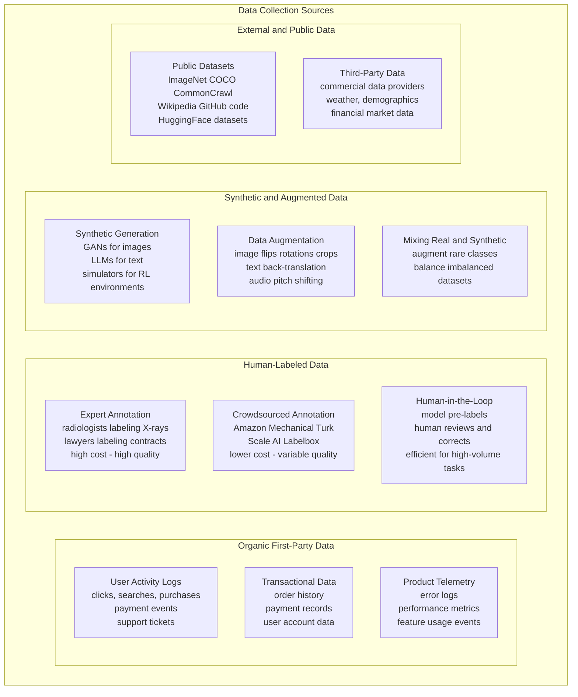
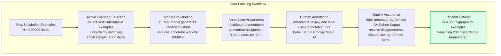
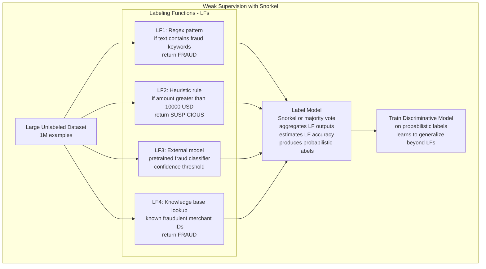

Data collection is the process of gathering, sourcing, and labeling the raw data that forms the foundation of ML training datasets. The diversity, volume, and quality of collected data determines the ceiling of model performance — no training algorithm or architecture can overcome a fundamentally biased, limited, or mislabeled dataset.

## Data Source Taxonomy

## Data Labeling Pipeline

## Label Quality and Weak Supervision

## Key Concepts

- **Data Flywheel**: The virtuous cycle where more users generate more data, enabling training better models, which improve the product, attracting more users. Building the data flywheel is one of the most important strategic decisions in ML-powered products — it creates compounding competitive advantage over time. Collect data by design: log everything useful, instrument product actions as implicit labels.

- **Implicit vs Explicit Labels**: Explicit labels require human annotation (expensive, slow). Implicit labels come from user behavior — a click signals relevance in search, a purchase signals interest in recommendations, a fraud report labels a transaction. Implicit labels are abundant and cheap but noisy (a non-click doesn't mean irrelevance — the item may not have been seen). Design the product to collect high-quality implicit labels.

- **Inter-Annotator Agreement (IAA)**: A measure of how consistently different human annotators label the same examples. Cohen's Kappa > 0.8 indicates strong agreement; < 0.6 indicates the labeling task is ambiguous. Low IAA signals that the labeling guidelines are unclear or the task is inherently subjective. Fix guidelines before scaling annotation — scaling a broken annotation process multiplies garbage.

- **Active Learning**: Selectively choosing which unlabeled examples to annotate based on model uncertainty. Instead of randomly sampling 1,000 examples from 1M unlabeled items, active learning selects the 1,000 examples the current model is most uncertain about — maximizing the information gained per annotation dollar. Reduces labeled data requirements by 5-10x for many tasks.

- **Data Augmentation**: Programmatically creating new training examples from existing ones. For images: random crops, flips, color jitter, Mixup, CutMix. For text: synonym replacement, back-translation, paraphrase generation. For tabular data: SMOTE for class imbalance. Augmentation is most valuable for small datasets or rare classes, and must preserve the label (a horizontally flipped cat is still a cat; an augmented fraud transaction must still represent fraud).

- **Weak Supervision (Snorkel)**: Using noisy, heuristic labeling functions (regexes, rules, weak classifiers) to label large datasets programmatically. Individual labeling functions are imprecise, but combining many using a learned label model produces reliable probabilistic labels for training. Enables labeling millions of examples without human annotation. Best for tasks with existing domain heuristics.

- **Synthetic Data**: Generating artificial training examples using generative models, simulations, or rule-based systems. Useful for rare events (catastrophic failure scenarios in autonomous driving), privacy-sensitive data (synthetic patient records), and augmenting class-imbalanced datasets. Synthetic data quality must be validated — a generative model can produce plausible but systematically wrong examples.

## Trade-offs

| Collection Strategy | Cost | Volume | Quality | Label Noise |
|--------------------|------|--------|---------|------------|
| Expert annotation | Very High | Low | Very High | Very Low |
| Crowdsourced annotation | Medium | Medium | Medium | Medium |
| Implicit feedback | Very Low | Very High | Noisy | High |
| Weak supervision | Low | Very High | Medium | Medium |
| Synthetic data | Low | Very High | Task-dependent | Low if careful |

## When to Use

- **Expert annotation**: Medical imaging, legal documents, scientific data — tasks where domain expertise is required for correct labeling and errors are costly
- **Crowdsourced annotation**: General object detection, sentiment classification — tasks clear enough for non-experts with quality controlled by redundancy and IAA filtering
- **Implicit feedback**: Recommendation, search, ad click prediction — tasks where user behavior is the label and scale is essential
- **Weak supervision**: When labeled data is scarce but domain rules exist and scaling annotation is too slow — get a model working quickly with weak labels, refine with targeted expert annotation
- **Synthetic data**: Class imbalance correction, data augmentation for small datasets, privacy-preserving training data generation