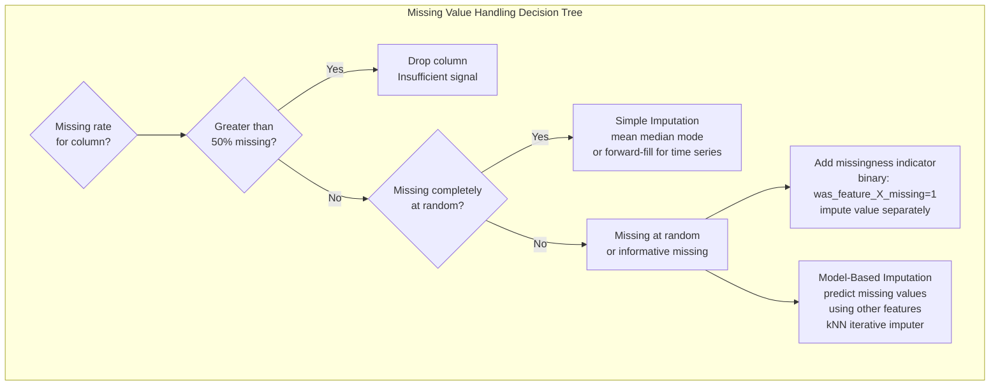
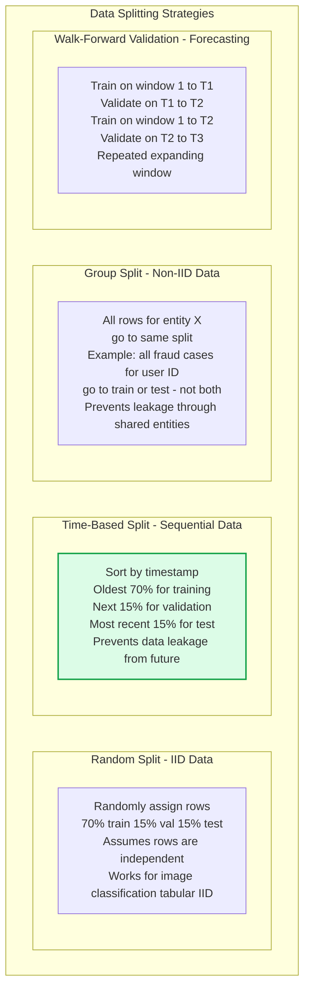

Data preprocessing transforms raw, messy collected data into clean, consistent numerical representations that ML algorithms can learn from. Preprocessing decisions — how to handle missing values, how to encode categoricals, how to scale features, how to split data — directly affect model accuracy, training stability, and the validity of offline evaluation metrics.

## Preprocessing Pipeline

```mermaid
graph TD
    subgraph Pipeline[End-to-End Preprocessing Pipeline]
        Raw[Raw Training Data\nFrom data lake or warehouse]

        Schema[Schema Enforcement\nValidate column types\nRequired fields present\nRejecting malformed rows]

        Clean[Data Cleaning\nRemove duplicates\nFix inconsistent formats\nStandardize categorical values]

        Missing[Missing Value Handling\nNumeric: mean median or forward-fill\nCategorical: mode or Unknown category\nHigh-missing-rate: drop column or row]

        Outlier[Outlier Treatment\nclip at percentile 1 and 99\nor log-transform skewed features\nor winsorize extreme values]

        Encode[Categorical Encoding\nLow cardinality: one-hot\nHigh cardinality: target or ordinal\nEmbedding for very high cardinality]

        Scale[Feature Scaling\nStandardize zero mean unit variance\nor min-max scale 0 to 1\nTree models: not required\nNeural nets and linear models: required]

        Split[Train-Val-Test Split\ntime-based for time-series data\nrandom for IID data\nStratified for imbalanced classes]

        Cleaned[Cleaned and Split Dataset\nReady for training]

        Raw --> Schema --> Clean --> Missing --> Outlier --> Encode --> Scale --> Split --> Cleaned
    end

    style Cleaned fill:#dcfce7,stroke:#16a34a,stroke-width:2px
```

## Missing Value Strategies

## Train-Validation-Test Split Design

## Key Concepts

- **Preprocessing Pipeline as Code**: Preprocessing logic must be implemented as a reusable, versioned pipeline — not ad-hoc notebook code. The same pipeline must run identically during training and serving (training-serving skew prevention). Scikit-learn's Pipeline, Spark transformers, or custom classes ensure consistent transformations. Every transformation fitted on training data (mean for imputation, vocabulary for encoding) must be persisted and applied identically at serving time.

- **Fit on Train, Transform All**: A critical rule — preprocessing statistics (mean, standard deviation, vocabulary, category mapping) must be computed only on the training set, then applied to validation and test sets. Computing statistics on the full dataset (including val/test) causes data leakage — the model indirectly sees information from test examples, producing optimistic evaluation metrics.

- **Label Encoding vs One-Hot Encoding**: For tree-based models (XGBoost, LightGBM), ordinal label encoding is often sufficient — trees can split on categorical codes. For linear models and neural networks, one-hot encoding is required because the model would otherwise interpret categorical codes as ordinal numbers. For very high-cardinality categoricals (thousands of unique values), target encoding or learned embeddings outperform both.

- **Temporal Data Leakage**: The most common and damaging mistake in time-series ML — using future information in training that would not be available at prediction time. Causes: random splitting of temporal data (test rows from early dates are contaminated by features computed using later dates), point-in-time incorrect joins, window aggregations that cross the label date. Always use time-based splits for any data with a temporal dimension.

- **Class Imbalance**: When one class is much rarer than others (e.g., fraud is 0.1% of transactions). Imbalanced datasets cause models to learn to predict the majority class always. Mitigations: oversample the minority class (SMOTE), undersample the majority class, use class weights in the loss function, or use evaluation metrics robust to imbalance (AUC-ROC, F1 by class, precision-recall AUC rather than accuracy).

- **Feature Scaling**: Standardization (z-score: subtract mean, divide by std) centers features at 0 with unit variance. Min-max scaling maps features to [0,1]. Required for distance-based algorithms (k-NN, SVM), linear models, and neural networks — gradient descent converges faster and more reliably with scaled features. Tree-based models are scale-invariant and do not require scaling.

- **Duplicate Detection**: Training on duplicated records inflates the effective training set size without adding information, can bias model learning toward frequently appearing examples, and can cause data leakage if duplicates appear in both train and test sets. Exact duplicates are easy to detect by hash; near-duplicates require fuzzy matching (Jaccard similarity, MinHash LSH for text, perceptual hashing for images).

## Trade-offs

| Missing Value Strategy | Bias | Variance | Preserves Info | Complexity |
|-----------------------|------|---------|---------------|-----------|
| Drop rows | High if MNAR | Low | No | Lowest |
| Mean imputation | Medium | Low | Partial | Low |
| Missingness indicator | Low | Medium | Yes | Medium |
| Model-based imputation | Low | Medium | Yes | High |

## When to Use

- **Time-based split**: Any dataset with timestamps — almost always the correct choice for production ML where the model predicts future events from past data
- **Group-based split**: Recommendation systems, user-level models, any system where the same entity appears multiple times — prevents the model from memorizing entity-specific patterns that don't generalize
- **SMOTE for imbalance**: Classification problems with less than 5% minority class rate when collecting more minority class data is infeasible
- **Target encoding for high cardinality**: When a categorical feature has thousands of unique values (merchant ID, device model) — one-hot creates sparse high-dimensional vectors; target encoding condenses to meaningful single values