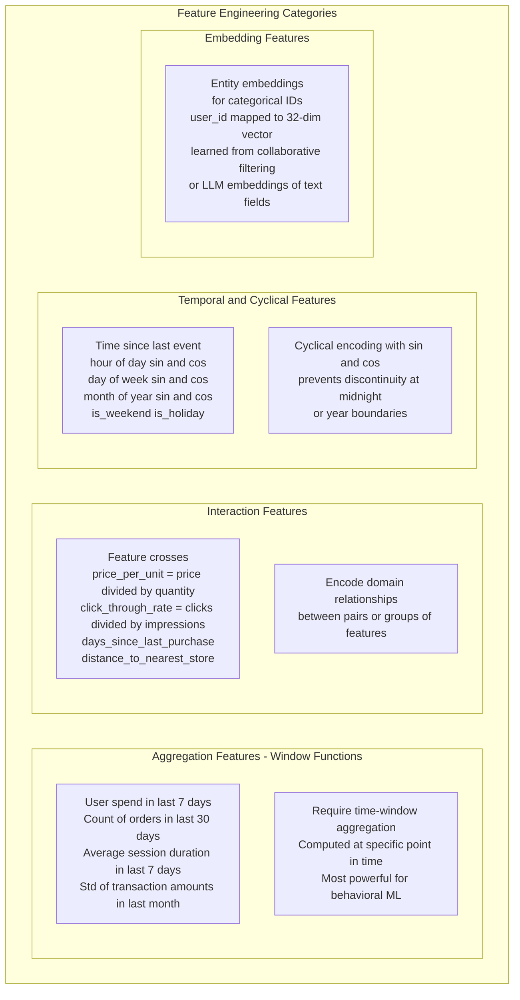
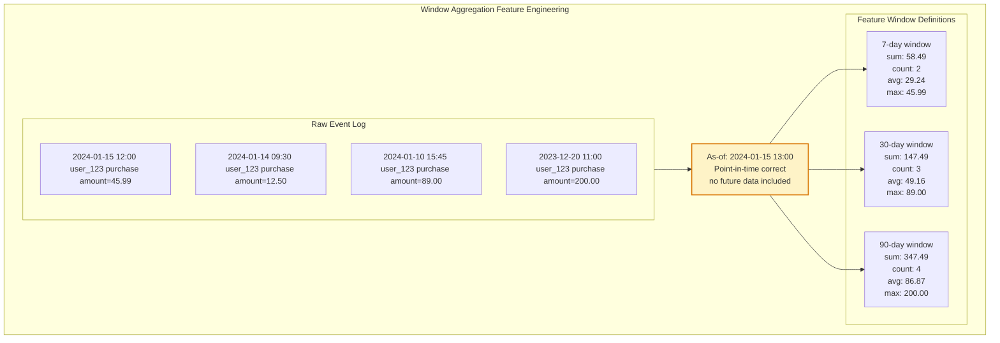
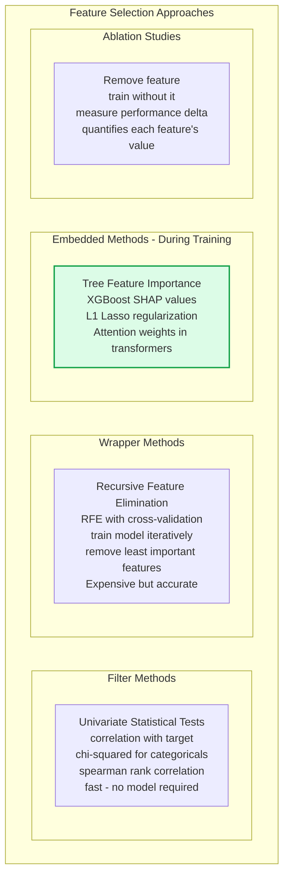

Feature engineering is the process of transforming raw data into informative representations — features — that capture the signals most predictive of the target variable. Good feature engineering encodes domain knowledge about what makes examples similar or different, enabling models to learn faster and generalize better. In tabular ML, feature engineering often has a larger impact on model performance than model architecture selection.

## Feature Engineering Taxonomy

## Time-Window Aggregation Design

## Feature Selection Methods

## Key Concepts

- **Window Aggregations**: Computing statistics (sum, count, mean, std, min, max) over a rolling time window anchored to each observation's timestamp. These are among the most predictive features in behavioral ML tasks — "how much did this user spend in the last 7 days" is more predictive of fraud than "how much did they spend ever". Must be computed point-in-time correctly to avoid label leakage.

- **Feature Crosses**: Creating new features by combining two or more existing features. Examples: price-to-income ratio, click-through rate (clicks/impressions), days-since-last-purchase. Feature crosses encode domain knowledge about relationships between variables that the model cannot easily learn from the individual features alone, especially for linear models that cannot learn interactions without explicit feature crosses.

- **Cyclical Encoding**: Hour-of-day, day-of-week, and month-of-year are cyclical — hour 23 is similar to hour 0, but raw integer encoding puts them far apart. Encoding cyclical features as sin and cos projections (sin(2π * hour/24), cos(2π * hour/24)) preserves the cyclical relationship. Critical for time-series and behavioral features.

- **Target Encoding**: Replacing a categorical value with the mean of the target variable for that category (e.g., replace merchant_id with the average fraud rate for that merchant). Very powerful for high-cardinality categoricals, but must be computed with cross-validation on training folds to prevent target leakage (the category's own label would inflate its encoding).

- **Entity Embeddings**: Representing high-cardinality categorical entities (user IDs, product IDs, merchant IDs) as dense learned vectors rather than one-hot or target encodings. Embeddings can capture complex relationships — users who prefer similar products are nearby in embedding space. Can be pre-trained from collaborative filtering, LLM text descriptions, or learned jointly with the prediction model.

- **SHAP Values (SHapley Additive exPlanations)**: A game-theoretic method for attributing each feature's contribution to a model's prediction. SHAP values are model-agnostic and satisfy desirable fairness properties. They explain individual predictions ("the model predicted fraud because of high_amount = +0.3, new_device = +0.2, low_history = +0.1") and aggregate to feature importance rankings. Essential for model debugging and stakeholder communication.

- **Feature Drift**: The statistical properties of features in production changing from what they were during training (covariate shift). Monitor feature distributions (mean, std, PSI) in production relative to the training set. Feature drift is the leading cause of silent model performance degradation.

## Trade-offs

| Feature Type | Predictive Power | Computation Cost | Interpretability | Risk of Leakage |
|-------------|-----------------|-----------------|-----------------|----------------|
| Raw features | Low | Very Low | High | Low |
| Window aggregations | Very High | Medium | High | High (if not PIT) |
| Feature crosses | High | Low | Medium | Low |
| Entity embeddings | High | High (training) | Low | Low |
| Target encoding | High | Low | Medium | High (without cross-val) |

## When to Use

- **Window aggregations**: Any behavioral prediction task (fraud, churn, recommendation, credit risk) — they are almost always the highest-signal features
- **Cyclical encoding**: Any feature encoding time-of-day, day-of-week, or other periodic variables — always use sin/cos rather than raw integers
- **Target encoding**: High-cardinality categoricals (more than ~50 unique values) where one-hot creates too many dimensions
- **SHAP values**: During model development for feature selection, debugging, and stakeholder explanation; in production for monitoring individual prediction explanations and detecting model drift
- **Entity embeddings**: Recommendation systems, ad targeting, any system where entity IDs are primary keys with millions of unique values