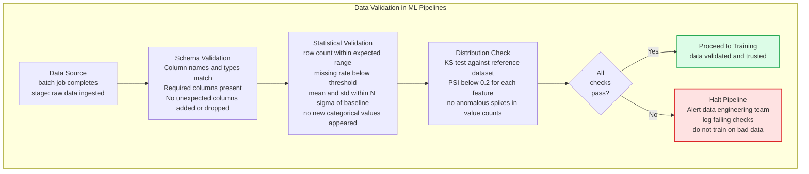
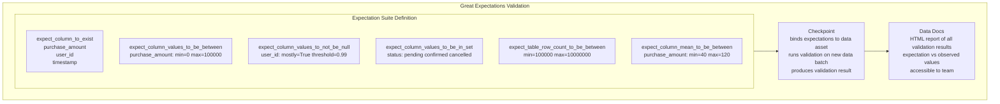
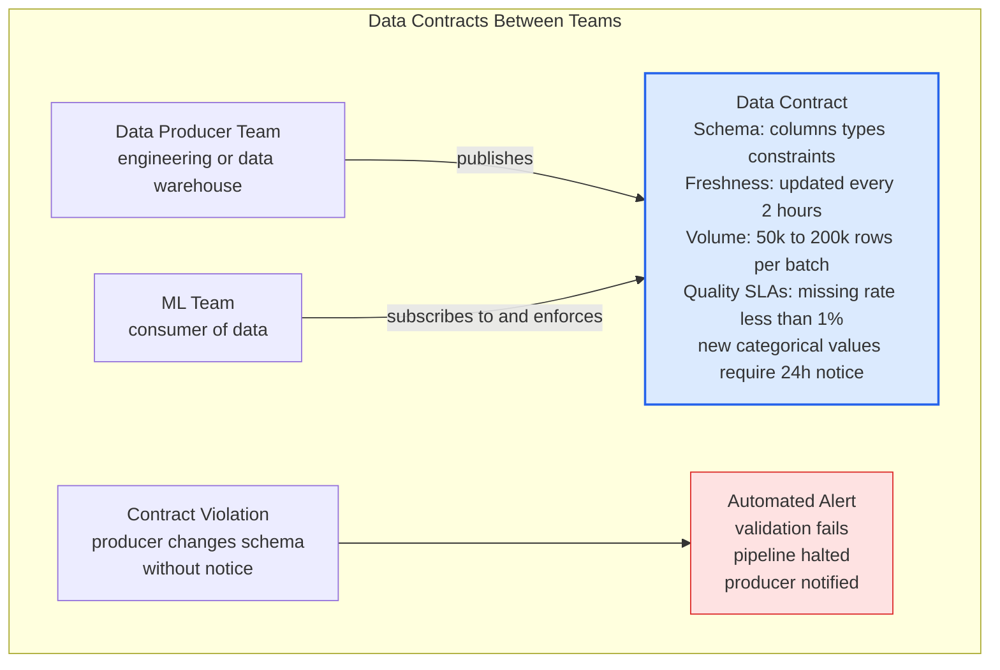

# Data Validation

Data validation is the automated process of testing whether incoming data meets defined quality expectations before it enters ML training pipelines or serves as model inputs. Without systematic data validation, data quality issues propagate silently through the ML pipeline — producing models trained on garbage data or serving predictions based on corrupted features, often without any error signal.

## Data Validation Architecture

## Great Expectations Suite

## Data Contract Pattern

## Key Concepts

- **Schema Validation**: Verifying that the data structure matches expectations — correct column names, correct data types, no unexpected columns added or required columns removed. Schema changes (renaming a column, changing a type from int to float) can silently break downstream ML pipelines that rely on specific column names and types. Schema validation catches these changes at the point of data arrival, not after training produces a bad model.

- **Statistical Validation**: Checking that data statistics (row count, missing rates, means, standard deviations, value distributions) fall within expected ranges established from historical baseline data. Sudden drops in row count indicate upstream pipeline failures; spikes in missing rates indicate data collection issues; distribution shifts indicate data quality problems or schema changes.

- **Great Expectations**: The most widely adopted open-source data validation library for Python. Expectations are assertions about data (e.g., "column X should be non-null 99% of the time", "column Y should be between 0 and 100"). Expectation suites are generated from profiling historical data and stored as JSON, then run as checkpoints in data pipelines to validate new batches.

- **Data Contracts**: Formal agreements between data producers (teams that generate data) and data consumers (ML teams that use it) specifying schema, freshness requirements, volume ranges, and quality SLAs. Data contracts shift ownership of data quality to the producer — they must notify consumers before breaking changes and maintain quality SLAs. Breaking a data contract triggers automated alerts.

- **Expectation Suite Generation**: Great Expectations can automatically profile a representative dataset and generate a baseline expectation suite. These auto-generated expectations provide a starting point — review and tune them (many defaults are too strict or too lenient) before using in production validation. Key expectations to always include: row count bounds, null rate thresholds, value range constraints, and cardinality checks for categoricals.

- **Alerting on Validation Failure**: Validation without alerting is useless — the pipeline must halt and notify the team when validation fails. Alerting must go to the team that owns the data (not just the ML team), with enough context to diagnose the issue: which expectations failed, observed values vs expected ranges, and the data batch identifier. Validation failures should block model training runs, not be silently logged.

- **Serving-Time Validation**: Validation should also run on inference requests in production — checking that incoming feature values match the training data distribution. A feature value outside the training range (e.g., a purchase amount 100x the training maximum) indicates the model is extrapolating and the prediction should be flagged as unreliable or returned with a lower confidence score.

## Trade-offs

| Validation Approach | Coverage | Overhead | Catch Rate | Team Effort |
|--------------------|---------|---------|-----------|------------|
| No validation | None | None | 0% | None |
| Schema only | Low | Very Low | ~50% of issues | Low |
| Schema + statistics | Medium | Low | ~80% of issues | Medium |
| Full GE suite + contracts | High | Medium | ~95% of issues | High |

## When to Use

- **Schema validation**: Always — minimum viable validation with near-zero overhead. Every ML pipeline should validate schema before any computation.
- **Statistical validation**: Any production ML pipeline — catches upstream data quality issues before they corrupt a training run
- **Great Expectations**: Recommended for teams with multiple data sources feeding multiple models — centralized expectation management and Data Docs reporting
- **Data contracts**: When the data producer is a separate team — formal contracts prevent surprise schema changes that break ML pipelines. Essential in large organizations with clear data platform and ML platform separation
- **Serving-time validation**: High-stakes applications (fraud detection, healthcare, finance) where out-of-distribution inputs can produce dangerous predictions
