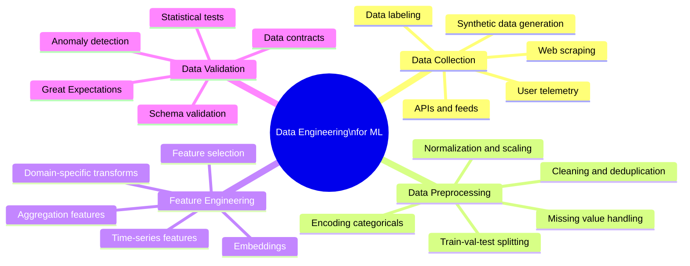
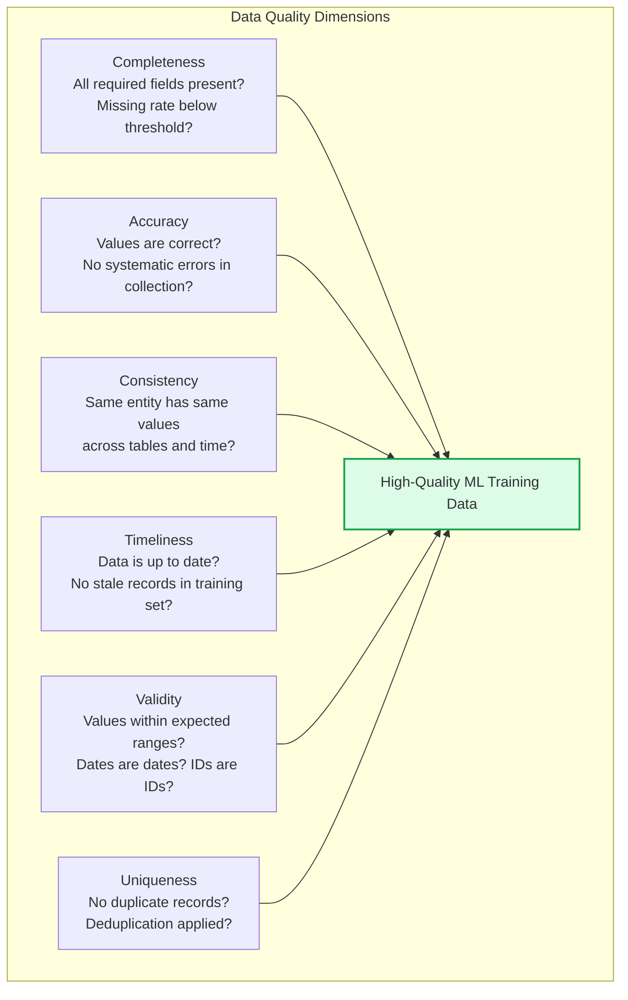

# Data Engineering for ML

Data engineering for ML is the practice of designing, building, and maintaining the data infrastructure that supplies ML models with clean, consistent, and well-governed training data. The quality of training data is the single largest determinant of model quality — garbage in, garbage out — making robust data pipelines a foundational investment for any serious ML system.

## Overview

## Data Quality Dimensions

## Topics in This Section

| File | Topic | Key Concepts |
|------|-------|--------------|
| [01_data_collection.md](01_data_collection.md) | Data Collection | Sources, labeling, synthetic data |
| [02_data_preprocessing.md](02_data_preprocessing.md) | Data Preprocessing | Cleaning, transforms, splitting |
| [03_feature_engineering.md](03_feature_engineering.md) | Feature Engineering | Domain features, aggregations |
| [04_data_validation.md](04_data_validation.md) | Data Validation | Schema, statistics, Great Expectations |
