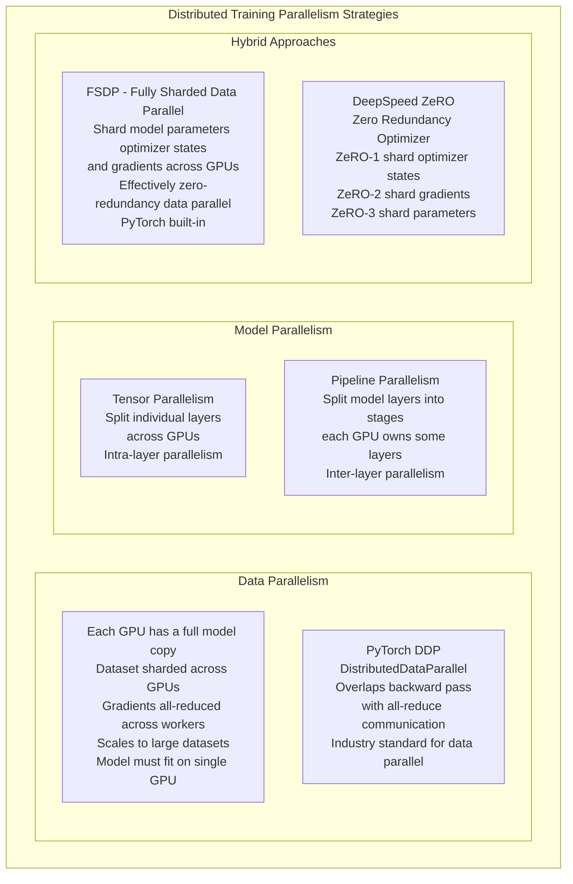
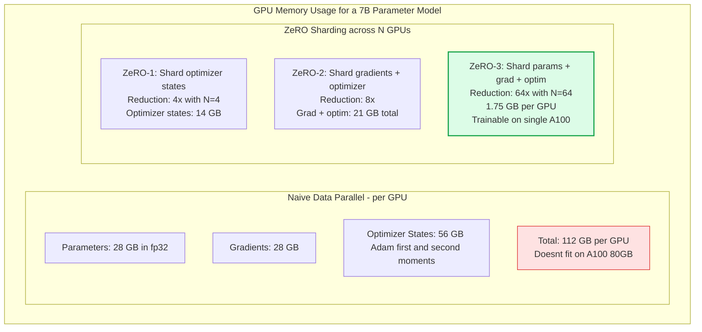

Distributed training splits the workload of training large neural networks across multiple GPUs and multiple machines. As models grow to billions or trillions of parameters and training datasets grow to trillions of tokens, single-GPU training becomes infeasible — distributed training is the only approach that can train frontier models within reasonable time and cost budgets.

## Distributed Training Strategies Overview

## DDP Communication Pattern

```mermaid
graph TD
    subgraph DDPFlow[DDP - AllReduce Gradient Synchronization]
        subgraph Forward[Forward Pass - Parallel]
            GPU0F[GPU 0: Forward on batch shard 0]
            GPU1F[GPU 1: Forward on batch shard 1]
            GPU2F[GPU 2: Forward on batch shard 2]
            GPU3F[GPU 3: Forward on batch shard 3]
        end

        subgraph Backward[Backward Pass - Parallel]
            GPU0B[GPU 0: Compute local gradients]
            GPU1B[GPU 1: Compute local gradients]
            GPU2B[GPU 2: Compute local gradients]
            GPU3B[GPU 3: Compute local gradients]
        end

        AllReduce[All-Reduce Operation\nRing-All-Reduce or NCCL\nAverage gradients across all GPUs\nAll GPUs receive identical gradients]

        Update[Synchronized Update\nAll GPUs apply same gradient update\nModels remain identical\nStep count incremented]

        Forward --> Backward --> AllReduce --> Update
    end
```

## FSDP / DeepSpeed ZeRO Memory Savings

## Key Concepts

- **Data Parallelism**: The simplest and most common form of distributed training. Each GPU holds a complete replica of the model and processes a different mini-batch. After the backward pass, gradients are averaged across all GPUs via all-reduce. All GPUs apply the same averaged gradient, keeping model replicas synchronized. Scales training throughput linearly with the number of GPUs (assuming communication doesn't bottleneck). Requires the model to fit in the memory of a single GPU.

- **All-Reduce**: The collective communication operation that sums (or averages) tensors across all workers. For gradient synchronization, each worker contributes its local gradients and receives the global average. NCCL (NVIDIA Collective Communication Library) implements highly optimized ring-all-reduce using NVLink and InfiniBand. All-reduce bandwidth determines the maximum achievable scaling efficiency.

- **Gradient Accumulation**: Computing gradients over multiple mini-batches before performing the optimizer step. Simulates a larger effective batch size without increasing GPU memory — important when the desired batch size exceeds what fits in GPU memory. With gradient accumulation of 8 steps, an effective batch size of 8x the per-GPU batch size is achieved, then one optimizer step and gradient zero-ing.

- **Mixed Precision Training (BF16/FP16)**: Training with 16-bit floating point instead of 32-bit. Halves memory usage for activations and parameters, enables processing larger batches, and increases GPU throughput (tensor cores are optimized for 16-bit). Master weights and optimizer states are kept in FP32 for numerical stability. BF16 (Brain Float 16) has a larger dynamic range than FP16 and is preferred for LLM training (less loss spiking).

- **Gradient Checkpointing (Activation Recomputation)**: During the forward pass, instead of storing all intermediate activations in GPU memory (needed for backpropagation), discard them and recompute them during the backward pass. Reduces activation memory by ~10x at the cost of ~33% increase in compute. Critical for training large models where activation memory dominates.

- **FSDP (Fully Sharded Data Parallel)**: PyTorch's native implementation of ZeRO-3-style sharding. Model parameters, gradients, and optimizer states are sharded across all GPUs — each GPU only holds 1/N of each. Before a layer's forward pass, the full parameters are all-gathered; after the backward pass, they are re-sharded. Enables training models much larger than single-GPU memory. Supported directly in PyTorch without additional libraries.

- **DeepSpeed ZeRO**: Microsoft's implementation with three stages of sharding plus CPU offloading. ZeRO-Infinity allows offloading parameters to CPU RAM and NVMe SSDs — enabling training models that don't fit in aggregate GPU memory. Required for training the largest frontier models (100B+ parameters).

## Trade-offs

| Strategy | Model Size Limit | Communication Overhead | Implementation Complexity | Batch Size |
|---------|-----------------|----------------------|--------------------------|-----------|
| DDP | Single GPU memory | Low | Low | Scales linearly |
| FSDP ZeRO-3 | N x GPU memory | Medium | Medium | Scales linearly |
| Tensor Parallel | N x GPU memory | High | High | Fixed |
| Pipeline Parallel | N x GPU memory | Medium | Very High | Fixed |

## When to Use

- **DDP**: Default for any model that fits on a single GPU — simplest distributed strategy with near-linear scaling efficiency
- **FSDP / ZeRO-2**: Models that fit across GPUs in aggregate but not on a single GPU (7B-70B models on moderate clusters)
- **ZeRO-3 / ZeRO-Infinity**: Largest models where parameters must be sharded — 70B+ on clusters, or when optimizer states dominate memory
- **Gradient checkpointing**: Always enable when training large transformers — the 33% compute overhead is almost always worth the memory savings that enable larger batch sizes
- **BF16 mixed precision**: Default for all modern LLM training — A100/H100 hardware natively supports BF16 and it's numerically stabler than FP16