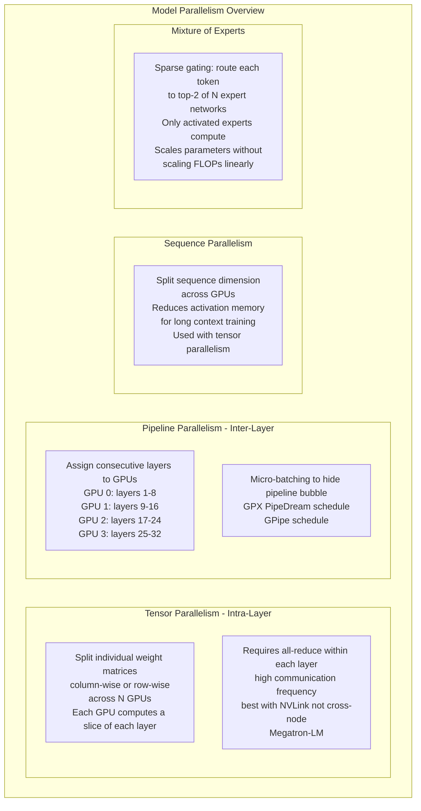
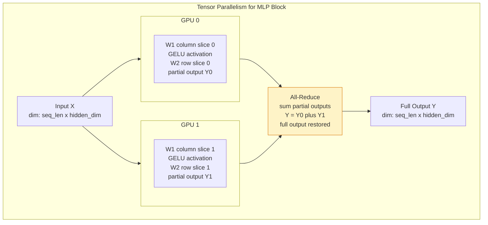
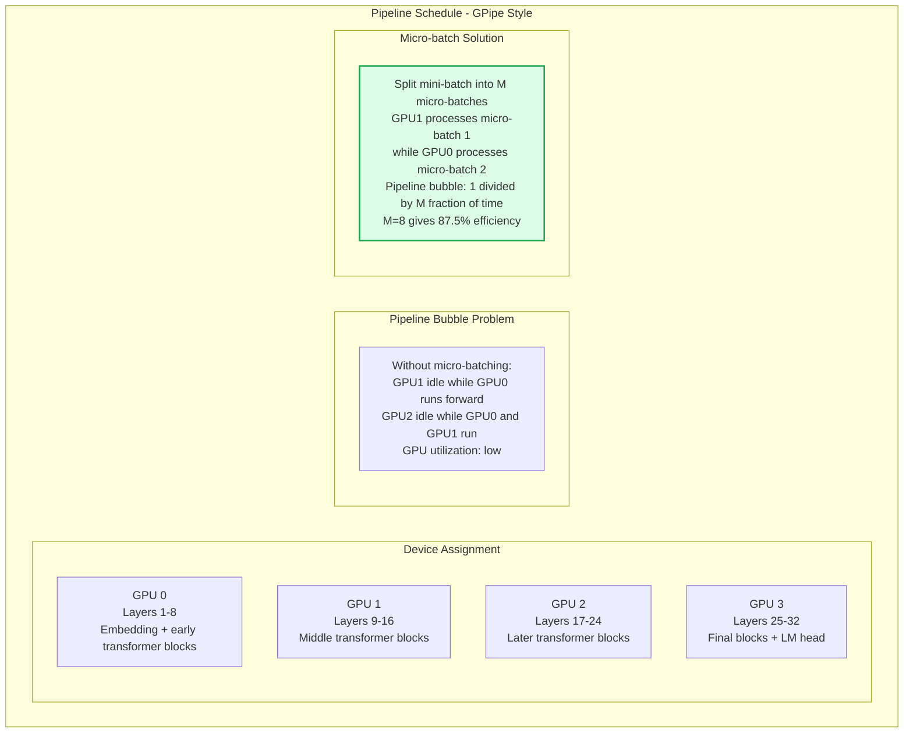
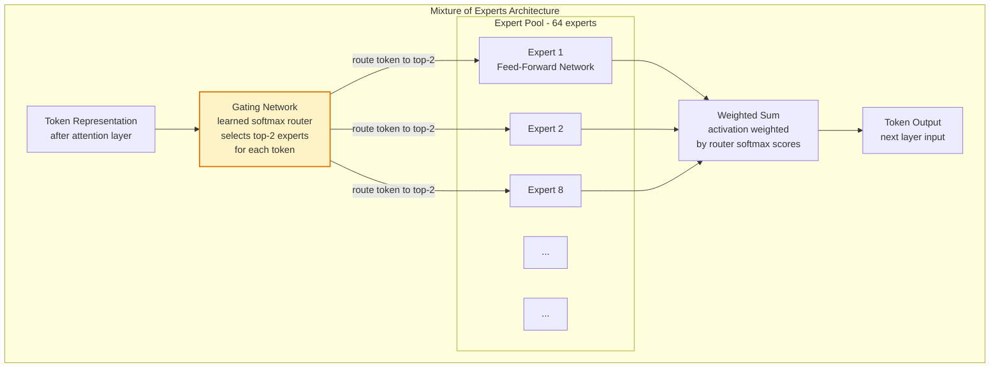

Model parallelism distributes different parts of a neural network across multiple GPUs when the model is too large to fit on a single device even with parameter sharding. While data parallelism scales by processing more data simultaneously, model parallelism scales by partitioning the model itself — dividing layers, splitting weight matrices across devices, or routing to specialized expert subnetworks.

## Model Parallelism Strategies

## Tensor Parallelism in Transformers

## Pipeline Parallelism with Micro-batching

## Mixture of Experts (MoE) Architecture

## Key Concepts

- **Tensor Parallelism (TP)**: Splitting individual weight matrices within a single transformer layer across multiple GPUs. For a linear layer Y=XW, the weight matrix W is split column-wise — each GPU computes a partial output, then an all-reduce sums the partial outputs to produce the full result. Requires communication on every layer's output, making it communication-intensive — best suited for NVLink-connected GPUs on the same node. Megatron-LM pioneered this approach for training GPT-3 scale models.

- **Pipeline Parallelism (PP)**: Assigning consecutive groups of transformer layers to different GPUs. The forward pass produces activations at GPU boundary points, which are transmitted to the next GPU. Without scheduling tricks, this creates a "pipeline bubble" where most GPUs are idle. Micro-batching (GPipe) and interleaved schedules (PipeDream) reduce the bubble to less than 10% of total time with M=8+ micro-batches.

- **3D Parallelism**: Combining data parallelism, tensor parallelism, and pipeline parallelism simultaneously — the approach used by Megatron-LM and DeepSpeed to train the largest models. Tensor parallel within a node (high-bandwidth NVLink), pipeline parallel across nodes, data parallel across pipeline replicas. Each dimension is tuned to maximize hardware utilization given the specific network topology.

- **Mixture of Experts (MoE)**: A sparse scaling approach where a transformer's feed-forward layers are replaced by N experts (separate FFN networks) plus a learned router. Each token is routed to the top-2 experts for computation. The total parameter count scales with N, but the FLOPs per token only increase by ~2 (routing adds overhead, but only 2 of N experts are activated). Enables building models with 100B+ parameters that compute at the cost of a much smaller dense model. Used by Mixtral, GPT-4 (reported), and Switch Transformer.

- **Expert Parallelism**: Placing different MoE experts on different GPUs for distributed serving of MoE models. Each GPU specializes in a subset of experts. Requires routing tokens across GPUs (all-to-all collective) to reach the correct expert. The all-to-all communication overhead is the main constraint on scaling expert parallelism.

- **Load Balancing in MoE**: A key challenge — the router must distribute tokens roughly equally across experts to avoid some GPUs being overloaded while others are idle. Auxiliary load balancing loss terms encourage the router to maintain balanced routing. Without load balancing, MoE models can collapse to using only 2-3 experts ("expert collapse").

- **Activation Memory in Pipeline Parallelism**: Pipeline parallel stages must retain activations for the backward pass until their gradient is computed. With many micro-batches in flight, activation memory can become the bottleneck. Gradient checkpointing (recomputing activations during backward) trades compute for memory and is commonly combined with pipeline parallelism.

## Trade-offs

| Strategy | Communication Volume | GPU Utilization | Memory Efficiency | Implementation |
|---------|---------------------|----------------|------------------|---------------|
| Tensor Parallel | High (per layer) | High | High | Complex |
| Pipeline Parallel | Low | Medium (bubble) | Very High | Very Complex |
| MoE | Medium (all-to-all) | High | Excellent | Very Complex |
| FSDP alone | Medium (per step) | High | Very High | Medium |

## When to Use

- **Tensor parallelism**: Training models where a single layer's weight matrix exceeds GPU memory, or to reduce per-GPU memory with fast NVLink interconnect
- **Pipeline parallelism**: Very deep models (100+ layers) spread across multiple nodes where tensor parallelism's communication overhead is too high for cross-node links
- **3D parallelism**: Training frontier LLMs (100B+ parameters) — the only practical approach at this scale, combining all three strategies
- **MoE architecture**: When parameter count must scale beyond compute budget — MoE provides capacity at dense model compute cost. Excellent for LLM pretraining at scale
- **Sequence parallelism**: Long-context training (32K+ tokens) where attention activations become the memory bottleneck, combined with tensor parallelism