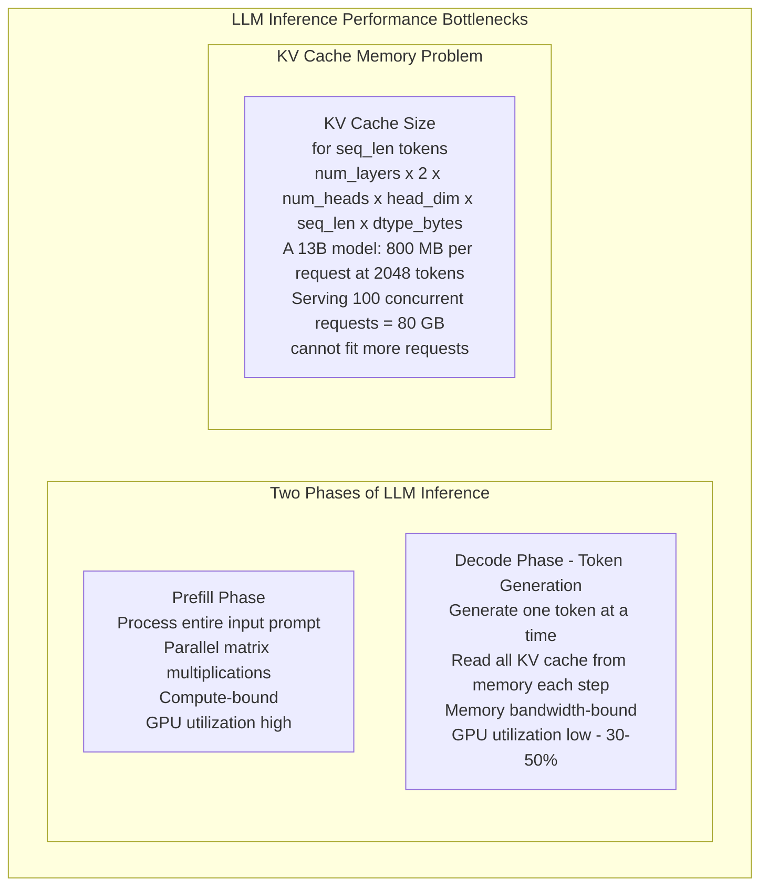
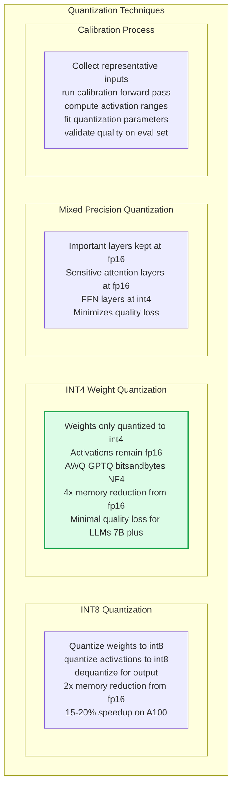
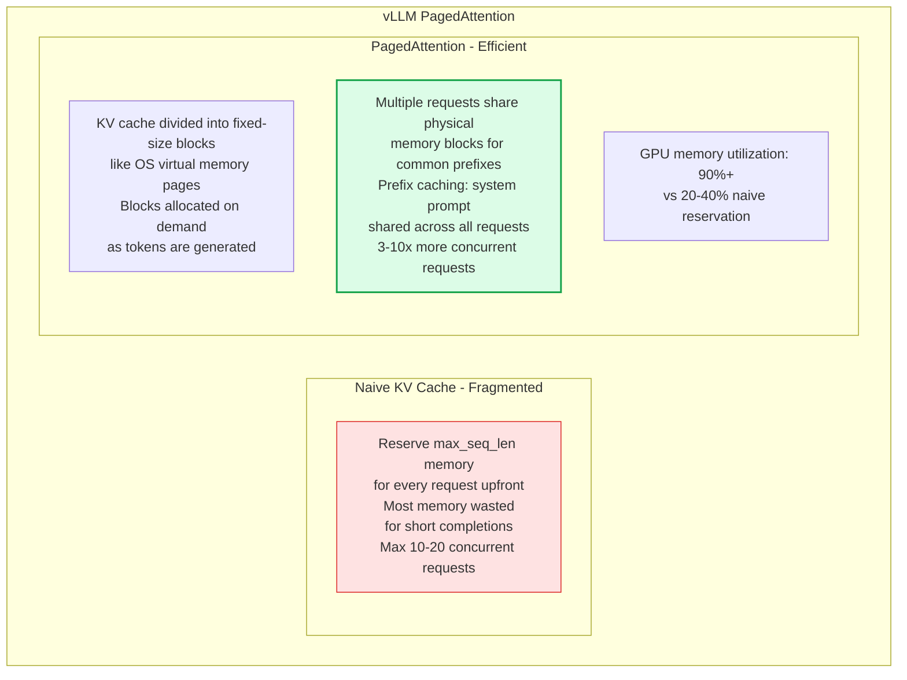
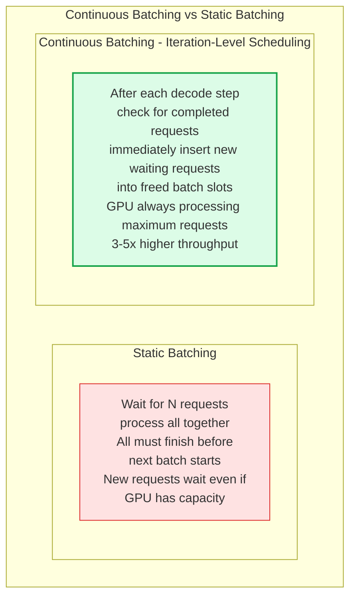
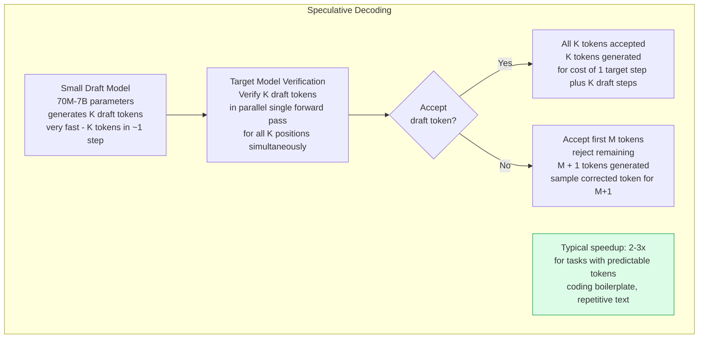

# Inference Optimization

Inference optimization reduces the latency and cost of running large neural networks at serving time. Training cost is paid once; inference cost is paid for every prediction in production — for large LLMs handling millions of requests, optimizing inference has 10-100x impact on total compute spend. Key techniques include quantization, KV-cache management, continuous batching, and speculative decoding.

## LLM Inference Bottlenecks

## Quantization

## KV Cache Management with vLLM

## Continuous Batching

## Speculative Decoding

## Key Concepts

- **KV Cache**: During autoregressive token generation, each new token attends to all previous tokens. Rather than recomputing attention keys and values for previous tokens at each step, they are cached in GPU memory. This KV cache grows with sequence length and is the dominant memory consumer during LLM inference. A single 13B parameter model request at 4096 tokens requires ~1.6GB of KV cache storage.

- **Continuous Batching (Iteration-Level Batching)**: The core scheduling innovation in modern LLM serving. Traditional static batching processes all requests in a batch together, wasting capacity when short requests complete while long ones continue. Continuous batching evicts completed requests and inserts new ones at every decode step, maximizing GPU utilization. vLLM, TGI (Text Generation Inference), and TensorRT-LLM all implement continuous batching.

- **PagedAttention**: vLLM's innovation that applies virtual memory paging concepts to KV cache management. Instead of pre-allocating contiguous memory for the maximum sequence length, blocks are allocated dynamically as tokens are generated. This eliminates memory waste and enables prefix caching — multiple requests sharing a common system prompt can share the same cached KV blocks.

- **INT4 Quantization**: Reducing model weights from 16-bit (FP16/BF16) to 4-bit integers, achieving 4x memory reduction with minimal quality loss for models above ~7B parameters. Methods: GPTQ (post-training quantization by layer-wise optimization), AWQ (activation-aware weight quantization preserving outlier channels), bitsandbytes NF4 (used in QLoRA). Smaller models suffer more quality degradation from INT4 quantization.

- **Flash Attention**: A hardware-aware attention algorithm that computes attention without materializing the full N×N attention matrix in GPU memory. Instead, attention is computed in tiles that fit in GPU SRAM (fast memory), reducing memory bandwidth requirements from O(N²) to O(N). Flash Attention 2 and 3 achieve near-theoretical GPU bandwidth utilization and are the default implementation in all modern LLM frameworks.

- **Speculative Decoding**: Exploits the observation that the target model's time per token is the same regardless of batch size (it's memory-bandwidth-bound). A small draft model generates K candidate tokens cheaply; the target model verifies all K in one forward pass. When the draft is correct (common for predictable continuations), K tokens are produced for the cost of ~1 target forward pass. Rejection sampling ensures correctness — the output distribution matches the target model exactly.

- **TensorRT-LLM**: NVIDIA's optimized LLM inference library. Fuses operations (attention, layer norm, activation), uses TensorRT's kernel optimization, and implements continuous batching, quantization, and multi-GPU serving. Best-in-class latency and throughput for NVIDIA GPUs in production serving.

## Trade-offs

| Optimization | Latency Gain | Throughput Gain | Quality Loss | Implementation |
|-------------|-------------|----------------|-------------|---------------|
| INT8 quantization | 20-30% | 20-30% | Minimal | Low |
| INT4 quantization | 50-70% | 50-70% | Small (7B+) | Low |
| Flash Attention | 30-50% | 30-50% | None | Drop-in |
| Continuous batching | 0 | 3-5x | None | Framework |
| PagedAttention | 0 | 2-4x | None | vLLM |
| Speculative decoding | 2-3x | ~1x | None | Medium |

## When to Use

- **Flash Attention**: Always — it's a drop-in replacement with no quality loss and significant speedup, available in PyTorch 2.0+ natively
- **INT4 quantization**: When GPU memory is the constraint and serving models with 7B+ parameters — acceptable quality tradeoff for 4x memory reduction
- **vLLM**: Default serving framework for open-source LLMs — continuous batching and PagedAttention are pre-integrated and production-hardened
- **Speculative decoding**: High-throughput serving with predictable output patterns (coding assistants, structured generation) — 2-3x speedup with no quality loss
- **INT8 quantization**: When INT4 quality loss is unacceptable but memory savings are still needed — intermediate tradeoff
