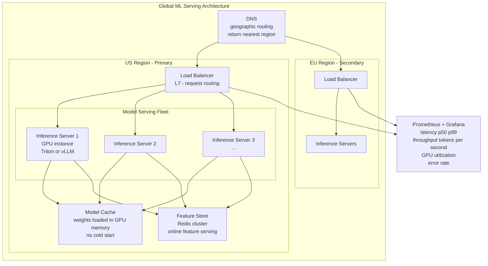
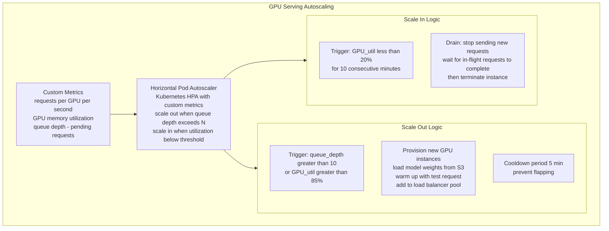
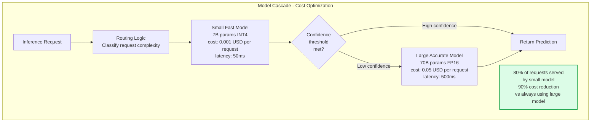
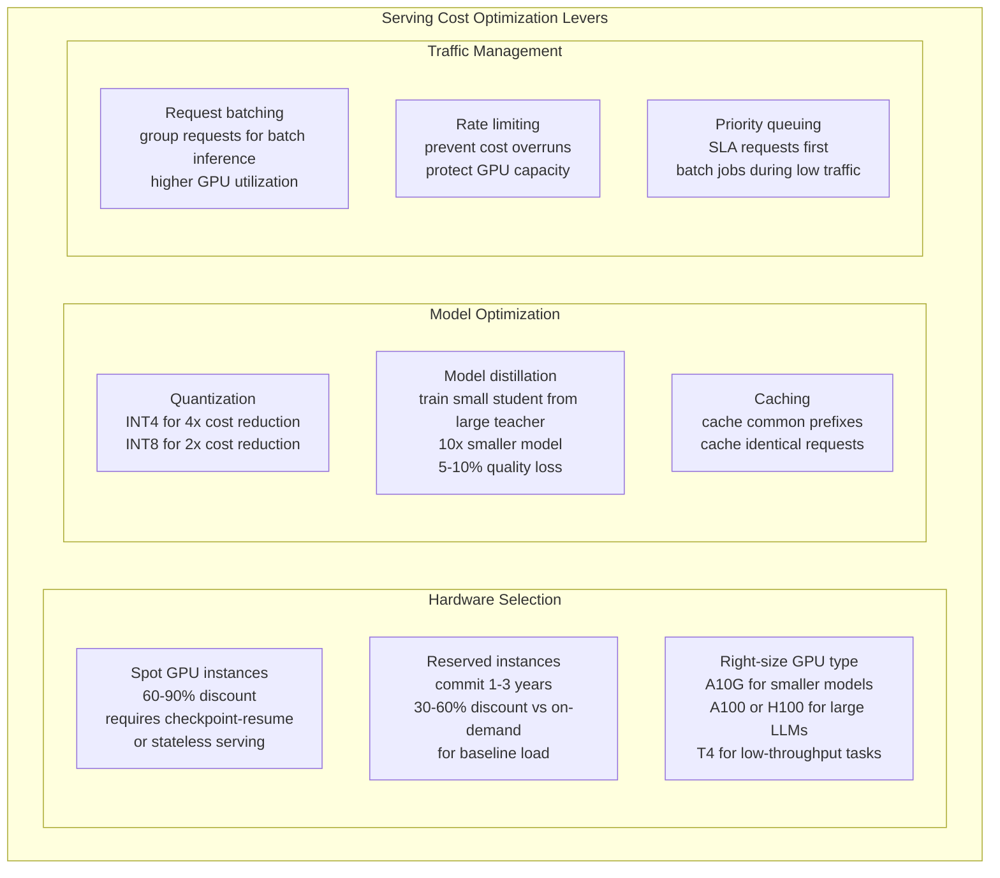

Serving ML models at scale means maintaining low latency, high availability, and cost efficiency while handling highly variable traffic — from zero to millions of requests per hour. Large-scale ML serving combines infrastructure patterns (autoscaling, load balancing, multi-region deployment) with ML-specific optimizations (batching, caching, model routing) to meet production SLAs at sustainable cost.

## Large-Scale Serving Architecture

## Autoscaling Strategy

## Model Routing and Cascading

## Cost Optimization Strategies

## Key Concepts

- **Cold Start**: The latency penalty incurred when a new serving instance starts up and must load model weights from storage (S3/GCS) into GPU memory before serving the first request. A 70B model at FP16 requires loading ~140GB, which at 10 GB/s network bandwidth takes 14 seconds. Mitigations: keep warm instances (scale-to-zero is infeasible for latency-sensitive serving), pre-load models on instance initialization, use instance storage for faster loading.

- **Request Batching**: Grouping multiple inference requests into a single batch maximizes GPU utilization by keeping more compute units busy simultaneously. Dynamic batching (waiting up to N milliseconds for more requests to accumulate before processing) trades a small latency increase for significant throughput improvement. Triton Inference Server, vLLM, and TensorRT-LLM all implement dynamic batching.

- **Prefix Caching**: For LLMs, if multiple requests share a common prefix (e.g., all start with the same system prompt), the KV cache for that shared prefix can be computed once and reused. vLLM implements automatic prefix caching. For applications with long system prompts (RAG context, few-shot examples), prefix caching can reduce time-to-first-token by 50-80%.

- **Model Distillation**: Training a smaller "student" model to mimic the output distribution of a larger "teacher" model. The student is trained on the teacher's soft probability outputs (not just hard labels), which carry richer information. A well-distilled 7B model can approach the quality of a 70B model at 10x lower inference cost. DistilBERT, TinyLlama, and Phi-3 demonstrate the power of distillation.

- **Capacity Planning**: Estimating GPU resource requirements for a given traffic target. Key calculation: throughput (tokens/second per GPU) from benchmarks, target RPS and average output length → required GPUs per region. Add 30-50% headroom for traffic spikes. Plan for model upgrade overhead (old and new versions run simultaneously during rollout).

- **Traffic Shaping**: Managing inbound request traffic to protect serving infrastructure. Rate limiting prevents individual clients from consuming all GPU capacity. Priority queuing ensures latency-sensitive synchronous requests (user-facing) are served before batch jobs. Circuit breakers reject requests during overload to prevent cascade failure (better to return an error than a 30-second timeout).

- **Multi-Region Serving**: Deploying serving infrastructure in multiple geographic regions to reduce latency for globally distributed users and improve availability (one region can handle traffic if another fails). DNS-based geographic routing directs users to the nearest region. Model weights and configuration must be replicated to all regions.

## Trade-offs

| Serving Strategy | Latency | Throughput | Cost | Complexity |
|----------------|---------|-----------|------|-----------|
| Single GPU, no batching | Lowest | Very Low | High | Low |
| Dynamic batching | Low | High | Medium | Low |
| Model cascade | Variable | High | Low | Medium |
| Multi-region | Lowest (geo) | High | High | Very High |
| Spot instances + stateless | Low | High | Low | High |

## When to Use

- **Dynamic batching**: Always for latency-tolerant API endpoints — 5-10ms batching window typically yields 3-5x throughput improvement with negligible latency impact
- **Model cascade**: Cost-sensitive applications where a fraction of requests require high-accuracy — route to expensive model only for uncertain cases
- **Prefix caching**: Any LLM application with consistent system prompts or few-shot examples — free latency improvement with no quality tradeoff
- **Spot instances for serving**: Background/batch inference where occasional interruptions are acceptable — not recommended for user-facing real-time serving below 99.9% availability requirements
- **Multi-region**: User-facing global applications where regional latency matters, or when availability requirements (99.99%) exceed single-region fault tolerance