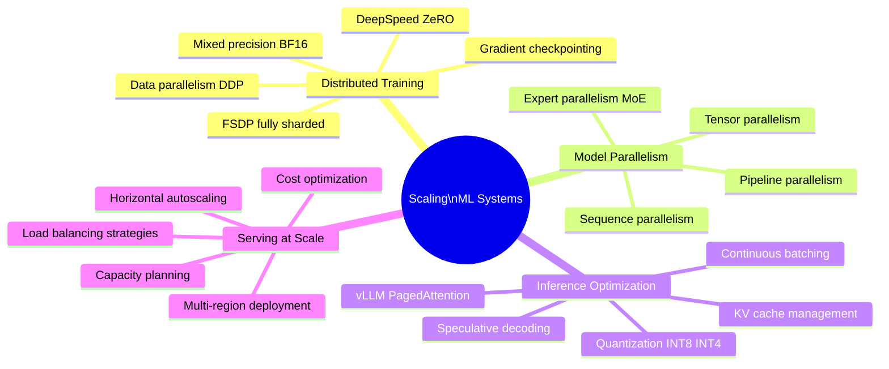
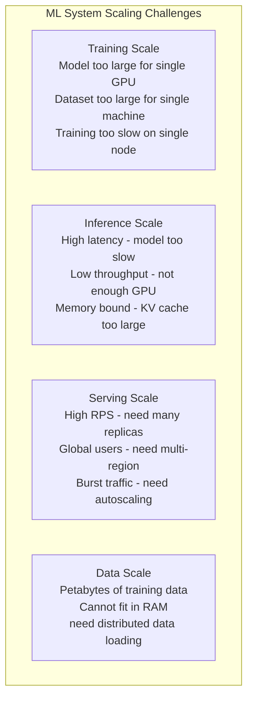

# Scaling ML Systems

Scaling ML systems addresses the engineering challenges that emerge when models, datasets, and traffic grow beyond what a single machine or naive distributed approach can handle. Scaling in ML spans four dimensions: training (data and model parallelism for trillion-parameter models), inference (throughput optimization and KV-cache management), serving (handling millions of requests per second), and data (managing petabyte-scale datasets).

## Overview

## Scaling Dimensions

## Topics in This Section

| File | Topic | Key Concepts |
|------|-------|--------------|
| [01_distributed_training.md](01_distributed_training.md) | Distributed Training | DDP, FSDP, DeepSpeed ZeRO |
| [02_model_parallelism.md](02_model_parallelism.md) | Model Parallelism | Tensor, pipeline, MoE parallelism |
| [03_inference_optimization.md](03_inference_optimization.md) | Inference Optimization | Quantization, KV cache, vLLM |
| [04_serving_at_scale.md](04_serving_at_scale.md) | Serving at Scale | Autoscaling, multi-region, cost |
