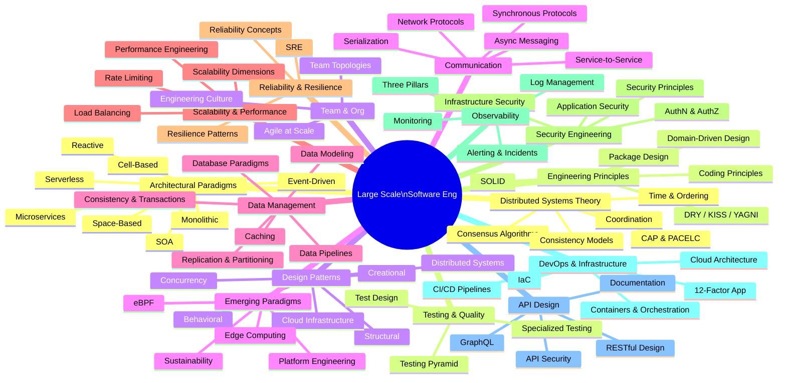

# Large Scale Software Engineering

A comprehensive reference covering the core concepts, paradigms, patterns, and practices required to design, build, and operate large-scale software systems. This documentation spans architectural thinking, engineering principles, distributed systems theory, and modern operational practices.

## Scope

This project documents the software engineering body of knowledge needed to reason about and build systems that serve millions of users reliably, efficiently, and securely — across all layers from architecture to culture.

## Knowledge Map

## Sections

| # | Section | Description |
|---|---------|-------------|
| 01 | [Architectural Paradigms](docs/01_architectural_paradigms/README.md) | System-level architectural styles and when to use them |
| 02 | [Software Engineering Principles](docs/02_software_engineering_principles/README.md) | Foundational design principles for quality code |
| 03 | [Design Patterns](docs/03_design_patterns/README.md) | Proven solutions to recurring design problems |
| 04 | [Communication Protocols](docs/04_communication_protocols/README.md) | How services exchange data reliably |
| 05 | [Data Management](docs/05_data_management/README.md) | Storing, querying, and moving data at scale |
| 06 | [Scalability & Performance](docs/06_scalability_performance/README.md) | Handling growth and achieving low latency |
| 07 | [Reliability & Resilience](docs/07_reliability_resilience/README.md) | Building systems that survive failures |
| 08 | [Security Engineering](docs/08_security_engineering/README.md) | Securing systems from threats |
| 09 | [Observability & Monitoring](docs/09_observability_monitoring/README.md) | Understanding system behaviour in production |
| 10 | [DevOps & Infrastructure](docs/10_devops_infrastructure/README.md) | Automating delivery and infrastructure management |
| 11 | [API Design](docs/11_api_design/README.md) | Designing usable, stable, secure APIs |
| 12 | [Distributed Systems Theory](docs/12_distributed_systems_theory/README.md) | The mathematical and theoretical foundations |
| 13 | [Testing & Quality](docs/13_testing_quality/README.md) | Verifying correctness and preventing regressions |
| 14 | [Team & Organizational](docs/14_team_organizational/README.md) | Human systems that deliver software |
| 15 | [Emerging Paradigms](docs/15_emerging_paradigms/README.md) | New approaches reshaping the field |

## How to Use This Reference

- **Architects**: Start with sections 01, 03, 12
- **Backend Engineers**: Focus on sections 02, 03, 04, 05, 06
- **SREs / Platform Engineers**: Sections 07, 09, 10, 15
- **Security Engineers**: Section 08, and the security sub-topics across other sections
- **Engineering Managers**: Sections 14, 02, 13
