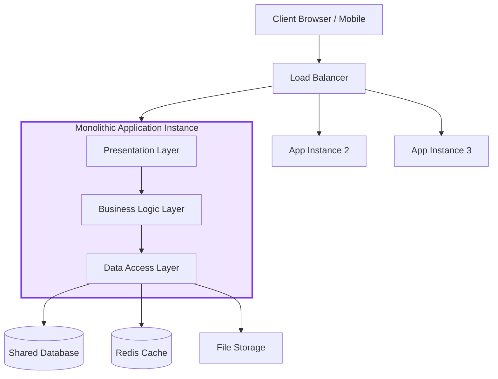
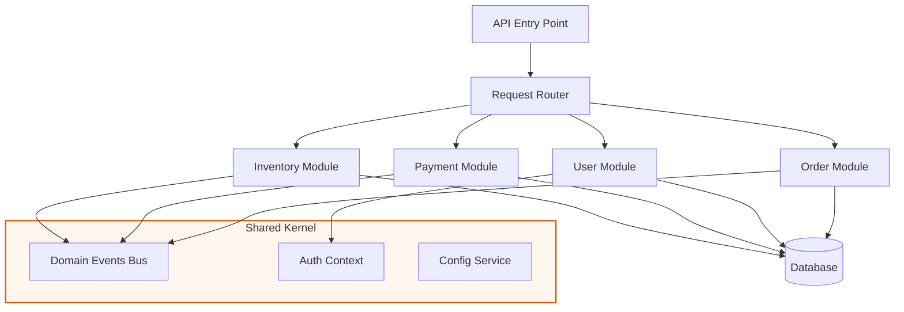
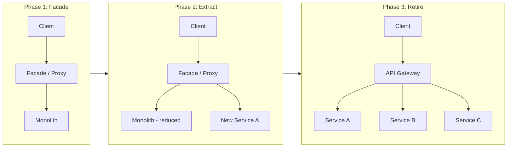

A monolithic architecture packages all application functionality into a single deployable unit. All components — UI, business logic, and data access — share the same process space and are deployed together, making development straightforward but creating coupling that complicates independent scaling and evolution.

## Architecture Diagrams

### Traditional Monolith

### Modular Monolith

### Strangler Fig Migration Pattern

## Key Concepts

- **Single Deployable Unit**: Everything compiles and deploys together. One artifact (JAR, WAR, binary, container image) contains all functionality. This simplifies deployment logistics but creates a monolithic blast radius — a bug in one module can crash the entire process.

- **Shared Memory Space**: All modules share the same heap, which enables zero-cost in-process function calls and avoids the latency and serialization overhead of network calls. This is a genuine performance advantage over microservices for tightly coupled workflows.

- **Modular Monolith**: A disciplined variant where internal modules have explicit contracts, no direct cross-module database access, and communicate via internal events or interfaces. Provides most of the development simplicity of a monolith while preparing for future service extraction.

- **Vertical Scaling**: Monoliths scale by deploying more instances of the entire application. This wastes resources for unevenly loaded modules but is operationally simple.

- **Strangler Fig Pattern**: A migration strategy where a façade intercepts all traffic; new functionality is redirected to new services incrementally until the monolith is fully replaced (or reduced to a manageable residue).

- **Shared Database Anti-pattern**: The classic monolith failure mode: all modules directly access shared tables, creating implicit coupling that makes it impossible to extract services later without extensive refactoring.

## Trade-offs

| Aspect | Traditional Monolith | Modular Monolith | Microservices |
|--------|---------------------|-----------------|---------------|
| Development speed (early) | Fastest | Fast | Slow |
| Operational complexity | Low | Low | High |
| Independent scaling | Not possible | Not possible | Per-service |
| Fault isolation | None | Limited | Strong |
| Deployment risk | High (all-or-nothing) | High | Low per service |
| Latency (internal calls) | Near-zero | Near-zero | Network + serialization |
| Team autonomy | Low | Moderate | High |
| Database flexibility | One schema | One schema | Per-service schema |

## When to Use

**Use a monolith when:**
- Team is small (fewer than ~10 engineers)
- Domain is not yet well understood — premature decomposition is expensive
- Time-to-market is the primary constraint
- Throughput requirements are moderate and vertically scalable

**Use a modular monolith when:**
- You expect to eventually extract services but aren't sure where the boundaries lie
- You want monolith simplicity with architectural discipline enforced by tooling (ArchUnit, module system boundaries)

**Avoid when:**
- Multiple teams need independent deployment cadences
- Different modules have vastly different scaling needs (e.g., batch processing vs. real-time API)
- Regulatory requirements mandate strict data isolation between capabilities