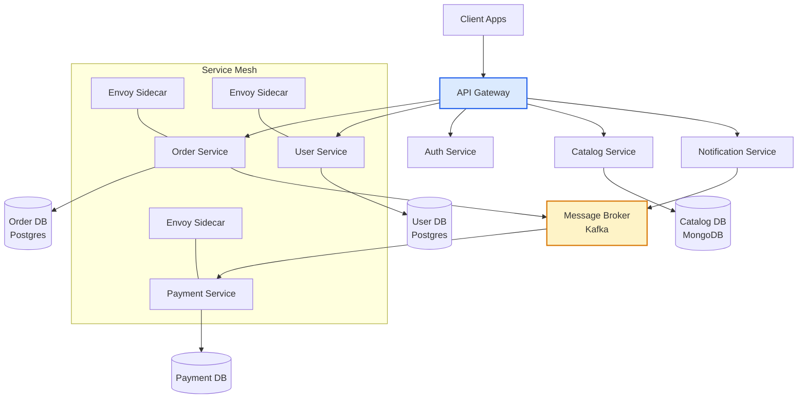
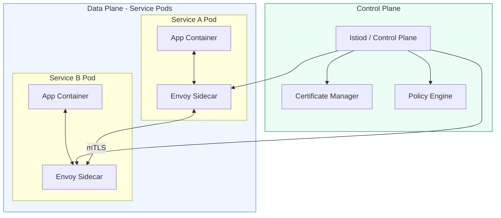
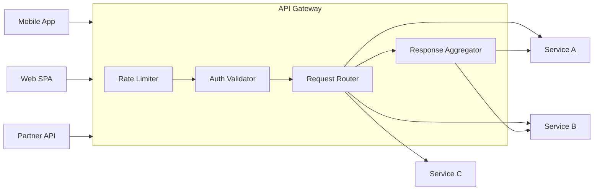

Microservices decompose a system into small, independently deployable services — each owning a bounded domain, its own data store, and its own release lifecycle. The approach enables team autonomy and fine-grained scaling at the cost of significant distributed systems complexity.

## Architecture Diagrams

### Microservices System Topology

### Service Mesh Architecture

### API Gateway Pattern

## Key Concepts

- **Bounded Context**: Each service owns a domain boundary derived from Domain-Driven Design. The boundary defines what data the service owns exclusively, its API contract, and what events it publishes. Crossing boundaries always happens via API or message, never via shared database tables.

- **Database per Service**: Each service has its own schema/database, inaccessible to other services. This enforces true encapsulation but requires eventual consistency across service boundaries — joins must be done at the application layer via API composition or CQRS read models.

- **API Gateway**: A single ingress point that handles cross-cutting concerns: routing, authentication, rate limiting, SSL termination, request transformation, and response aggregation. The Backend for Frontend (BFF) variant creates per-client-type gateways.

- **Service Mesh**: A dedicated infrastructure layer (Istio, Linkerd, Consul Connect) that handles service-to-service communication: mutual TLS, retries, circuit breaking, traffic splitting, and observability — without application code changes.

- **Sidecar Proxy**: The data-plane component of a service mesh. Every service pod gets an Envoy (or similar) sidecar that intercepts all inbound/outbound traffic and applies mesh policies transparently.

- **Inter-service Communication**: Services communicate synchronously via HTTP/REST or gRPC, or asynchronously via message brokers (Kafka, RabbitMQ). Async patterns improve resilience by decoupling sender from receiver availability.

- **Orchestration vs. Choreography**: In orchestration, a central orchestrator (saga orchestrator, workflow engine) directs the sequence of service calls. In choreography, services react to events and self-coordinate — more decoupled but harder to trace.

## Trade-offs

| Concern | Microservices | Monolith |
|---------|--------------|---------|
| Deployment independence | Full | None |
| Network latency | Present (milliseconds) | None |
| Operational overhead | Very high | Low |
| Data consistency | Eventually consistent | ACID |
| Testing complexity | High (contract tests) | Moderate |
| Debugging/tracing | Requires distributed tracing | Simple stack traces |
| Team autonomy | High | Low |
| Infrastructure cost | Higher (per-service resources) | Lower |

## When to Use

**Use microservices when:**
- Multiple teams need to deploy independently without coordination
- Different services have dramatically different scaling profiles
- Polyglot persistence is needed (different services benefit from different databases)
- System is large and the domain is well-understood enough to draw stable boundaries

**Avoid when:**
- Domain is not yet understood — service boundaries drawn too early become a distributed monolith
- Team lacks operational maturity for containers, service mesh, distributed tracing
- Latency budget is extremely tight (in-process calls are orders of magnitude faster)
- Data consistency requirements are strict and complex cross-service transactions are frequent