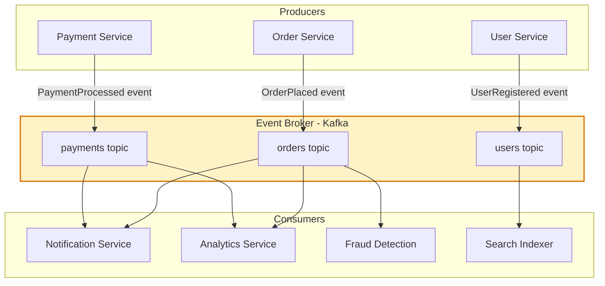
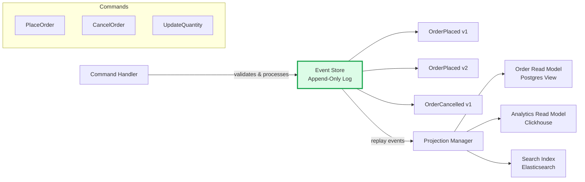
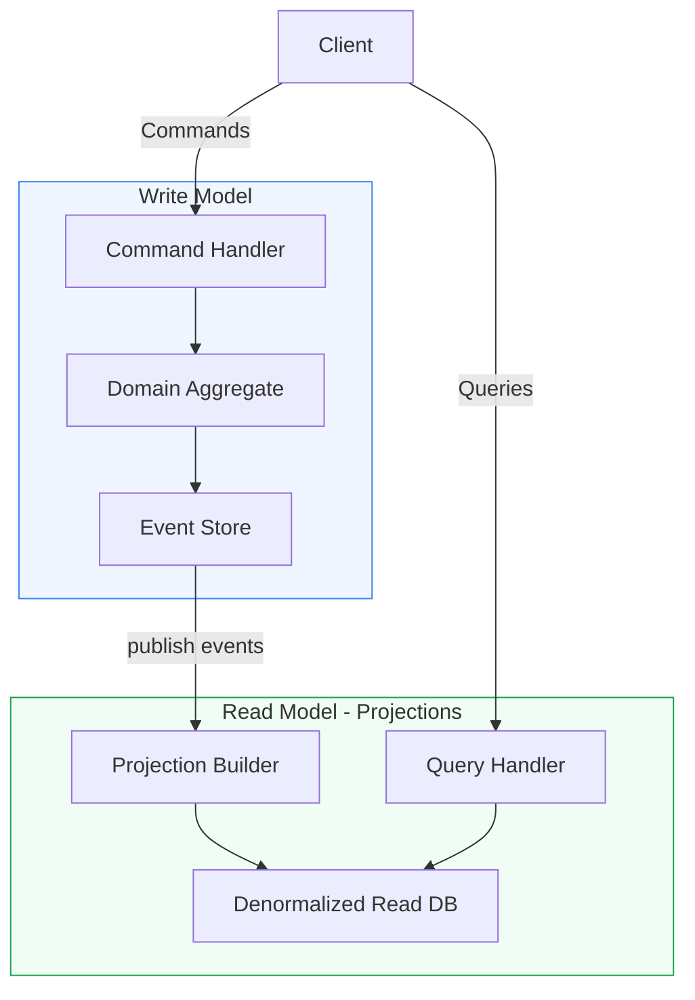
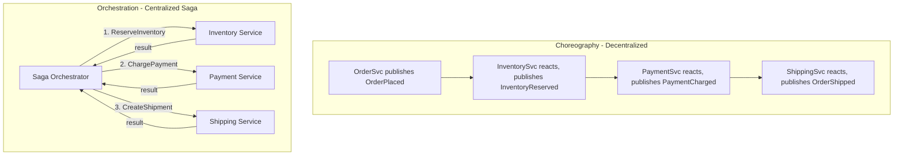

# Event-Driven Architecture

Event-Driven Architecture (EDA) structures a system around the production, detection, and reaction to events. Components communicate by publishing and subscribing to events rather than invoking each other directly, enabling loose temporal and spatial coupling between producers and consumers.

## Architecture Diagrams

### Event-Driven System Overview

### Event Sourcing Pattern

### CQRS Architecture

### Choreography vs Orchestration

## Key Concepts

- **Event**: An immutable record of something that happened in the past, named in past tense (OrderPlaced, PaymentFailed). Events carry the data needed for consumers to react without calling back the producer.

- **Event Broker**: The durable, ordered, distributed log through which events flow. Apache Kafka, AWS EventBridge, and Google Pub/Sub are common implementations. The broker decouples producers from consumers temporally — consumers can be offline and catch up later.

- **Event Sourcing**: Storing the complete sequence of domain events as the system of record, rather than storing current state. The current state is derived by replaying events. Enables time travel, audit logs, and new projections without data migration.

- **CQRS (Command Query Responsibility Segregation)**: Separates the write model (command-side, normalised for writes) from the read model (query-side, denormalised for reads). Often paired with event sourcing — events from the write side populate read-side projections.

- **Saga Pattern**: A sequence of local transactions across services, each publishing an event that triggers the next step. If a step fails, compensating transactions undo prior steps. Sagas replace distributed ACID transactions in EDA systems.

- **Choreography**: Each service independently listens for relevant events and reacts. No central coordinator. Highly decoupled but workflow is implicit and hard to observe.

- **Orchestration**: A central saga orchestrator directs each step explicitly. More observable and easier to reason about complex flows, but introduces a coordination bottleneck.

- **Outbox Pattern**: Solves the dual-write problem — instead of writing to the database and publishing an event separately (two-phase commit), services write both to a local outbox table atomically. A relay process then reads the outbox and publishes events reliably.

## Trade-offs

| Aspect | Event-Driven | Synchronous Request-Response |
|--------|-------------|------------------------------|
| Temporal coupling | None | High |
| Complexity | High | Low |
| Consistency | Eventual | Can be strong |
| Auditability | Excellent (event log) | Requires extra work |
| Debugging | Challenging (async) | Straightforward |
| Throughput | Very high (buffered) | Rate-limited by slowest service |
| Schema evolution | Requires careful versioning | Easier to version |

## When to Use

**Use event-driven when:**
- Multiple consumers need to react to the same business event independently
- Temporal decoupling is critical (downstream services may be unavailable)
- Audit trail and event replay capabilities are needed
- Throughput needs to be very high and producers should not block on consumers

**Avoid when:**
- Strong consistency is required across the entire workflow
- The team lacks experience with async debugging and distributed tracing
- Latency requirements are tight and the overhead of message serialization/broker is unacceptable
