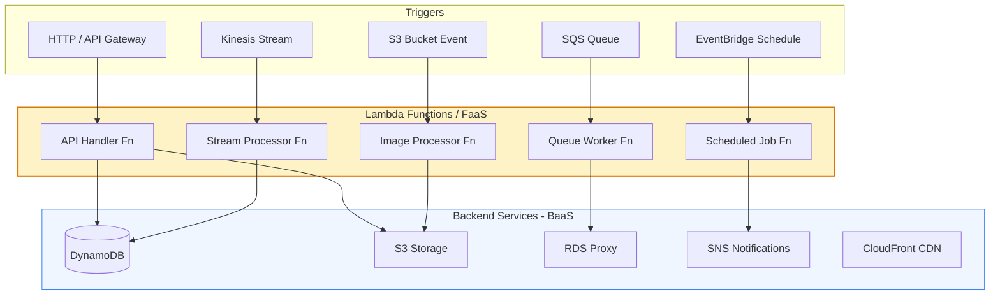
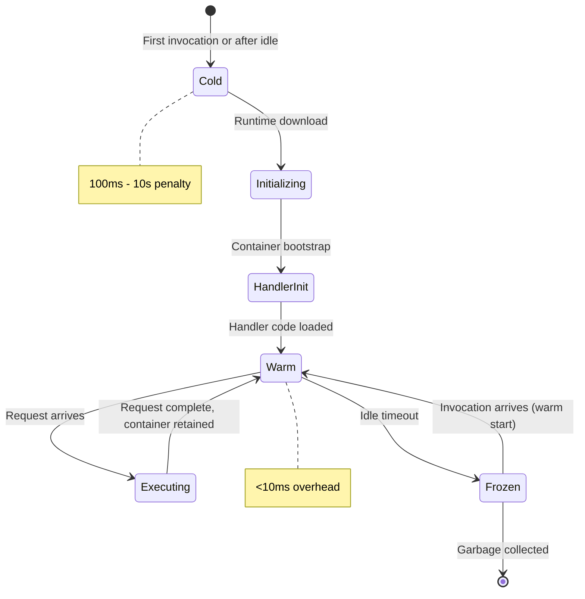
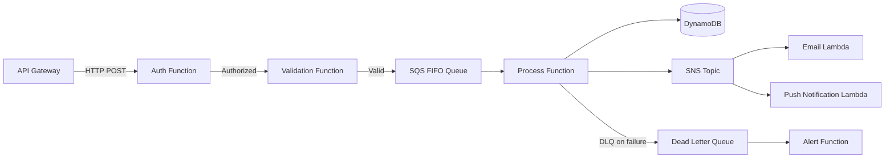

Serverless architecture abstracts away server management entirely — developers deploy functions or backend services without provisioning infrastructure. Execution is triggered by events and billed per invocation, enabling near-infinite scale with zero idle cost, at the expense of runtime constraints and cold-start latency.

## Architecture Diagrams

### Serverless Application Architecture

### Cold Start Lifecycle

### Serverless Event Processing Pipeline

## Key Concepts

- **Function as a Service (FaaS)**: The compute unit in serverless. A function is a single-purpose, stateless code unit that executes in response to a trigger. AWS Lambda, Google Cloud Functions, and Azure Functions are the major implementations. Each invocation gets its own isolated ephemeral execution environment.

- **Backend as a Service (BaaS)**: Managed cloud services (databases, auth, storage, queues) that replace self-managed backend infrastructure. Serverless applications combine FaaS for compute with BaaS for persistence and cross-cutting concerns.

- **Cold Start**: When a function hasn't been invoked recently, the cloud provider must allocate a container, download the runtime, and initialize the application. This adds 100ms–10s of latency. Mitigation strategies include provisioned concurrency, minimising dependency bundle size, and using lightweight runtimes.

- **Stateless Execution**: Each function invocation must treat execution context as ephemeral. Persistent state must be externalised to databases, object storage, or caches. The `/tmp` filesystem is available within an invocation but not guaranteed between invocations.

- **Event Triggers**: Functions are invoked by events from API gateways, object storage events, queue messages, stream records, scheduled events, or other cloud service triggers. The trigger defines the concurrency model and retry behaviour.

- **Concurrency Model**: Cloud providers scale function instances automatically — each concurrent request gets its own instance. This enables massive parallelism but can overwhelm downstream databases (connection storm anti-pattern).

- **Dead Letter Queues (DLQ)**: Failed async invocations that exhaust retries are sent to a DLQ for inspection and reprocessing. Essential for event-driven serverless reliability.

- **Step Functions / Durable Orchestration**: For multi-step workflows requiring state, orchestration engines (AWS Step Functions, Azure Durable Functions) coordinate function execution with retry, branching, and parallel execution — externalising workflow state from functions.

## Trade-offs

| Aspect | Serverless | Containers (Always-on) |
|--------|-----------|----------------------|
| Idle cost | Zero | Full cost |
| Cold start latency | Present | None |
| Maximum execution time | 15 min (AWS Lambda) | Unlimited |
| Operational overhead | Minimal | Significant |
| Memory/CPU control | Limited | Full |
| Local dev experience | Complex | Straightforward |
| Vendor lock-in | High | Moderate |
| Concurrency control | Automatic | Manual |
| Database connections | Can exhaust pools | Predictable |

## When to Use

**Use serverless when:**
- Workloads are spiky, intermittent, or unpredictable
- Event-driven processing pipelines (file uploads, queue workers, webhooks)
- Rapid prototyping where operational simplicity is prioritised
- Tasks with clear execution boundaries (image resize, PDF generation, data transformation)

**Avoid when:**
- Long-running processes exceed FaaS time limits
- Cold start latency is unacceptable (real-time user-facing APIs with strict p99 SLAs)
- High-throughput persistent connections (WebSockets, streaming) are needed
- Tight control over runtime, networking, or hardware is required