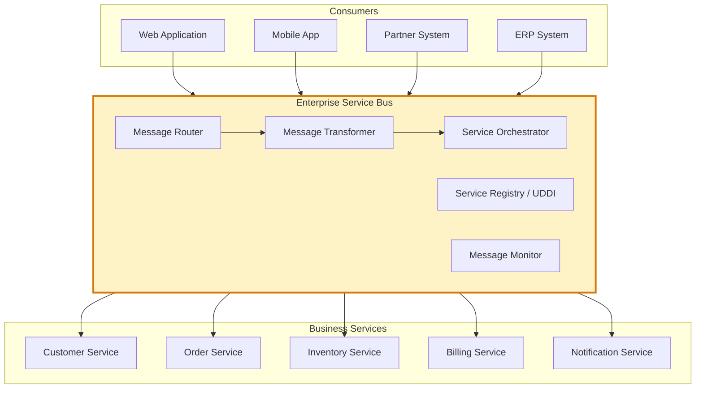
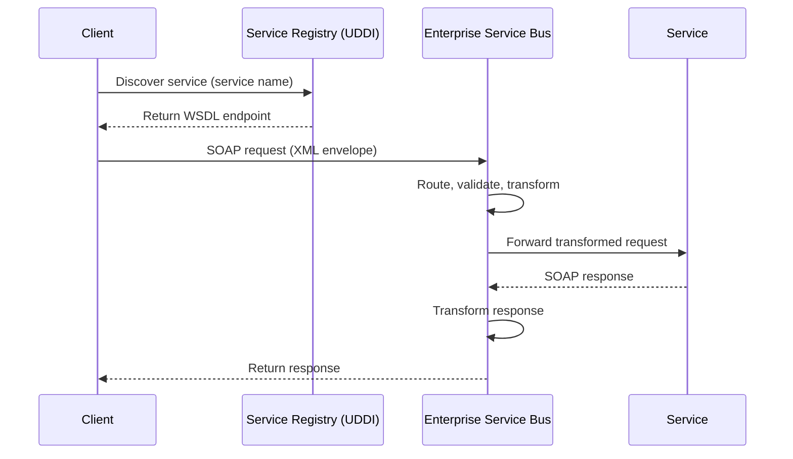
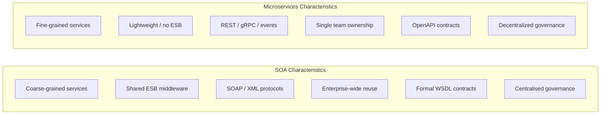

Service-Oriented Architecture organizes software as a collection of interoperable services that communicate via standardized protocols, typically over an Enterprise Service Bus. SOA predates microservices and emphasizes reusability, enterprise integration, and formal service contracts over fine-grained decomposition.

## Architecture Diagrams

### Classical SOA with ESB

### SOA Service Contract (WSDL/SOAP Flow)

### SOA vs Microservices Comparison

## Key Concepts

- **Enterprise Service Bus (ESB)**: The central middleware layer in SOA that handles routing, transformation, protocol mediation, orchestration, and monitoring. The ESB is a smart pipe — logic lives in the bus rather than in services. This centralisation is both SOA's strength (single governance point) and its greatest weakness (bottleneck, single point of failure).

- **Service Contract**: A formal, technology-neutral description of a service's interface. In classic SOA, this is expressed as WSDL (Web Services Description Language) — a machine-readable XML document describing operations, data types, and endpoints. The contract is the binding agreement between service providers and consumers.

- **Service Registry (UDDI)**: A directory where service providers publish WSDL documents and consumers discover available services dynamically. Modern equivalents include Consul, etcd, and Kubernetes service discovery.

- **Message Transformation**: The ESB transforms message formats between producer and consumer schemas. A service expecting an internal canonical data model receives a transformed version of whatever format the caller sent.

- **Orchestration**: The ESB (or a dedicated orchestration engine like BPEL) coordinates sequences of service calls to fulfil complex business processes, handling failures, retries, and compensation.

- **Loose Coupling vs. Contract Coupling**: SOA achieves loose coupling at the implementation level but tight coupling at the contract level — services depend on specific WSDL schemas. Schema changes require careful versioning to avoid breaking consumers.

- **Service Reusability**: SOA's primary design goal — services should be designed for reuse across multiple consumers. This often conflicts with the need to evolve services quickly for specific business needs.

## Trade-offs

| Aspect | SOA | Microservices |
|--------|-----|---------------|
| Communication | SOAP/XML, heavy protocols | REST/gRPC, lightweight |
| Middleware | Central ESB required | Lightweight or service mesh |
| Governance | Centralised, formal | Decentralised per team |
| Reusability focus | High | Low — services are team-owned |
| Granularity | Coarse-grained | Fine-grained |
| Performance | Overhead of ESB | Direct service calls |
| Enterprise integration | Excellent | Harder without ESB |
| Evolution speed | Slow (governance overhead) | Fast per team |

## When to Use

**Use SOA when:**
- Integrating heterogeneous enterprise systems (ERP, CRM, legacy mainframes) that cannot be rewritten
- Formal governance, auditability, and enterprise-wide service reuse are organisational requirements
- The integration team is separate from development teams and owns cross-system data flows

**Avoid when:**
- Building greenfield systems with modern cloud infrastructure where lightweight patterns suffice
- Team autonomy and independent deployment velocity are priorities
- ESB becomes a bottleneck or single point of failure for critical flows