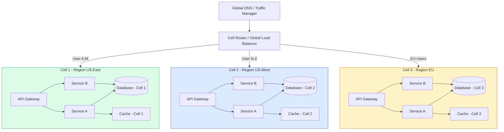
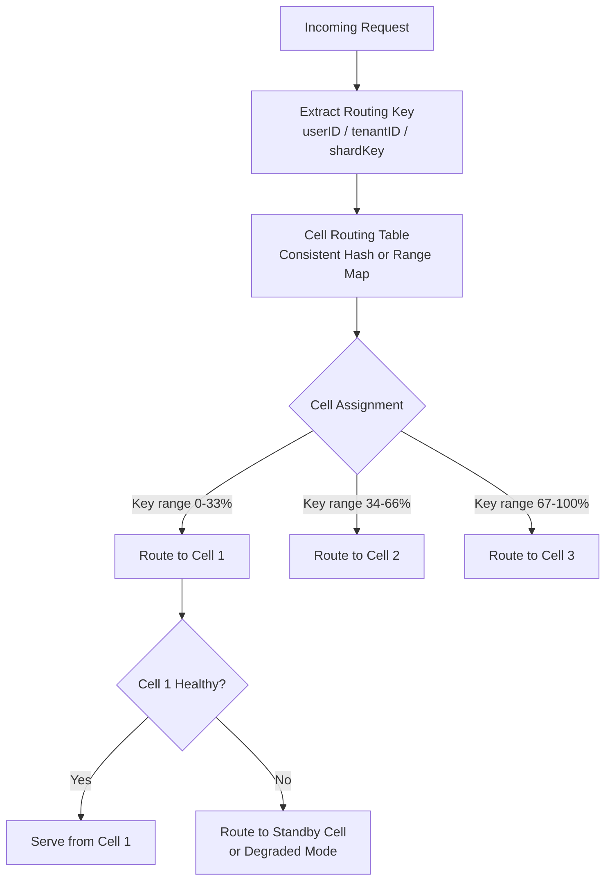
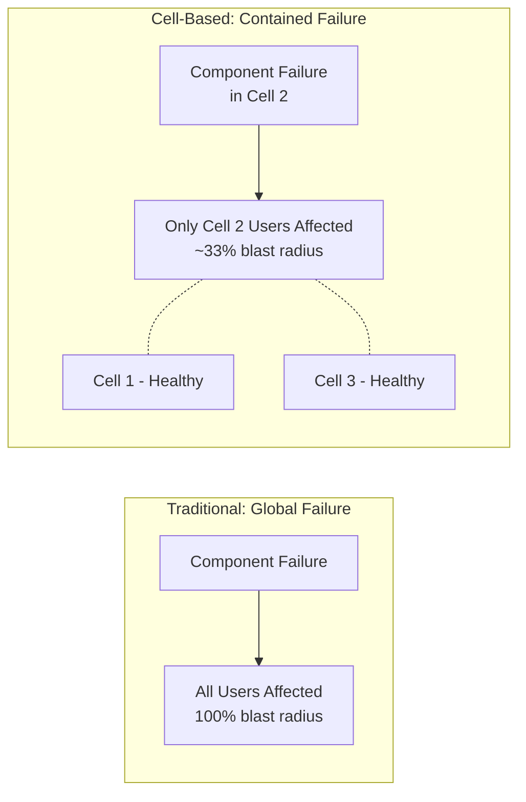

Cell-Based Architecture organizes a system into independent, self-contained deployment units called cells — each capable of serving a subset of users autonomously. The primary design goal is blast-radius reduction: failures in one cell do not propagate to others, enabling high availability without requiring globally coordinated failover.

## Architecture Diagrams

### Cell-Based System Topology

### Cell Routing Logic

### Blast Radius Comparison

## Key Concepts

- **Cell**: An isolated, self-sufficient deployment unit containing a complete copy of all services and data needed to serve its assigned user population. A cell is operationally independent — it has its own databases, caches, internal load balancers, and service instances. No shared mutable state between cells.

- **Blast Radius**: The scope of impact when a failure occurs. In a traditional architecture, one failing component can affect all users. In a cell-based architecture, a cell failure only affects the fraction of users assigned to that cell. Typical deployments size cells so that the maximum blast radius is 1-5% of users.

- **Cell Router**: The global traffic management layer that maps incoming requests to the correct cell based on a routing key (user ID, tenant ID, geographic region). The cell router must be extremely reliable — it is outside the blast radius of any cell but is itself a global dependency.

- **Routing Key**: The attribute used to assign users to cells. Common choices: user ID (consistent hashing), tenant ID (for multi-tenant SaaS), or geographic region (for data residency). The key must be present on every request and should distribute load evenly.

- **Cell Sealing**: The discipline of ensuring that cells do not communicate with each other at runtime. Cross-cell calls would re-introduce coupling and violate blast radius guarantees. Global coordination (user migration between cells, global configuration) happens through control-plane operations, not request-time calls.

- **Shuffle Sharding**: A technique where users are assigned to virtual shards that map to overlapping cell subsets. A failure affects only users sharing the same shard, providing better blast radius control than simple cell assignment.

- **Cell Lifecycle**: Cells can be created, drained, migrated, and destroyed independently. To onboard a new region, provision a new cell, drain users from existing cells to it, and the system is live — no global coordination needed.

## Trade-offs

| Aspect | Cell-Based | Microservices (no cells) |
|--------|-----------|--------------------------|
| Blast radius | Bounded (~1/N users) | Can be unbounded |
| Resource efficiency | Lower (duplicate infra per cell) | Higher |
| Complexity | High (cell router, migration) | High (service mesh) |
| Global features | Harder (cross-cell coordination) | Easier |
| Regional data residency | Native | Requires extra work |
| Deployment isolation | Per-cell | Per-service |
| Operational discipline | Very high | High |

## When to Use

**Use cell-based architecture when:**
- High availability guarantees require strict blast radius control
- Operating at a scale where even 1% of users affected by a failure represents millions of users
- Multi-tenant SaaS platforms where tenant isolation is a business requirement
- Data residency regulations require user data to stay within specific regions

**Avoid when:**
- System scale does not justify the significant infrastructure duplication cost
- Cross-user global features are central to the product (global leaderboards, shared documents)
- Team lacks operational maturity to manage cell lifecycle and routing infrastructure