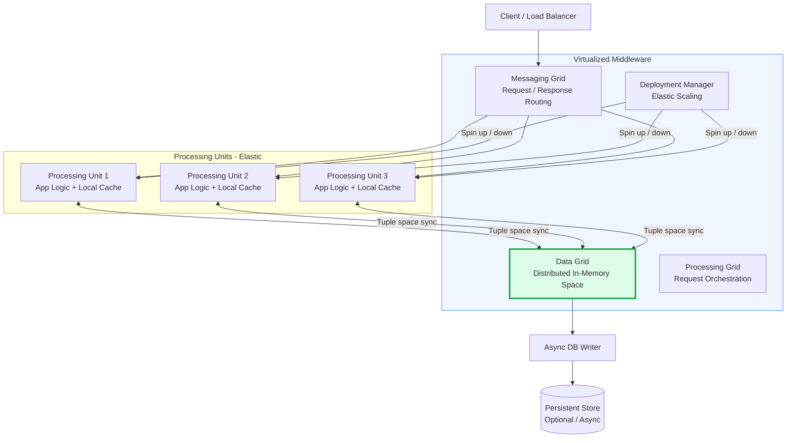
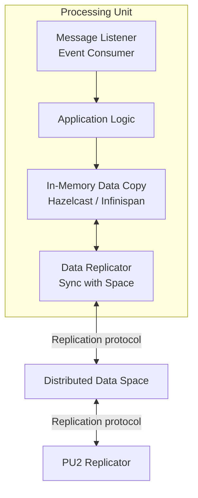
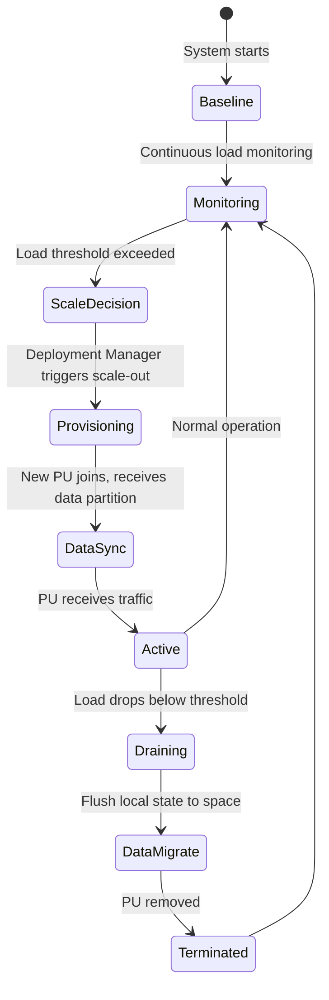

# Space-Based Architecture

Space-Based Architecture (SBA) eliminates the database as a bottleneck by distributing both processing and data across an in-memory data grid. All processing units share a common "space" (distributed tuple store), enabling elastic scale-out with near-linear throughput improvements — the architecture was designed specifically for high-concurrency applications with unpredictable load spikes.

## Architecture Diagrams

### Space-Based Architecture Overview

### Processing Unit Internal Structure

### Elastic Scaling Lifecycle

## Key Concepts

- **Tuple Space / Data Grid**: The central shared memory abstraction. A distributed associative memory where any processing unit can read, write, or take tuples (data objects). Implementations include Hazelcast, Apache Ignite, GemFire (VMware Tanzu). Data in the grid is replicated across nodes for fault tolerance.

- **Processing Unit (PU)**: The deployable application unit. Each PU contains the application logic and a local, synchronized copy of the data it needs. Requests are routed to any PU because all PUs have the same data view — there is no affinity requirement. This is what enables elastic scale-out.

- **Messaging Grid**: Routes incoming requests to available processing units. Functions like a smart load balancer aware of PU capacity and health. Unlike a traditional load balancer, it participates in the grid topology.

- **Data Replication**: When a PU updates data in its local cache, the change is propagated to all other PUs and the central data grid synchronously or asynchronously. Synchronous replication provides consistency but reduces throughput; async improves throughput with eventual consistency.

- **Asynchronous Database Writer**: Because in-memory operations are the hot path, persistence to a traditional database is done asynchronously in the background. This means the database is not on the critical request path — a fundamental departure from traditional architectures.

- **Deployment Manager**: Monitors system load and automatically provisions or terminates processing units. When a new PU starts, it receives a partition of the data grid. When it terminates, its data partition is redistributed.

- **Near-Linear Scalability**: Because each added PU brings its own compute and a copy of the data it needs, adding more PUs increases throughput proportionally without a bottleneck at the database.

## Trade-offs

| Aspect | Space-Based | Traditional 3-Tier |
|--------|------------|-------------------|
| Scalability ceiling | Very high (near-linear) | Database bottleneck |
| Data consistency | Eventual (async replication) | Strong (ACID) |
| Memory requirements | High (data replicated in RAM) | Low |
| Infrastructure cost | High | Lower |
| Latency | Very low (in-memory) | Higher (DB round trips) |
| Persistence durability | Weaker (async writes) | Strong |
| Operational complexity | Very high | Moderate |
| Use case fit | High concurrency, spiky loads | General purpose |

## When to Use

**Use space-based architecture when:**
- Extremely high concurrency requirements (hundreds of thousands of concurrent users)
- Workloads have large, unpredictable spikes that require elastic scale-out in seconds
- Data volumes fit in memory (or can be partitioned to fit)
- Session-based applications where user state must be instantly available to any node

**Avoid when:**
- Strong ACID consistency across complex transactions is required
- Data volumes far exceed available memory
- The team lacks expertise in distributed in-memory grids
- Cost of in-memory infrastructure is prohibitive
