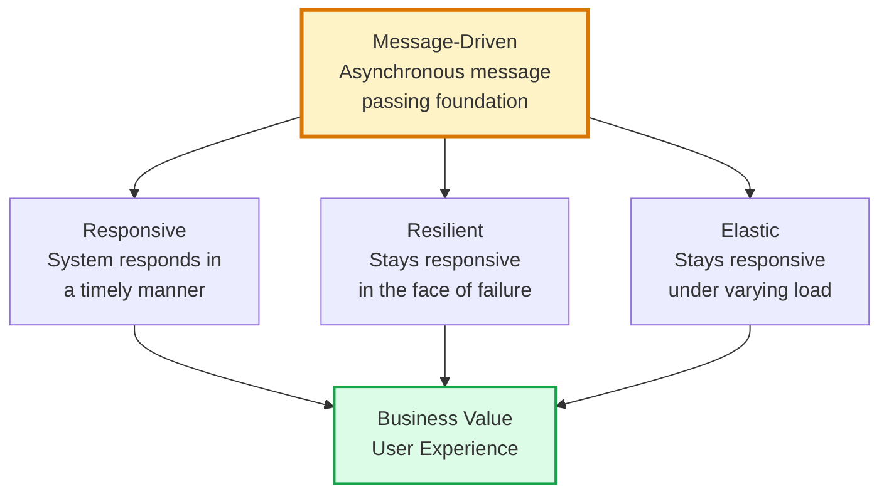
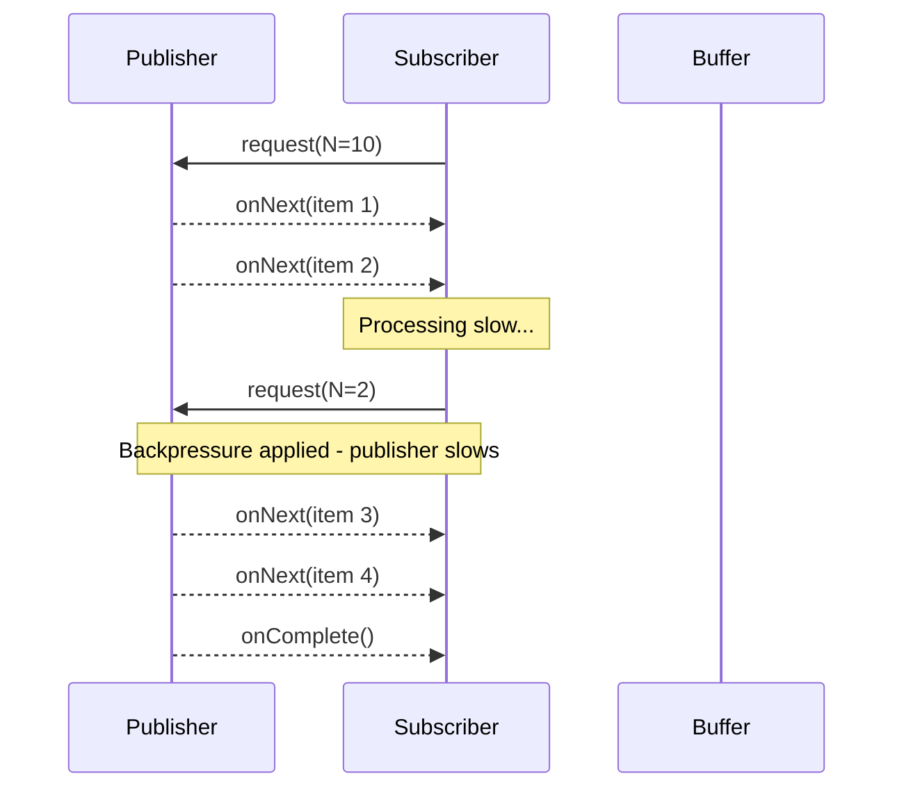
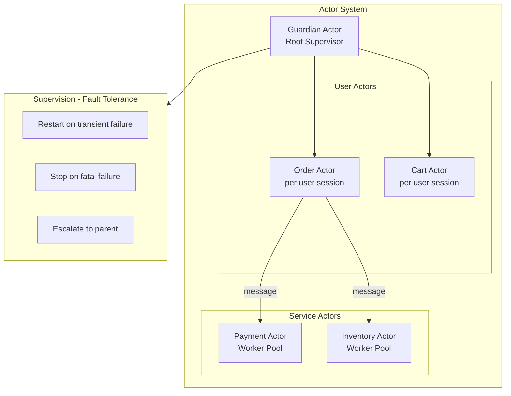
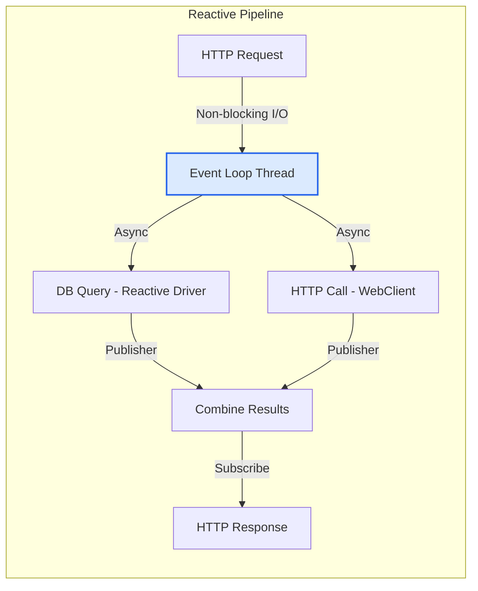

# Reactive Architecture

Reactive Architecture is a design approach for building systems that are responsive, resilient, elastic, and message-driven — the four pillars of the Reactive Manifesto. The goal is to build systems that remain responsive under varying load and in the presence of failures by embracing asynchronous, non-blocking message passing as the fundamental communication primitive.

## Architecture Diagrams

### The Four Pillars of Reactive

### Reactive Stream with Backpressure

### Actor Model Architecture

### Reactive Microservices Communication

## Key Concepts

- **Responsiveness**: The system always responds within an acceptable time, even under failure or load. If the system cannot respond normally (e.g., due to overload), it responds with a degraded response rather than hanging. This requires non-blocking I/O and timeout discipline.

- **Resilience through Isolation**: Failures are contained within their component. Components are isolated using replication, supervision hierarchies, and bulkheads so that a failure in one component does not cascade. The supervisor handles failure recovery — the failed component doesn't need to know how to recover itself.

- **Elasticity**: The system scales processing resources up and down in response to demand, with no contention points or central bottlenecks. Reactive systems are designed so that adding more instances is sufficient to increase throughput — no shared mutable state between instances.

- **Message-Driven Foundation**: All inter-component communication happens via asynchronous messages. This provides temporal decoupling (sender doesn't wait for receiver), location transparency (receiver could be local or remote), and enables backpressure.

- **Backpressure**: A flow control mechanism where consumers signal to producers how much data they can handle. Without backpressure, a fast producer overwhelms a slow consumer, causing buffer overflow and memory exhaustion. Reactive Streams (the standard) makes backpressure a first-class protocol concern.

- **Actor Model**: A concurrency model where actors are the fundamental unit of computation. Each actor has a mailbox (message queue), processes messages sequentially, and can create child actors. Akka (Scala/Java) is the primary implementation. Actors provide natural isolation and supervision.

- **Reactive Streams Standard**: A specification (implemented by Project Reactor, RxJava, Akka Streams, Java Flow API) for asynchronous stream processing with non-blocking backpressure. Defines Publisher, Subscriber, Subscription, and Processor interfaces.

- **Non-blocking I/O**: Reactive systems use event-loop threads (Netty, Vert.x, Node.js model) where a single thread handles many concurrent connections without blocking. Blocking I/O would starve the event loop and defeat the purpose.

## Trade-offs

| Aspect | Reactive | Traditional (Blocking) |
|--------|---------|----------------------|
| Thread usage | Very low (event loop) | High (thread per connection) |
| Throughput at scale | Excellent | Degrades with thread contention |
| Stack traces / debugging | Very difficult (async) | Straightforward |
| Code complexity | High (functional/reactive APIs) | Lower |
| Learning curve | Steep | Moderate |
| Error handling | Complex (async error channels) | Simple (try/catch) |
| Backpressure | Built-in | Manual |
| Libraries ecosystem | Growing | Mature |

## When to Use

**Use reactive architecture when:**
- High concurrency with many simultaneous connections (chat, streaming, real-time systems)
- I/O-bound workloads where threads would otherwise block on network or disk
- Event-driven systems that process streams of data continuously
- Systems requiring elastic scale-out with minimal resource waste

**Avoid when:**
- CPU-bound workloads where non-blocking I/O provides no advantage
- Team lacks experience with functional programming and reactive APIs
- Codebase integrates heavily with blocking libraries (JDBC, blocking HTTP clients) that cannot be reactified
- Debugging simplicity and stack trace readability are priorities
